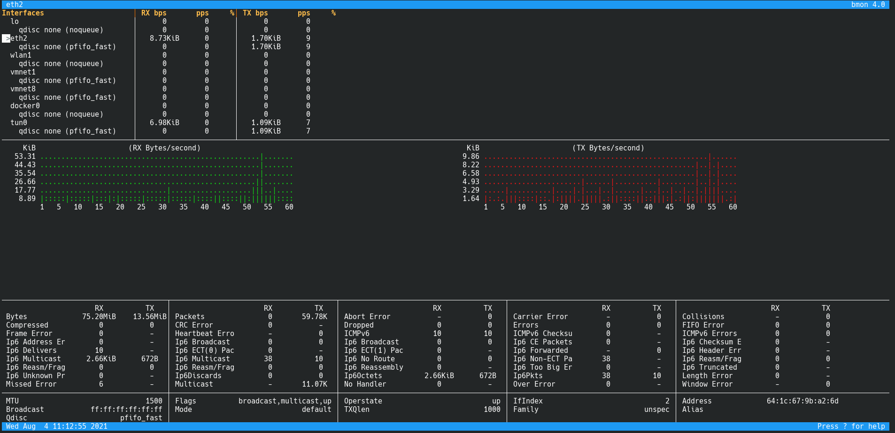

Salve Salve Pessoal!

Vamos para mais uma ferramenta que uso no meu dia a dia como administrador **Linux** e hoje vamos falar sobre o **bmon**.

O **bmon** é uma ferramenta de monitoramento e depuração para capturar estatísticas relacionadas as suas interfaces de rede.

Ela apresenta os dados de forma bem amigável e legível, facilitando muito o trabalho de resolução de problemas.

Segue o link do projeto:

[https://github.com/tgraf/bmon/](https://github.com/tgraf/bmon/)

Até o próximo post!

:D
