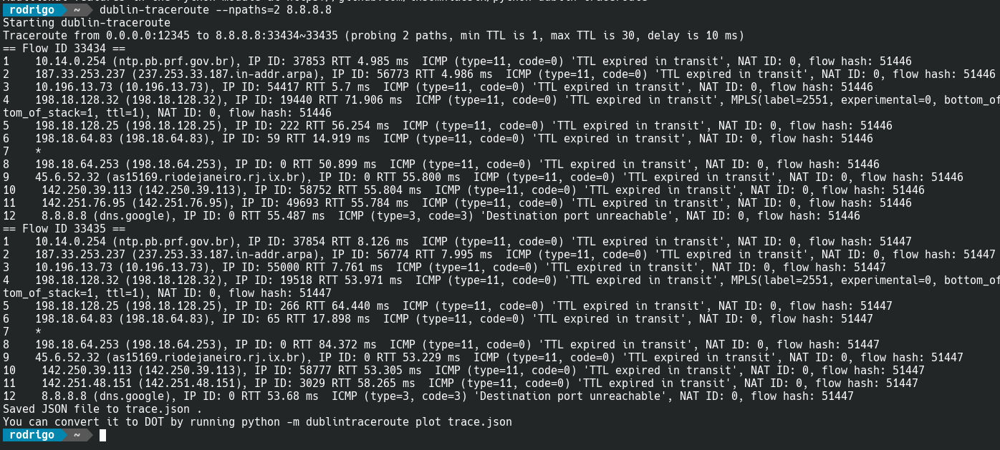
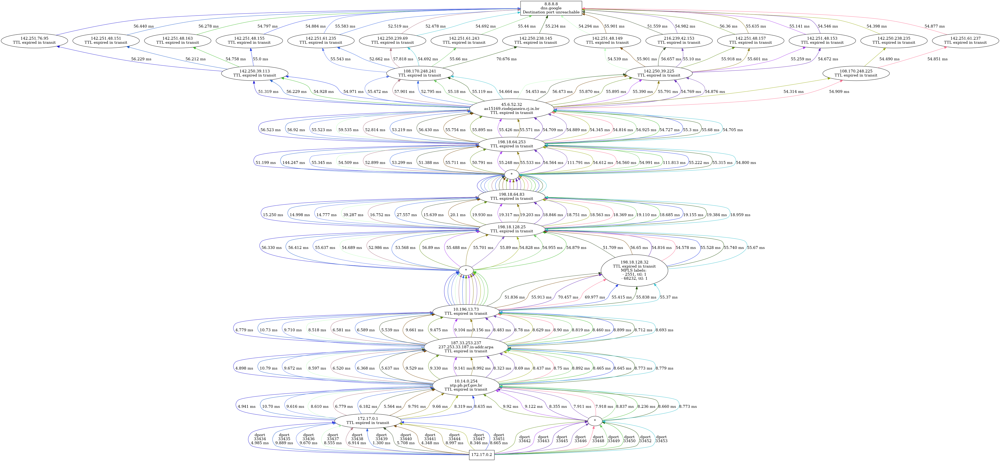

Salve Salve Pessoal!

Vamos para mais uma ferramenta do meu dia a dia com Linux.

Todos nós conhecemos muito bem o nosso amigo **traceroute**, normalmente ele nos mostra a rota percorrida de um host a outro.

Porém ele não mostra todas as rotas possíveis quando traçamos uma rota para um host na internet.

O **Dublin-traceroute** resolve esse problema para nós, ele traça todas as rotas possíveis para um determinado host na internet.

Por padrão o **Dublin-traceroute** exibe a saída na linha de comando e cria um arquivo **json** chamado **trace.json** no diretório local.

Veja um exemplo abaixo:

Podemos converter esse arquivo trace.json em uma imagem usando o script **to\_graphviz.py**.

Veja o exemplo abaixo:Ficou bem mais interessante de olhar não é? ;)

Você pode executar ele diretamente via **container**, o container vai executar o **dublin-traceroute** para o ip **8.8.8.8** e já vai converter o arquivo para imagem.

Para maiores informações sobre a ferramenta acesse o site abaixo:

[https://dublin-traceroute.net/](https://dublin-traceroute.net/)

Até o próximo post!

:D
