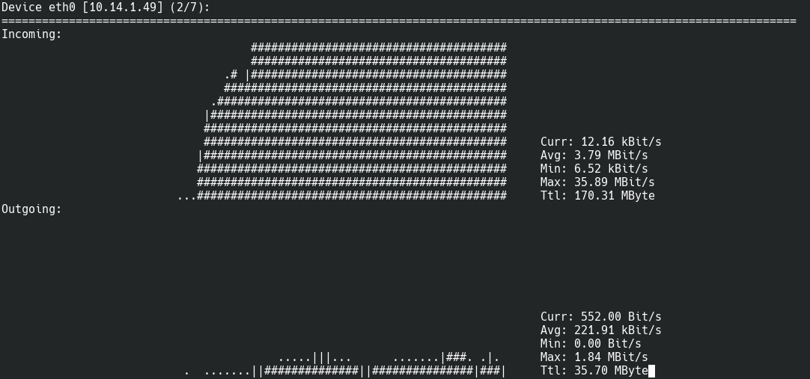

Salve Salve Pessoal!

Vamos para mais uma ferramenta que uso no meu dia a dia como administrador Linux e hoje vamos falar sobre o **nload**.

O **nload** exibe em tempo real o uso de suas interfaces de rede.

Ele vai mostrar o uso atual, a média, o mínimo, o máximo e o total utilizado, tando na entrada quanto na saída dos dados.

Para mudar a interface que você deseja visualizar os dados basta selecionar usando a setas para cima ou para baixo do teclado, simples né! :D

Apesar de ser uma ferramenta muito simples ela quebra um galho imenso quando queremos analisar em tempo real o uso de dados de cada interface do nosso sistema.

Podemos definir alguns parâmetros extras, acesse o help dela e descubra o que ela pode fazer por você.

Até o próximos post!

:D
