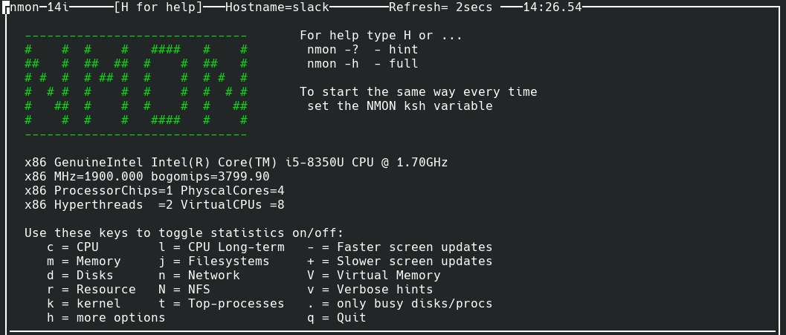
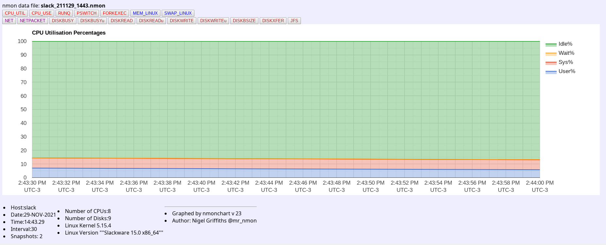

Salve Salve Pessoal!

Eu já mostrei diversas ferramentas do meu dia a dia com Linux, mas com certeza o **nmon** é uma das minha favoritas. ;)

O **nmon** é uma ferramenta que fornece uma grande quantidade de informações de desempenho de uma só vez. Podemos ver informações sobre CPU, memória, rede, discos, sistemas de arquivos, NFS, processos, recursos, etc.

<!--more-->

Também podemos salvar os dados, usar o **nmonchart** para converter em **html** e assim teremos uma visão mais amigável sobre as informações coletadas.

Existem diversas possibilidades com o **nmon**!

Espero que tenham gostado da dica e até o próximo post!

:D

Referências:

[http://nmon.sourceforge.net/pmwiki.php](http://nmon.sourceforge.net/pmwiki.php)
