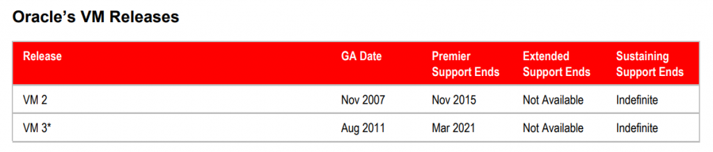

Salve Salve Pessoal!

Depois de um bom tempo sem postar nada devido a falta de tempo por causa de alguns projetos pessoais hoje venho falar um pouco sobre a vida últil do Oracle VM Server.

Algum tempo atrás a **Oracle** anunciou o **Oracle Linux Virtualization Manager**, como falei em posts anteriores ele vai substituir o **Oracle VM Server**.

Então para quem não sabe o **Oracle VM Server** só suporte até **Março de 2021**, é hora de começar a pensar e estudar a migração do ambiente para o **Oracle Linux Virtualization Manager**,

Já fiz alguns posts falando sobre essa nova ferramenta de virtualização da Oracle, vou continuar fazendo outros posts e devo mostrar como será o processo de migração.

[https://rodrigolira.eti.br/tag/oracle-linux-virtualization-manager/](https://rodrigolira.eti.br/tag/oracle-linux-virtualization-manager/)

Enquanto isso segue alguns links de bugs da atual versão **3.4.6**:

[https://blogs.oracle.com/virtualization/oracle-vm-manager-3461-errata-release-is-now-available](https://blogs.oracle.com/virtualization/oracle-vm-manager-3461-errata-release-is-now-available)

[https://blogs.oracle.com/virtualization/oracle-vm-release-3462-is-now-available](https://blogs.oracle.com/virtualization/oracle-vm-release-3462-is-now-available)

Até a próxima!
