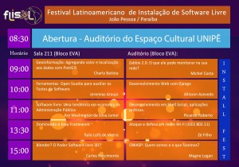
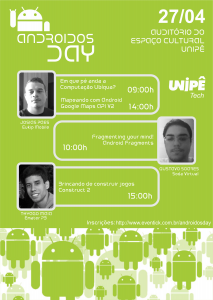

Salve Salve Galera!

Nesse fim de semana acontecera o Flisol (Festival Latinoamericano de Instalação de Software Livre), e João Pessoa não poderia ficar de fora dessa. O evento acontecerá no Centro Universitário de João Pessoa (UNIPÊ) e terá a seguinte programação como mostra a figura abaixo.

 

Nesse mesmo dia também acontecerá no mesmo local o androidosday, segue a programação abaixo:

 

Estarei no Flisol, quem tiver afim de conversar é só me procurar.
