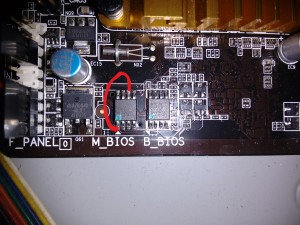
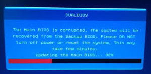

Salve Salve Pessoal!

Nos últimos dias fiquei sem meu desktop que uso para laboratórios, a placa mãe uma Gigabyte Z97M-D3H v1.0 iniciava, porém na tela da BIOS ela reiniciava.

Segue mais detalhes sobre o modelo da mesma:

[http://br.gigabyte.com/products/product-page.aspx?pid=4970#ov](http://br.gigabyte.com/products/product-page.aspx?pid=4970#ov)

Depois de muita pesquisa, acabei conseguindo fazer ela voltar a funcionar normalmente.

As placas gigabytes tem um tecnologia chamada de dual bios, maiores detalhes no link abaixo:

[http://www.gigabyte.pt/global/pt/pages/mb\_081226\_dualbios/tech\_081226\_dualbios.htm](http://www.gigabyte.pt/global/pt/pages/mb_081226_dualbios/tech_081226_dualbios.htm)

O problema é que a bios principal falhava e a bios de backup não conseguia carregar, então dessa forma a placa ficava em um loop infinito, nas pesquisas que fiz achei um cara com o mesmo problema, segue o vídeo que ele gravou e colocou no youtube:

https://www.youtube.com/watch?v=scugo2YBW50

Tentei várias solução, seguem os links que utilizei para tentar corrigir o problema.

[https://techjourney.net/recover-or-undo-corrupt-ami-bios-flash-update/](https://techjourney.net/recover-or-undo-corrupt-ami-bios-flash-update/)

[http://forums.tweaktown.com/gigabyte/33904-how-fix-dead-dual-bios-motherboard-if-flashing-failed.html](http://forums.tweaktown.com/gigabyte/33904-how-fix-dead-dual-bios-motherboard-if-flashing-failed.html)

[http://www.overclockers.com/forums/showthread.php/697533-GUIDE-Forcing-backup-BIOS-on-Gigabyte-motherboards](http://www.overclockers.com/forums/showthread.php/697533-GUIDE-Forcing-backup-BIOS-on-Gigabyte-motherboards)

Após tentar todos os procedimentos, o que funcionou comigo foi o terceiro método do terceiro link, só para informar, não funcionou na primeira vez que eu tentei, ele até chamava a bios de backup, mas por alguma razão ela não corrigia o problema.

Após várias tentativas eu consegui, segue o procedimento:

1 - Desconectei todos os dispositivos da placa mãe.

2 - Fiz o jumper entre os pinos 1 e 6 da bios principal (M\_BIOS), como mostra a imagem abaixo

Obs: Utilizei um clip para fazer o jumper.

3 - Liguei a placa mãe e fiquei com o jumper conectado até aparecer a tela de recuperação da bios, depois removi o jumper.

4 - A bios faz a recuperação automática, como mostra a imagem abaixo.

Depois desse procedimento a placa reinicia.

Pronto! A placa volta a funcionar normalmente.

Até a próxima :D
