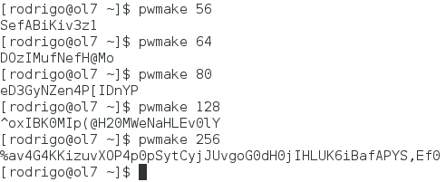

Salve Salve Pessoal!

O **pwmake** é uma ferramenta simples e configurável para gerar senhas aleatórias. A ferramenta permite que você especifique o número de bits que são usados para gerar a senha.

A entropia é retirada de /dev/urandom.

O número mínimo de bits é 56, normalmente os bits utilizados são os seguintes, 56, 64, 80, 128 ou 256.

Como podemos ver na imagem acima, o tamanho da senha vai depender de sua paranoia.

A complexidade e outras opções de configuração do pwmake podem ser configuradas no arquivo  /etc/security/pwquality.conf.

O **pwmake** também está presente no **CentOS 7** e no **Red Hat 7**.

Até a próxima :D
