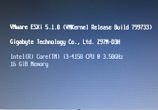

Salve Salve Pessoal!

Estou montando meu laboratório de estudos para a certificação VCAP-DCA.

Passei por algumas dificuldades com uma das minhas placas mãe, no caso a GIGABYTE Z97M-DH3, vou falar pra vocês quais foram as dificuldades.

1\. A ISO padrão do vSphere 5.5 não tem drivers nativos para a placa de rede on board da placa mãe. Uma medida de contornar isso é, quando as placas de redes são Realtek eu utilizo as ISOs customizadas da Dell, normalmente elas vem com drivers de rede adicionais, incluindo realtek, mas a mesma também não tem o driver.

2\. Tentei instalar a versão do vSphere 5.1 para ver se tinha mais sorte, da mesma forma a ISO padrão não contém o driver da placa de rede, porém, com a ISO customizada da Dell tive sucesso, a mesma reconheceu o drive de rede on board da placa mãe.

3\. Apesar da ISO da Dell reconhecer a placa de rede on board, não tive o mesmo sucesso com o HD, que no meu caso é um Sansung (Model: HD161HJ 160GB), achei isso muito estranho e desconfiei que poderia ser as configurações da bios da placa mãe.

Após fazer várias configurações na bios consegui resolver. O vSphere só reconheceu o disco local quando eu configurei a placa mãe para usar os discos com RAID.

Não sei explicar nesse momento o porque ela não reconheceu os discos normalmente, sei que depois disso consegui realizar a instalação sem problemas.

Fica a dica para caso alguém passe pelo mesmo problema.

Agora basta terminar de montar o lab para começar os estudos.

Valeu pessoal, até a próxima :)
