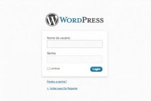

São Paulo - Segundo relatórios do HostGator e CloudFlare, um grande ataque foi lançado na internet para roubar senhas de blogs Wordpress.

O ataque, que envolvería mais de 90 mil IPs, pretende usar força bruta para descobrir domínios com senhas padrão e perfis de usuários listados como admin. Em [entrevista ao TechCrunch](http://techcrunch.com/2013/04/12/hackers-point-large-botnet-at-wordpress-sites-to-steal-admin-passwords-and-gain-server-access/), Matthew Prince, CEO da CloudFlare, o grupo é extremamente organizado e teria controle de 100 mil robôs para realizar a tarefa

Além dos riscos para o próprio blog, esse ataque pode abrir uma porta para que os criminosos tomem controle do servidor. Desse modo, o grupo por trás dos ataques construiria uma rede botnet muito mais poderosa. PCs comuns podem dar suporte a um grande ataque de negação de serviço, mas servidores têm acesso a mais banda e podem direcionar muito mais tráfego.

Se sua senha é fraca, esse é um bom momento para trocá-la. Escolha uma que misture letras, números e caracteres especiais. Além disso, um bom número de plugins para Wordpress pode limitar o número de tentativas erradas de um IP. Isso dificulta a ação dos robôs, já que muitas senhas erradas são disparadas por um mesmo IP no processo.

Trocar o seu perfil de admin para um nome mais protegido também é uma ótima ideia. Evite usar o nome do seu cachorro na infância, ou algo que possa ser aprendido sobre você em redes sociais.

Fonte: [INFO](http://info.abril.com.br/noticias/seguranca/golpe-pode-roubar-senhas-do-wordpress-13042013-8.shl)
