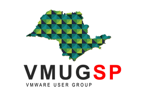

São Paulo, 03 de outubro de 2016.

O **VMUG** (Grupo de Usuários de VMware), associação independente com mais **150.000 membros em todo o mundo****chega a São Paulo** e será apresentado no [evento vForum São Paulo](http://vmugsp.com.br/vmugsp/2016/10/03/estaremos-no-vforum-sao-paulo-2016/), promovido pela VMware, empresa líder no segmento de Virtualização e Cloud Computing que acontece no **próximo dia 04 de outubro em São Paulo**.

O **VMUG SP** é o novo **Grupo de Usuários de VMware** que foi criado para i**ncentivar o networking e o compartilhamento de conhecimento entre os profissionais de VMware no Estado de São Paulo** e também**fortalecer o relacionamento com a VMware Brasil e seus parceiros de negócios.**

O grupo de São Paulo inicialmente será liderado por [Valdecir Carvalho](http://vmugsp.com.br/vmugsp/valdecir-carvalho/) do blog [Homelaber Brasil](http://homelaber.com.br/) ([@homelaber](https://twitter.com/homelaber)) e por[Fernando Frediani](http://vmugsp.com.br/vmugsp/fernando-frediani/), com grande experiência com o VMUG na Inglaterra. O grupo contará também com o apoio de [Caio Oliveira](http://vmugsp.com.br/vmugsp/caio-oliveira/) ([@oliveirac\_caio](https://twitter.com/oliveirac_caio)) Engenheiro Sênior de Pré-Vendas para a VMware América Latina.

Segundo Valdecir Carvalho: O **objetivo principal** agora é fazer com que os **profissionais de VMware saibam da existência comunidade VMUG** e também as inúmeras **vantagens** de se **tornar** um **membro do VMUG SP**, tais como**descontos** em **treinamentos oficiais** da **VMware**, **certificações**, **livros** e **acesso** a **todos** os **produtos VMware por um ano** através do **programa VMUG Advantage**. “_É uma pena que São Paulo, a maior cidade do Brasil não tenha um grupo VMUG local ativo.”_

O **grupo** **realizará** uma **reunião ainda esse ano**, provavelmente no **início de novembro**.  No próximo ano faremos ao menos 4 reuniões em São Paulo, capital e temos **planos** de **levar** as **reuniões** para **cidades do interior de São Paulo**como **Campinas**, **São José dos Campos**, **São Carlos**, que são **polos de tecnologia no estado**.

“_Tudo vai depender da mobilização da comunidade, será um grande desafio, mas estamos confiantes no sucesso do VMUG em São Paulo_” dizem os líderes do grupo local.

A **participação** nos **eventos organizados pelo VMUG** é totalmente **gratuita** e organizada pela comunidade para a comunidade.

Nas **reuniões do VMUG** são discutidos **assuntos técnicos** com **palestras** de **membros** da **comunidade**, apresentação de casos de uso e também contam com a presença de [**parceiros de negócios da VMware**](http://vmugsp.com.br/vmugsp/quero-patrocinar/) que tem a oportunidade de**interagir e estreirar relacionamentos** com os **profissionais de VMware** apresentando seus produtos e serviços.

Para saber mais informações sobre o VMUG e o VMUG São Paulo, acesse o site do grupo em [http://vmugsp.com.br](http://vmugsp.com.br/)

Recursos adicionais:

Imagens:

Banner: Um novo VMUG está nascendo

[http://vmugsp.com.br/vmugsp/wp-content/uploads/2016/10/vmugsp-launch-grande.png](http://vmugsp.com.br/vmugsp/wp-content/uploads/2016/10/vmugsp-launch-grande.png)

Logo VMUG SP

[http://vmugsp.com.br/vmugsp/wp-content/uploads/2016/08/vmug-sp-mapa-logo.png](http://vmugsp.com.br/vmugsp/wp-content/uploads/2016/08/vmug-sp-mapa-logo.png)

VMUG Logo

[http://vmugsp.com.br/vmugsp/wp-content/uploads/2016/09/vmug-logo.jpg](http://vmugsp.com.br/vmugsp/wp-content/uploads/2016/09/vmug-logo.jpg)

Mais informações:

**VMUG – VMware User Group** – [http://www.vmug.com](http://www.vmug.com/) (site em Inglês)

**Video sobre o VMUG:** [2015 VMUG Membership](https://youtu.be/d-3L9-5gFLg) (em Inglês)

**Evento vFORUM São Paulo 2016**

4 de Outubro, 2016 WTC – Golden Hall Av. Nações Unidas, 12551 – Brooklin Paulista, São Paulo.

Agenda: [http://bit.ly/vforum2016agenda](http://bit.ly/vforum2016agenda)

Registro: [http://bit.ly/vforum2016inscricao](http://bit.ly/vforum2016inscricao)

**Post Original** - [http://vmugsp.com.br/2016/10/03/press-release-grupo-de-usuarios-de-vmware-chega-a-sao-paulo/](http://vmugsp.com.br/2016/10/03/press-release-grupo-de-usuarios-de-vmware-chega-a-sao-paulo/)
