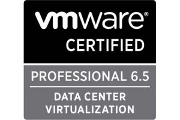

Salve Salve Pessoal!

Fim de ano chegando e diversos planos aparecendo para 2018, entre esses planos, um é atualizar a minha VCP-DCV para a versão mais nova, no caso a versão 6.5, e assim também fazer uma reciclagem sobre todo o assunto da prova.

Dessa forma resolvi fazer um guia de estudos, seguindo todos os assuntos cobrados no **Exam Guide** da **VMware** para a prova.

[https://mylearn.vmware.com/lcms/web/portals/certification/exam\_prep\_guides/Exam\_Prep\_Guide\_2V0-622\_3Oct2017.docx.pdf](https://mylearn.vmware.com/lcms/web/portals/certification/exam_prep_guides/Exam_Prep_Guide_2V0-622_3Oct2017.docx.pdf "Exam Preparation Guide")

**OBS:** Sei que já existem diversos blogs com o mesmo conteúdo e objetivo, porém todos que conheço são em inglês e meu objetivo aqui é ajudar a comunidade brasileira :P

Antes de mais nada, vamos entender um pouco mais sobre esta certificação e prova:

**1 -** Para podermos obter a certificação, precisamos fazer um curso oficial e obter o VMware ID, o curso vária de valor dependendo da época, do provedor e da modalidade, seja online ou presencial, uma boa saída para todos essa despesa é fazer o curso pelo Stanly Community College, para maiores detalhes sobre o Stanly, veja o post de Wesley do blog [IT PRO LAND](http://www.itproland.com.br/vmware-vsphere-install-configure-manage-stanly-community-college/).

**2 -** É necessário fazer o exame VCA-DCV nas versões 6 ou 6.5, os exames são online e custam $125 dólares, maiores detalhes nos links abaixo:

VCA6-DCV - [https://mylearn.vmware.com/mgrReg/plan.cfm?plan=64179&ui=www\_cert](https://mylearn.vmware.com/mgrReg/plan.cfm?plan=64179&ui=www_cert)

VCA6.5-DCV - [https://mylearn.vmware.com/mgrReg/plan.cfm?plan=99164&ui=www\_cert](https://mylearn.vmware.com/mgrReg/plan.cfm?plan=99164&ui=www_cert)

**3 -** A prova tem a duração de 120 minutos aqui no Brasil.

**4 -** A prova pode ser realizada em Inglês ou Japones.

**5 -** O custo com a prova é de $200 dólares aqui no Brasil.

**6 -** O código deste exame é o 2V0-662.

**7 -** A pontuação vária entre 100 e 500 ponto, sendo necessário realizar pelo menos 300 ponto para aprovação.

**8 -** A empresa que aplica as provas é a pearsonvue.

[http://pearsonvue.com/vmware/](http://pearsonvue.com/vmware/)

Para saber um pouco mais sobre o exame basta acessar o link abaixo:

[https://mylearn.vmware.com/mgrReg/plan.cfm?plan=99217&ui=www\_cert#](https://mylearn.vmware.com/mgrReg/plan.cfm?plan=99217&ui=www_cert#)

Agora vamos ao que mais interessa, como será a dinâmica do guia de estudos :D

Tentarei postar um vídeo ou um post falando sobre o tópico pelo menos uma vez por semana, não sei se vou conseguir seguir a ordem das seções e seus objetivos, isso depende de N fatores, mas tentarei.

Abaixo todas as seções e objetivos abordados no exame, sempre que fazer um post referente ao conteúdo, colocarei o link aqui.

#### Section 1 - Configure and Administer vSphere 6.x Security

**Objective 1.1** – Configure and Administer Role-based Access Control

**Objective 1.2** – Secure ESXi and vCenter Server

**Objective 1.3** –Configure and Enable SSO and Identity Sources

**Objective 1.4** – Secure vSphere Virtual Machines

#### Section 2 – Configure and Administer vSphere 6.x Networking

**Objective 2.1** – Configure policies/features and verify vSphere networking

**Objective 2.2** – Configure Network I/O control (NIOC)

#### Section 3 –Configure and Administer vSphere 6.x Storage

**Objective 3.1** – Manage vSphere Integration with Physical Storage

**Objective 3.2** – Configure Software-Defined Storage

**Objective 3.3** – Configure vSphere Storage Multipathing and Failover

**Objective 3.4** – Perform VMFS and NFS configurations and upgrades

**Objective 3.5** – Set up and Configure Storage I/O Control (SIOC)

#### Section 4 – Upgrade a vSphere Deployment to 6.x

**Objective 4.1** – Perform ESXi Host and Virtual Machine Upgrades

**Objective 4.2** – Perform vCenter Server Upgrades (Windows)

**Objective 4.3** – Perform vCenter Server migration to VCSA

#### Section 5 – Administer and Manage vSphere 6.x Resources

**Objective 5.1** –Configure Multilevel Resource Pools

**Objective 5.2** – Configure vSphere DRS and Storage DRS Clusters

#### Section 6 – Back up and Recover a vSphere Deployment

**Objective 6.1** – Configure and Administer vCenter Appliance Backup/Restore

**Objective 6.2** – Configure and Administer vCenter Data Protection

**Objective 6.3** – Configure vSphere Replication

#### Section 7 – Troubleshoot a vSphere Deployment

**Objective 7.1** – Troubleshoot vCenter Server and ESXi Hosts

**Objective 7.2** – Troubleshoot vSphere Storage and Networking

**Objective 7.3** – Troubleshoot vSphere Upgrades and Migrations

**Objective 7.4** – Troubleshoot Virtual Machines

**Objective 7.5** – Troubleshoot HA and DRS Configurations and Fault Tolerance

#### Section 8 – Deploy and Customize ESXi Hosts

**Objective 8.1** – Configure Auto Deploy for ESXi Hosts

**Objective 8.2** – Create and Deploy Host Profiles

#### Section 9 – Configure and Administer vSphere and vCenter Availability Solutions

**Objective 9.1** – Configure vSphere HA Cluster Features

**Objective 9.2** – Configure vCenter Server Appliance (VCSA) HA

#### Section 10 – Administer and Manage vSphere Virtual Machines

**Objective 10.1** – Create and Manage vSphere Virtual Machines and Templates

**Objective 10.2** – Create and Manage a Content Library

**Objective 10.3** – Objective 10.3 is no longer covered in the exam content.

**Objective 10.4** – Consolidate Physical Workloads using VMware vCenter Converter

Por enquanto é só, até a próxima! :D
