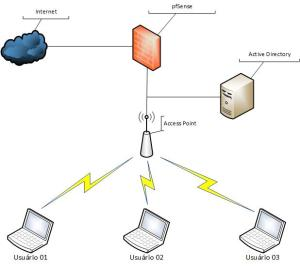

Salve Salve Pessoal!

Seguinte, eu tava pensando em fazer uma vídeo aula mostrando como configurar o Captive Portal do pfSense para autenticar os usuários do Active Directory via Radius.

Dai me veio a ideia de fazer um hangout, dessa forma a coisa pode ser ao vivo e vocês podem fazer perguntas, tirar dúvidas e etc.

Será uma boa experiência para mim que pretendo realizar outros vídeos ou até mesmo hangouts, vai que da certo :)

Neste hangout não vou mostrar como instalar os Sistemas Operacionais, na internet já existe diversos vídeos mostrando como fazer.

Porém vou mostrar todos os passos de como habilitar ou instalar os serviços tanto no Windows quanto no pfSense.

A imagem abaixo exemplifica um pouco o que vamos fazer:<!--more-->

 

Este cenário será realizado em cima do VMware Workstation, mas também pode ser realizado em qualquer outra plataforma de virtualização.

Para poder ter acesso ao hangout é necessário que você preencha o formulário que se encontra no link abaixo:

[http://goo.gl/forms/CWzhlXpJdJ](http://goo.gl/forms/CWzhlXpJdJ)

O hangout será realizado no dia 04/10/2014 as 20:00 horas.

Espero vocês lá :)
