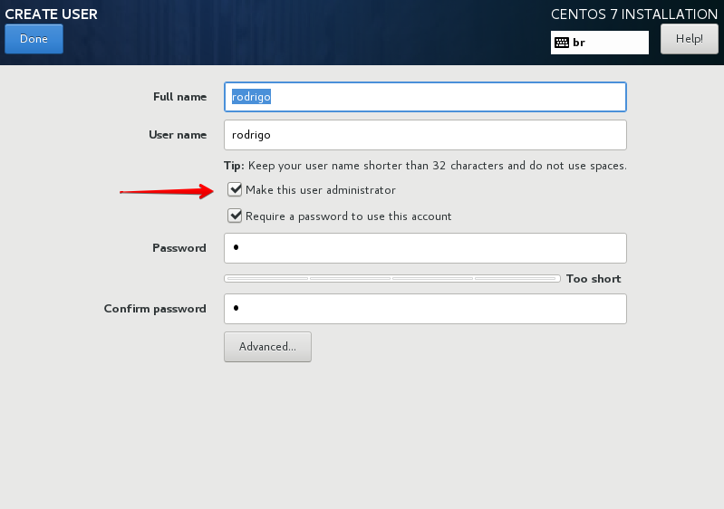

Salve Salve Pessoal!

Antes de começar essa serie de posts, vamos começar entendendo um pouco o que é o **hardening**?

Segundo a Wikipédia: _**Hardening**_ é um processo de mapeamento das ameaças, mitigação dos riscos e execução das atividades corretivas, com foco na infraestrutura e objetivo principal de torná-la preparada para enfrentar tentativas de ataque.

[https://pt.wikipedia.org/wiki/Hardening](https://pt.wikipedia.org/wiki/Hardening)

Não vou me aprofundar explicando o que é um hardening, aconselho que vocês pesquisem mais sobre o assunto para entenderem um pouco melhor, o google está cheio de conteúdo explicando ;)

Vamos começar essa serie falando sobre o controle de acesso do usuário **root**, muitos ainda insistem em deixar o mesmo ativo e até mesmo não sabem como desativa-ló no sistema, ou não sabem onde deixar o login de root habilitado ou desabilitado.

**1** - Muitas pessoas não sabem, mas não é necessário a criação de uma senha para usuário root durante a instalação, basta marcar o usuário como **administrador**, dessa forma o usuário poderá usar o comando **sudo** para executar as tarefas administrativas.

**2** - Mudando o **shell** do root para **/sbin/nologin** no arquivo **/etc/passwd**, nós impedimos ou permitimos o login de root das seguintes formas:

| **Bloqueia o Login** | **Permite o Login** |
| --- | --- |
| **console** (shell) | **sudo** (permite a execução de comandos que apenas o root poeria executar) |
| **gdm** (ambiente gráfico) | Clientes FTP |
| **kdm** (ambiente gráfico) | Clientes de E-mail |
| **xdm** (ambiente gráfico) |  |
| **su** (através do comando **su** e **sudo su**) |  |
| **ssh** (mesmo que a configuração do **ssh** permita) |  |
| **scp** (mesmo que a configuração do **ssh** permita) |  |
| **sftp** (mesmo que a configuração do **ssh** permita) |  |

**OBS:** Tenha certeza que o usuário faz parte do grupo **wheel**, para poder usar o comando **sudo** e executar as tarefas administrativas.

**3** - Também podemos desativar o login de root editando o arquivo **/etc/securetty**. Este arquivo lista todos os dispositivos aos quais o usuário root pode fazer login. Se o arquivo estiver em branco, o usuário root não poderá fazer login através dos dispositivos de comunicação que estavam listados nesse arquivo.

| **Bloqueia o Login** | **Permite o Login** |
| --- | --- |
| **console** (shell) | **sudo** (permite a execução de comandos que apenas o root poeria executar) |
| **gdm** (ambiente gráfico) | **su** (através do comando **su** e **sudo su**) |
| **kdm** (ambiente gráfico) | **ssh** (observa se a configuração do **ssh** permite) |
| **xdm** (ambiente gráfico) | **scp** (observa se a configuração do ssh permite) |
| **Qualquer outro serviço que utilize esses dispositivos** | **sftp** (observa se a configuração do ssh permite) |

**4** - Podemos desabilitar ou habilitar o acesso do usuário root apenas no serviço do ssh, ou até mesmo permitir o login apenas através de chaves, por padrão o login de root no Red Hat 7 vem desabilitado, desde de que seja criado um usuário no sistema na hora da instalação, caso você não tenha criado nenhum usuário na hora da instalação, deixando apenas o root, o login via ssh do mesmo será permitido.

Para habilitar ou desabilitar o login através do ssh precisamos editar o arquivo de configuração **/etc/ssh/sshd\_config** e editar a seguinte linha:

**#PermitRootLogin yes**

As opções possíveis de uso são:

**PermitRootLogin yes** (sem comentário com yes no final, permitimos o login de root)

**PermitRootLogin no** (sem comentário com no no final, proibimos o login de root)

**PermitRootLogin prohibit-password** ou **without-password** (permite o login de root apenas com chave)

| **Bloqueia o Login** | **Permite o Login** |
| --- | --- |
| **ssh** | **Qualquer outro programa que não faça uso do ssh** |
| **scp** |  |
| **sftp** |  |

Entraremos em mais detalhes sobre o ssh em outro post, dedicado apenas para ele.

**5** - Podemos fazer esse bloqueio utilizando o PAM, porém o PAM é bem complexo e vamos deixar para falar dele em posts dedicados a ele, em um outro momento.

Por enquanto é isso ai, espero que tenham gostado do post e dessa nova serie que estamos começando.

Até a próxima :D
