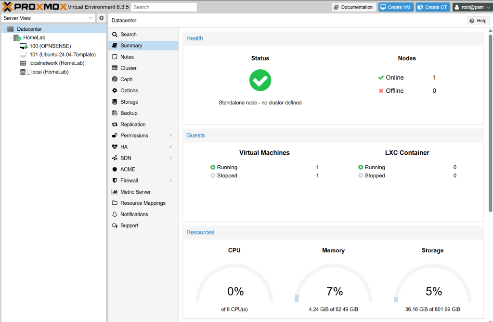

Salve Salve Pessoal!

Com a conclusão do meu mestrado, estou voltando a produzir conteúdos aqui no blog. Dei uma pausa por conta da carga intensa de atividades, tanto do mestrado quanto do trabalho, mas agora quero retomar com tudo.

Outro motivo da minha ausência foi a venda do meu antigo servidor, que fazia o papel de homelab. Se quiser conferir como ele era, o link está abaixo:

https://rodrigolira.eti.br/setup-e-homelab-2024/

Como optei por não investir em um novo hardware no momento, resolvi alugar um servidor na **OVH**. O custo-benefício tem sido bem interessante, já que não preciso me preocupar com consumo de energia, manutenção ou degradação dos componentes.

O modelo que escolhi foi o **Kimsufi KS-5**, que está saindo por **$35 dólares/mês** (aproximadamente **R$ 200,00**).

[https://eco.us.ovhcloud.com/kimsufi/ks-5/](https://eco.us.ovhcloud.com/kimsufi/ks-5/)

Suas configurações são:

**CPU:** Intel Xeon E3-1270 v6 - 4c/8t - 3.8 GHz/4.2 GHz  
**RAM:** 64 GB ECC 2400 MHz  
**Disco:** 2×450 GB SSD NVMe

Pode parecer um valor alto à primeira vista, mas a flexibilidade de trocar de máquina a qualquer momento ou até mesmo cancelar o serviço sem dor de cabeça é um grande diferencial.

No momento, estou rodando o **Proxmox 8** como sistema operacional. Nunca havia explorado a fundo essa solução, então estou aproveitando para aprender mais sobre ela, especialmente agora que o **ESXi Free** deixou de estar disponível.

Por enquanto, é isso! Espero compartilhar muitos conteúdos este ano.

Até o próximo post! ?
