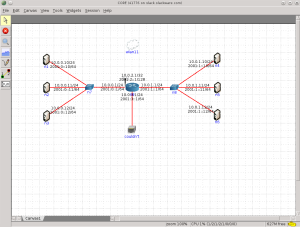

Salve Salve Pessoal!

O que é o CORE Network Emulator?

[](http://rodrigolira.eti.br/wp-content/uploads/2015/05/core.png)

É um emulador de redes, muito leve e poderoso, ele utiliza ferramentas instaladas na sua própria maquina, exemplo: se eu quero usar o tshark na minha rede virtual, basta eu instalar o tshark em meu sistema que automaticamente poderei utilizar o mesmo em minha rede virtual, as possibilidades são várias, tudo depende de sua necessidade, você pode até colocar sua maquina física dentro da rede virtual. Você pode rodar vários serviços nessa rede, trabalhar com IPv6 ou IPv4, roteamento estático ou dinâmico, abrir terminais nas maquinas, as possibilidades são várias.

Site Oficial: [http://www.nrl.navy.mil/itd/ncs/products/core](http://www.nrl.navy.mil/itd/ncs/products/core)<!--more-->

Vamos a instalação:

No slackware basta instalar apenas está dependência:

[http://slackbuilds.org/repository/14.1/libraries/libev/](http://slackbuilds.org/repository/14.1/libraries/libev/)

Baixe o source do CORE e instale:

```
# wget http://downloads.pf.itd.nrl.navy.mil/core/source/core-4.7.tar.gz
```

```
# tar -xvf core-4.7.tar.gz
```

```
# cd core-4.7
```

```
# ./bootstrap.sh
```

```
# CFLAGS="-fno-strict-aliasing $CFLAGS" ./configure
```

```
# make -j8
```

```
# make install
```

Pronto! CORE instalado:

```
Menu > Aplicativos > Sistema > Core Network Emulator
```

Espero que possa ser útil, para mim está sendo e muito.

Sites úteis:

[http://code.google.com/p/coreemu/](http://code.google.com/p/coreemu/)

[http://downloads.pf.itd.nrl.navy.mil/docs/core/core-html/install.html](http://downloads.pf.itd.nrl.navy.mil/docs/core/core-html/install.html)

Até a próxima :D
