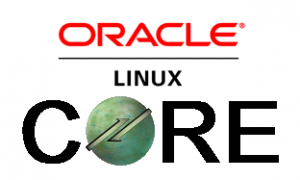
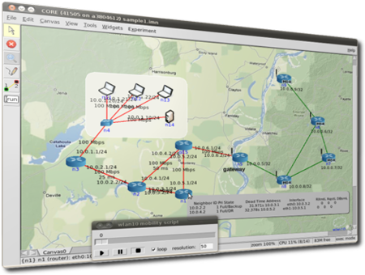
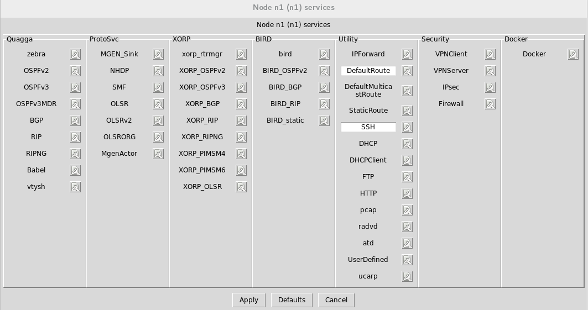

[](http://rodrigolira.eti.br/wp-content/uploads/2017/06/core-oracle.png)

Salve Salve Pessoal!

Normalmente quando pensamos em realizar laboratórios de redes e serviços, pensamos logo em subir um ambiente virtual em alguma solução de virtualização como o VirtualBox, normalmente temos hardware bem limitado para execução desses laboratórios, ou seja, não conseguimos abrir várias maquinas virtuais ao mesmo tempo.

Para quem não conhece o CORE Network (Common Open Research Emulator), é uma ferramenta para emulação de redes virtuais, é uma ferramenta muito poderosa e gratuita, onde podemos driblar essa limitação de hardware apenas utilizando ela.

[](http://rodrigolira.eti.br/wp-content/uploads/2017/06/core-screenshot-sm.png)

Podemos utilizar diversos protocolos em nossa rede virtual, segue abaixo uma imagem do que podemos configurar em nossa rede virtual. Atém de outras possibilidades, como conectar as redes virtuais em nossas redes reais.

[](http://rodrigolira.eti.br/wp-content/uploads/2017/06/Captura-de-tela-de-2017-06-22-16-06-49.png)

Obs: Não tem versão para windows :D

Vamos ao que interessa ;)

O processo de instalação do CORE é bem simples, para instalar a versão mais nova do CORE Network no Oracle Linux 7, siga os passos abaixo.

```
# wget https://downloads.pf.itd.nrl.navy.mil/core/packages/4.8/core-daemon-4.8-1.el7.x86_64.rpm

# wget https://downloads.pf.itd.nrl.navy.mil/core/packages/4.8/core-gui-4.8-1.el7.noarch.rpm

# yum localinstall core-daemon-4.8-1.el7.x86_64.rpm

# yum localinstall core-gui-4.8-1.el7.noarch.rpm

# systemctl start core-daemon

# systemctl start core-daemon
```

Pronto, agora basta começar a brincar com o CORE Network.

Em outros posts vou mostrar como podemos configurar alguns laboratórios e como utilizar melhor o CORE.

O processo de instalação também se aplica ao CentOS 7 e Red Hat 7.

Até a próxima :D
