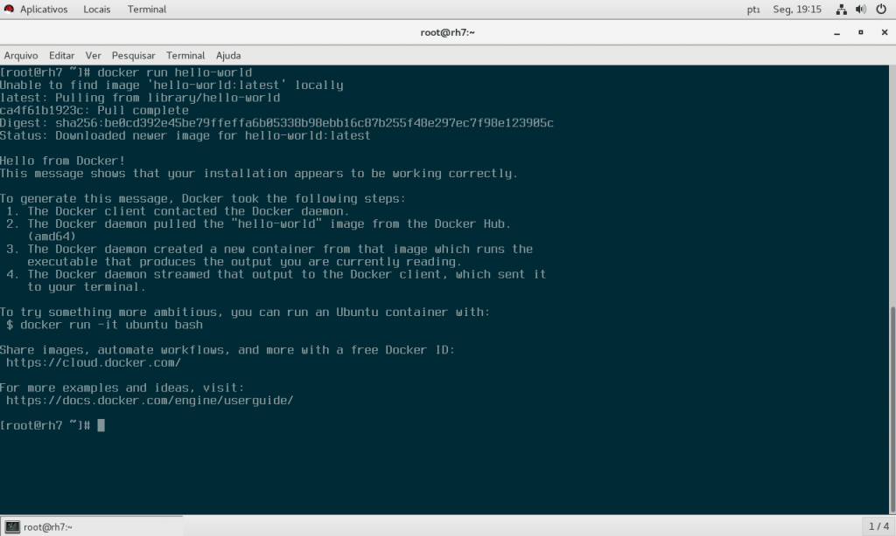

[](http://rodrigolira.eti.br/wp-content/uploads/2017/12/docker_banner.png)

Salve Salve Pessoal!

Faz um pouco de tempo que venho estudando e começando a trabalhar com o Docker.

Nesse post vou mostrar como fazer a instalação do Docker CE (Community Edition) no Red Hat 7, por padrão a Red Hat só suporta o Docker EE (Enterprise Edition), até no site do Docker informa que a versão CE não é suportada, mas podemos resolver isso. ;)

1 - Habilite o repositório extras no Red Hat:

```
# yum-config-manager --enable rhel-7-server-extras-rpms
```

2 - Instale todas as dependências (pode variar de acordo com o tipo de instalação do do seu Red Hat):

```
# yum install -y yum-utils device-mapper-persistent-data lvm2 policycoreutils-python
```

3 - Adicione o repositório do docker ce para o CentOS:

```
# yum-config-manager --add-repo https://download.docker.com/linux/centos/docker-ce.repo
```

4 - Atualize os repositórios:

```
# yum makecache fast
```

5 - Instale o Docker CE:

```
# yum -y install docker-ce
```

6 - Habilite o docker para iniciar na inicialização do sistema:

```
# systemctl enable docker
```

7 - Inicie o serviço do Docker:

```
# systemctl start docker
```

Pronto, feito isso basta executar o primeiro contêiner para ver se deu tudo certo.

```
# docker run hello-world
```

[](http://rodrigolira.eti.br/wp-content/uploads/2017/12/RH7-VMware-Workstation-2017-12-04-19.15.29.png)

Pronto, até a próxima :D
