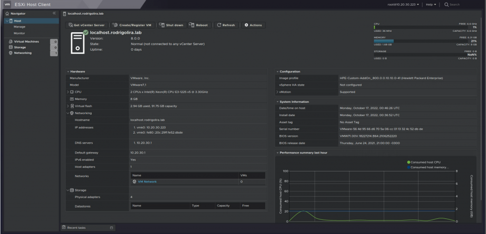

Salve Salve Pessoal!

A VMware lançou recentemente o **vSphere 8**, são diversas novidades e novas features, porém para começar vamos ver como está a nova versão do **ESXi** rodando em modo standalone.

Fiz um vídeo mostrando a instalação do **ESXi 8,** também mostro algumas novidades, como as novas possibilidades de temas da interface web.

<iframe title="YouTube video player" src="https://www.youtube.com/embed/FTlmTTpAQ78" width="750" height="400" frameborder="0" allowfullscreen="allowfullscreen"></iframe>

Espero que gostem e compartilhem!

Você pode ler mais detalhes no link abaixo:

[https://blogs.vmware.com/vsphere/2022/08/introducing-vsphere-8-the-enterprise-workload-platform.html](https://blogs.vmware.com/vsphere/2022/08/introducing-vsphere-8-the-enterprise-workload-platform.html)

Até o próximo post.

:D
