Salve Salve Pessoal!

Estou atualizando o meu homelab para a nova versão do ESXi (6.5) que foi disponibilizada a poucos dias para download. Dessa forma resolvi fazer um post sobre a instalação da mesma, na verdade não mudou em nada a instalação, os passos a seguir são os mesmos que a versão 6.0, mas como nunca fiz um post com os passos de instalação, resolvi fazer esse ;)

Os requisitos de hardware mínimo para instalação do ESXi continuam o mesmo, podemos verificar no link abaixo:

[http://pubs.vmware.com/vsphere-65/index.jsp#com.vmware.vsphere.install.doc/GUID-DEB8086A-306B-4239-BF76-E354679202FC.html](http://pubs.vmware.com/vsphere-65/index.jsp#com.vmware.vsphere.install.doc/GUID-DEB8086A-306B-4239-BF76-E354679202FC.html)

Então, vamos ao que interessa :D

Inicie o servidor ou VM pelo CD e escolha a opção de boot pela ISO do ESXi.

[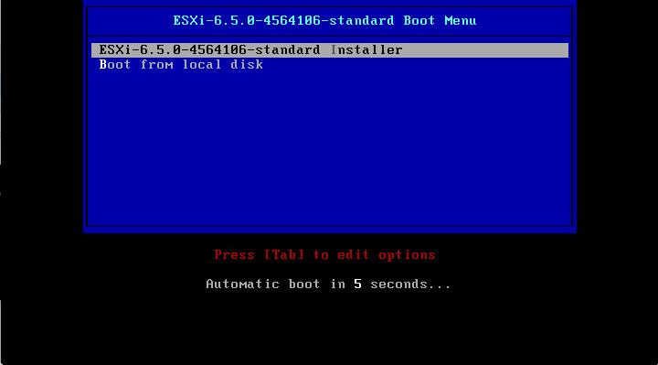](http://rodrigolira.eti.br/wp-content/uploads/2016/11/01.png)

Espere carregar todos os módulos.

[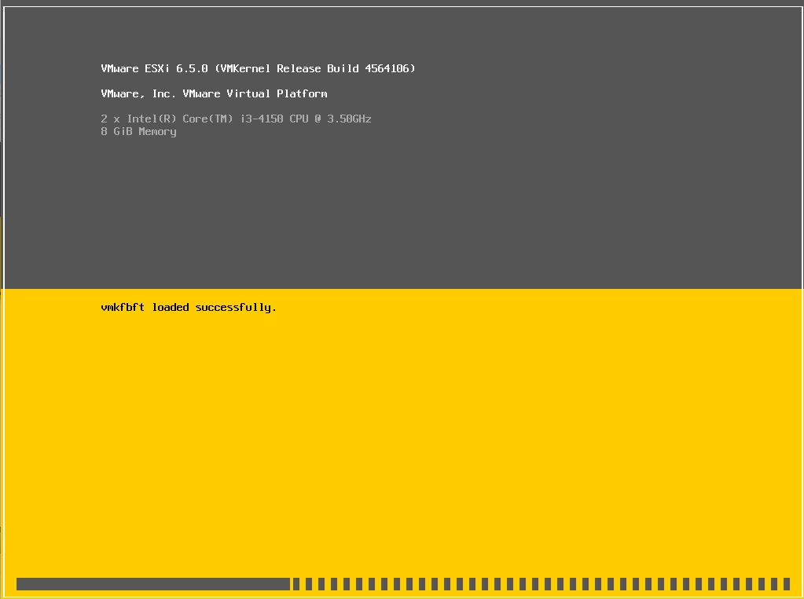](http://rodrigolira.eti.br/wp-content/uploads/2016/11/022.png)

Na tela de boas vindas tecle **ENTER** para continuar.

[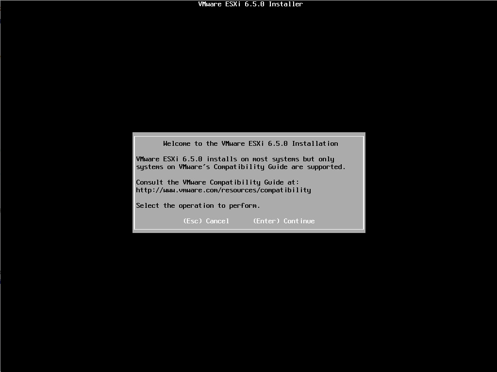](http://rodrigolira.eti.br/wp-content/uploads/2016/11/03.png)

Aceite a licença de uso teclando **F11**.

[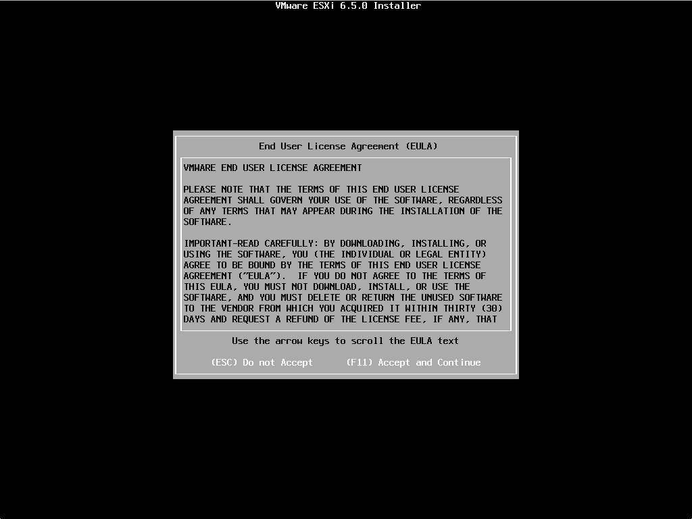](http://rodrigolira.eti.br/wp-content/uploads/2016/11/04.png)

Selecione o disco onde vai ser instalado o sistema e tecle **ENTER**.

[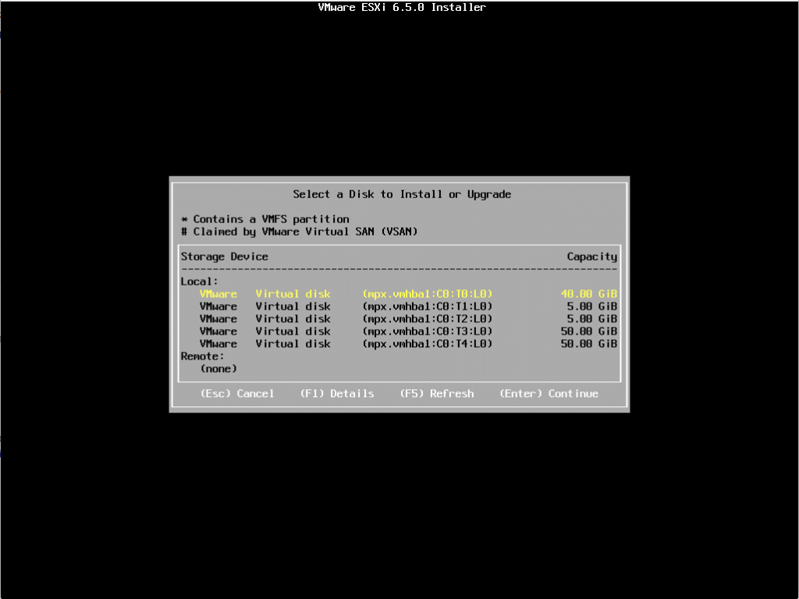](http://rodrigolira.eti.br/wp-content/uploads/2016/11/05.png)

Selecione o layout do teclado que deseja usar e tecle **ENTER**.

[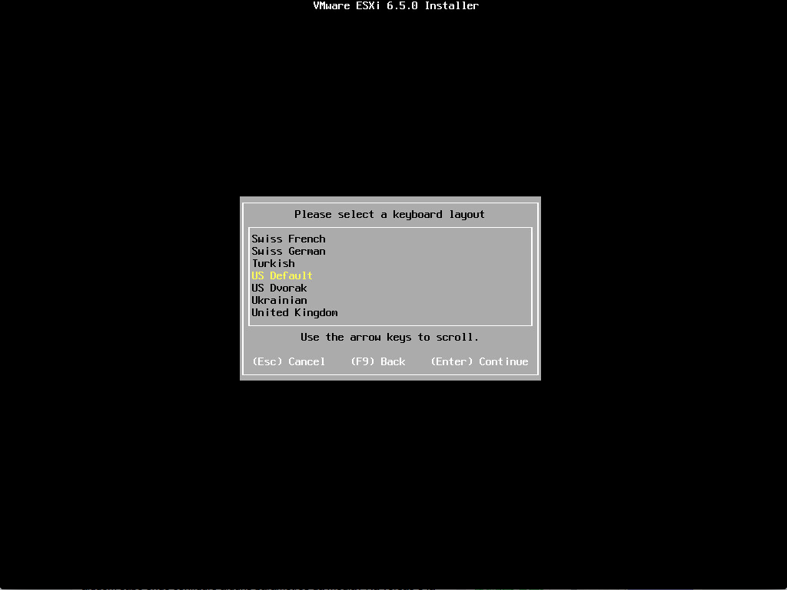](http://rodrigolira.eti.br/wp-content/uploads/2016/11/06.png)

Insira a senha que deseja usar e tecle **ENTER**.

[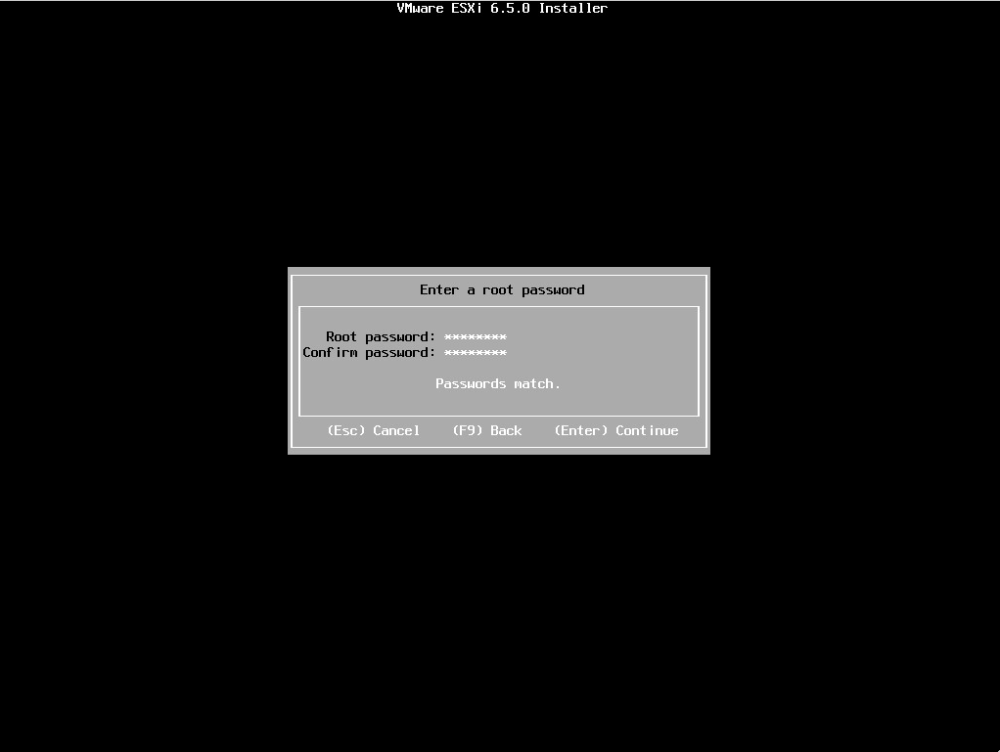](http://rodrigolira.eti.br/wp-content/uploads/2016/11/07.png)

Tecle **F11** para começar a instalar o ESXi.

[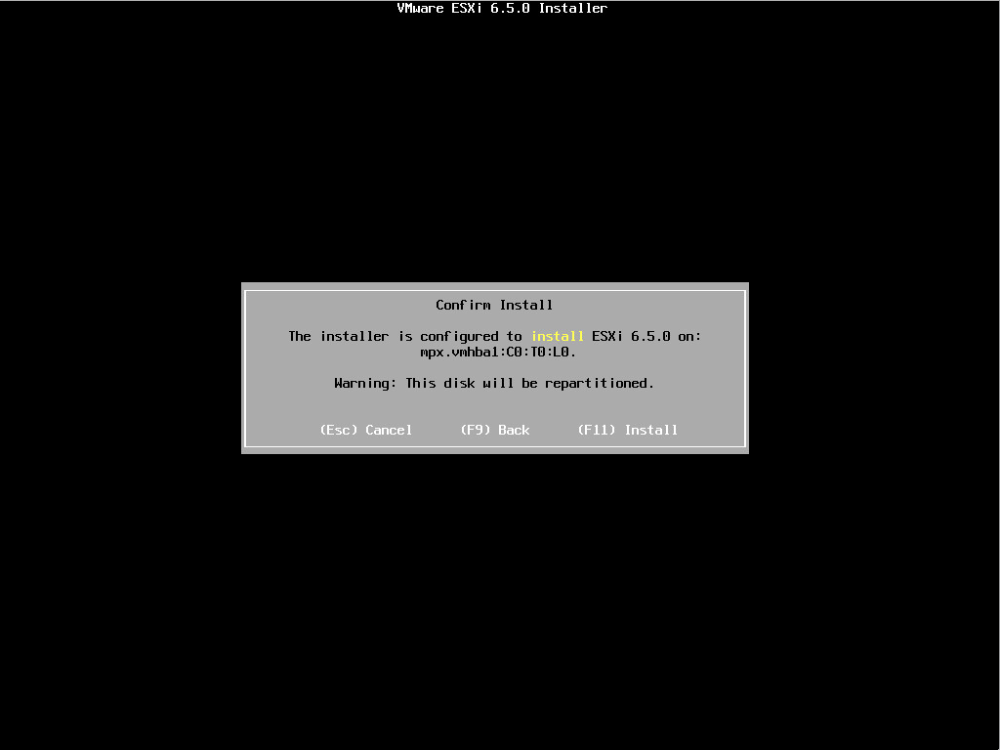](http://rodrigolira.eti.br/wp-content/uploads/2016/11/08.png)

O ESXi começa a ser instalado :D

[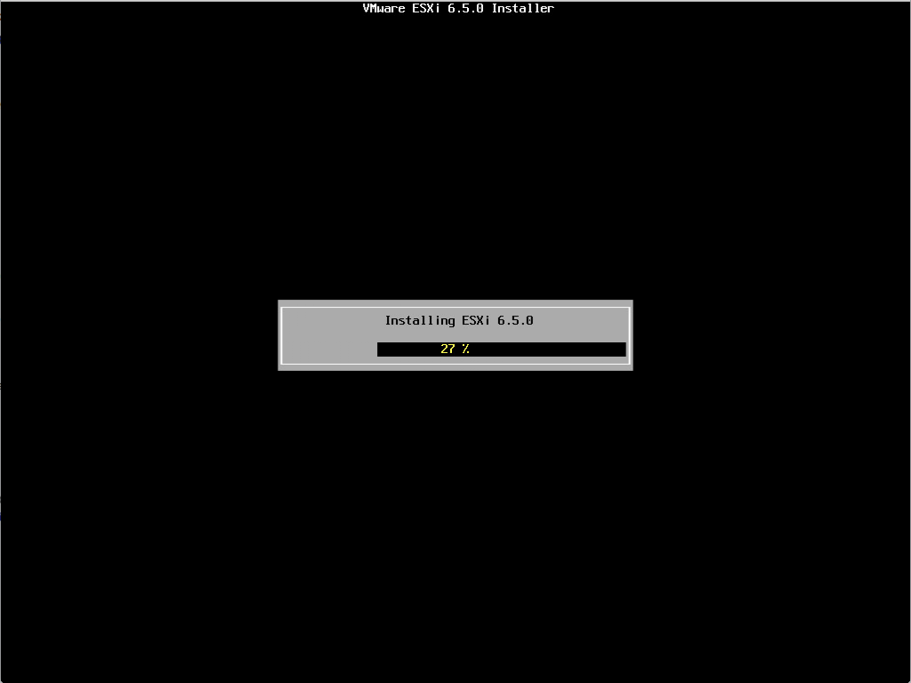](http://rodrigolira.eti.br/wp-content/uploads/2016/11/09.png) Após concluir a instalação tecle **ENTER** para reiniciar.

[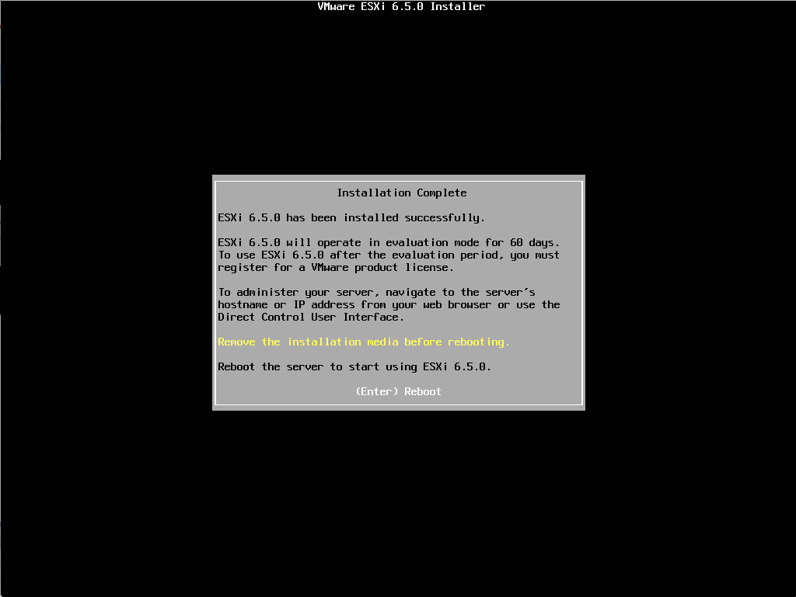](http://rodrigolira.eti.br/wp-content/uploads/2016/11/10.png)

Após o sistema reiniciar, ele irá pegar um endereço IP dinamicamente caso a sua rede possua um servidor DHCP. Caso não tenha um servidor DHCP nós podemos configurar o endereço IP manualmente, mas isso faremos no próximo post ;)

[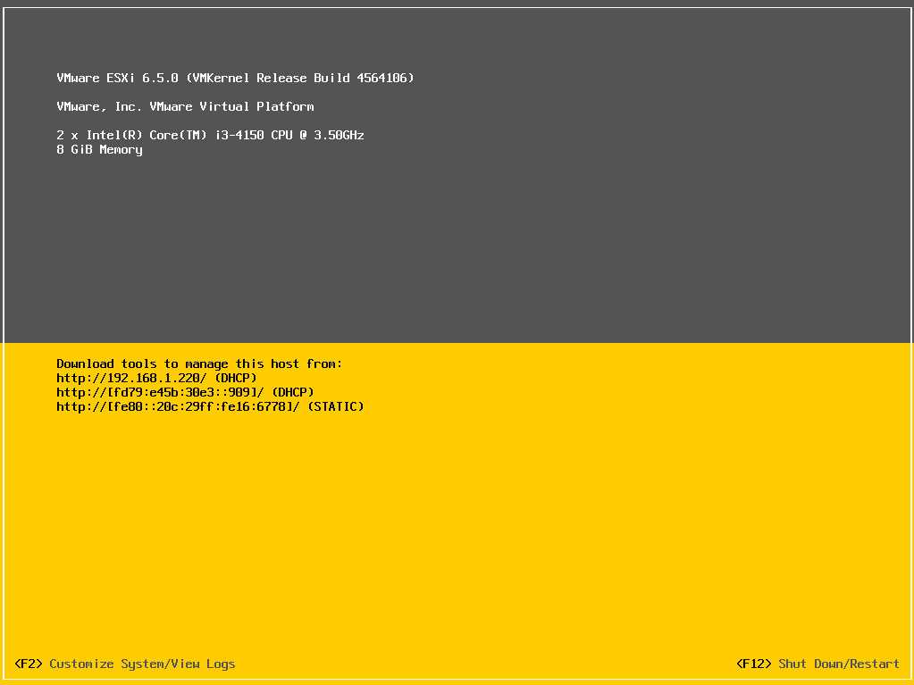](http://rodrigolira.eti.br/wp-content/uploads/2016/11/11.png)

Depois que tiver com o endereço IP, podemos acessar o nosso ESXi direto pelo navegado. Para acessar o servidor via navegador, insira o seguinte endereço, troque pelo seu IP.

**http://IP\_DO\_SERVIDOR/ui**

[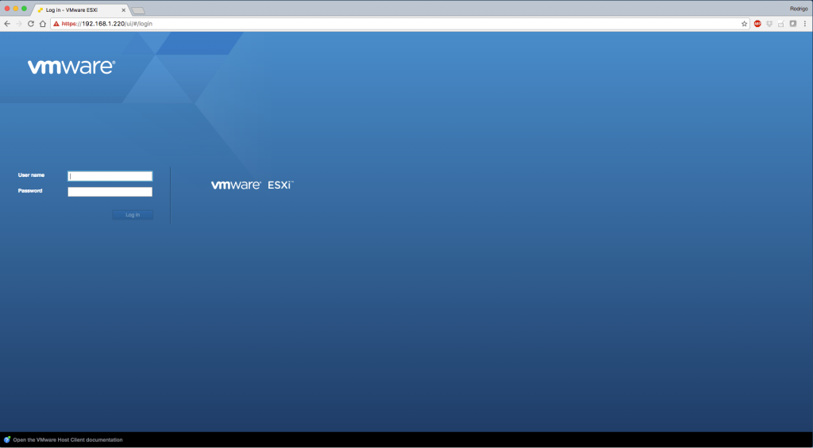](http://rodrigolira.eti.br/wp-content/uploads/2016/11/12.png)

Pronto, servidor pronto para usar :D

[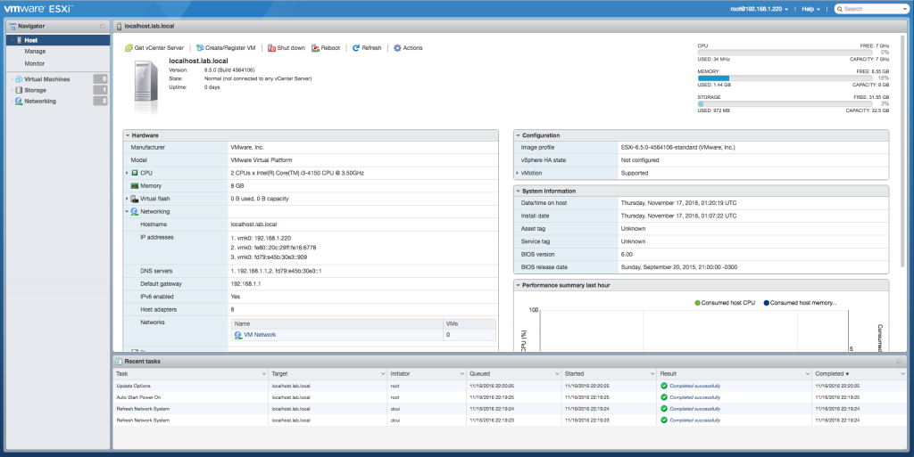](http://rodrigolira.eti.br/wp-content/uploads/2016/11/13.png) [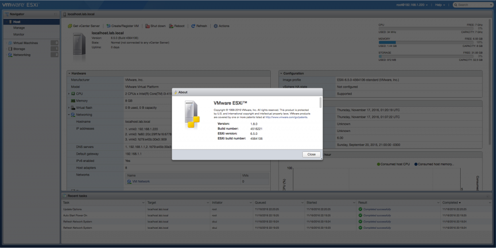](http://rodrigolira.eti.br/wp-content/uploads/2016/11/14.png)

Espero que tenham gostado.

No próximo post vou mostrar como configurarmos a DCUI e suas opções.

Até a próxima :D
