[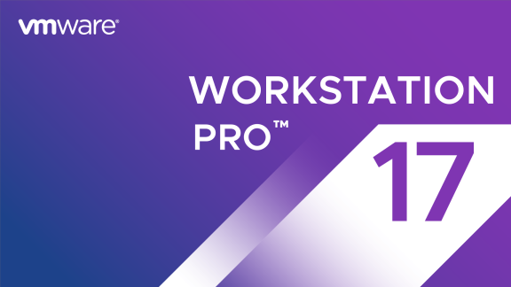](images/Workstation-1920x1080-banner-solid-576x324-1.png)

Salve Salve Pessoal!

Dias atrás foi lançado o **VMware Workstation 17 Pro** e o **Workstation Player 17**, ele trouxe algumas novidades, entre elas podemos citar:

- Suporte ao Windows 11
- Auto Start VMs
- Encryption for Player
- Fast Encryption
- OpenGL 4.3 Graphics
- Suporte a novos SOs:
    - Windows server 2022
    - Ubuntu 22.04, 20.04, 22.10
    - Debian 11.5, 12,
    - Fedora 37, 36,
    - RHEL 9
    - FreeBSD 12, 13

Nesse post vou mostrar como fazer a instalação e configuração no Slackware, o mesmo processo serve para outras distribuições Linux.

Faça o download no link abaixo:

[https://www.vmware.com/br/products/workstation-pro/workstation-pro-evaluation.html](https://www.vmware.com/br/products/workstation-pro/workstation-pro-evaluation.html)

Vamos ao que interessa! :D

**1** - Após fazer o download navegue até o diretório onde você salvou o arquivo de instalação e dê permissão de execução.

```
# chmod +x VMware-Workstation-Full-17.0.0-20800274.x86_64.bundle
```

[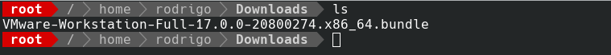](images/01.png)

**2** - Agora execute o programa com o seguinte comando, se colocarmos o parâmetro -h ele nos mostra um help.

```
# ./VMware-Workstation-Full-17.0.0-20800274.x86_64.bundle -h
```

[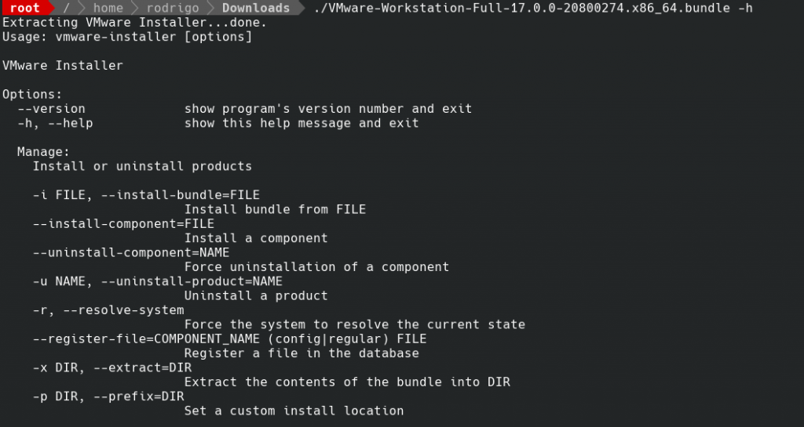](images/02.png)

**3** - Execute o programa, o processo de instalação é automático.

```
./VMware-Workstation-Full-17.0.0-20800274.x86_64.bundle
```

[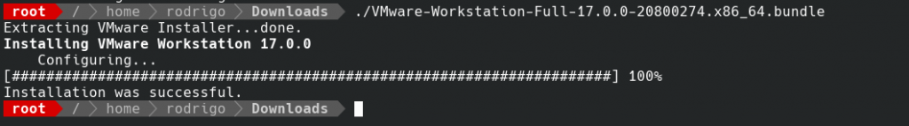](images/03.png)

**4** - Agora inicie o aplicativo no seu ambiente gráfico, leia e aceite os termos de uso e clique em **Next**.

[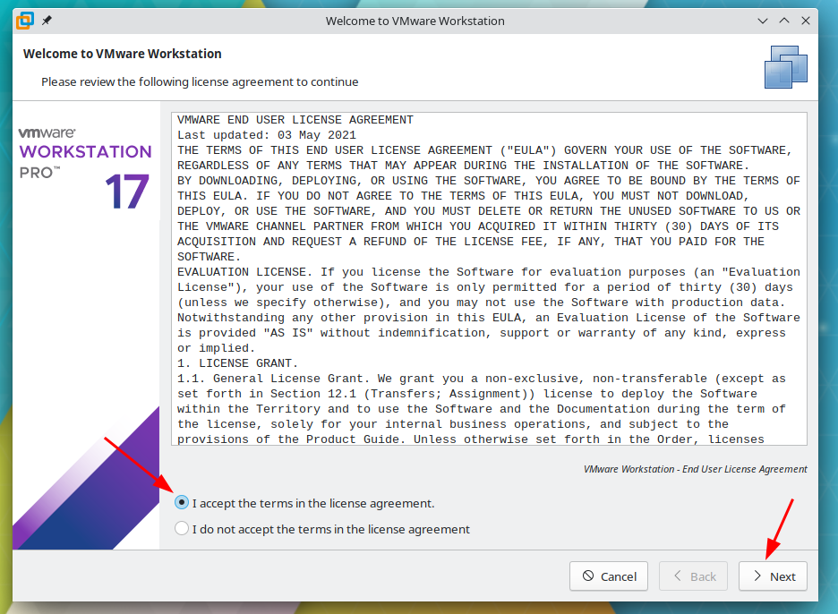](images/04.png)

**5** - Novamente, leia e aceite os termos de uso e clique em **Next**.

[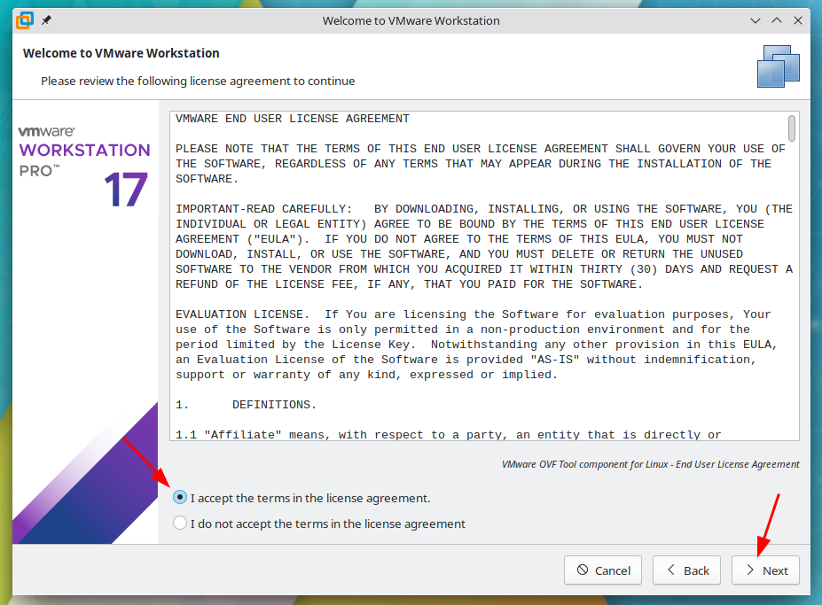](images/05.png)

**6** - Selecione **Yes** para buscar por atualizações na inicialização do programa e clique em **Next**.

[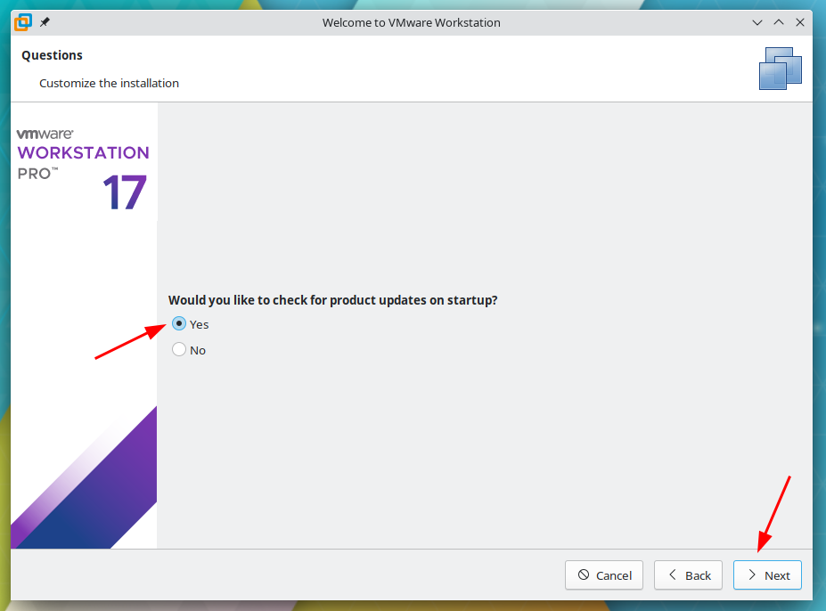](images/06.png)

**7** - Selecione **Yes** se deseja participar do **CEIP** e clique em **Next**.

[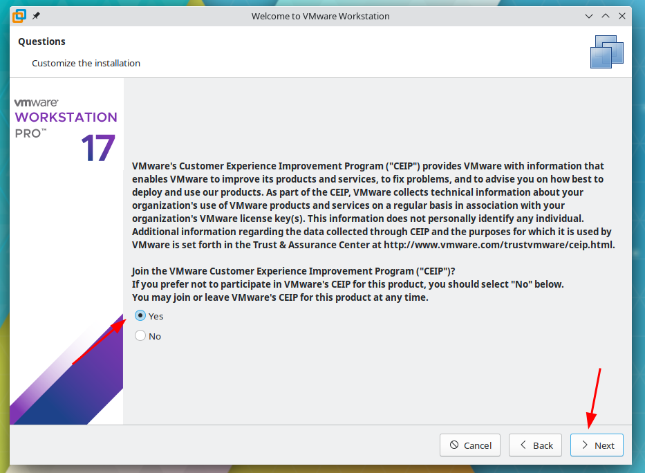](images/07.png)

**8** - Insira sua chave de licença ou selecione testes grátis por 30 dias, clique em **Finish**.

[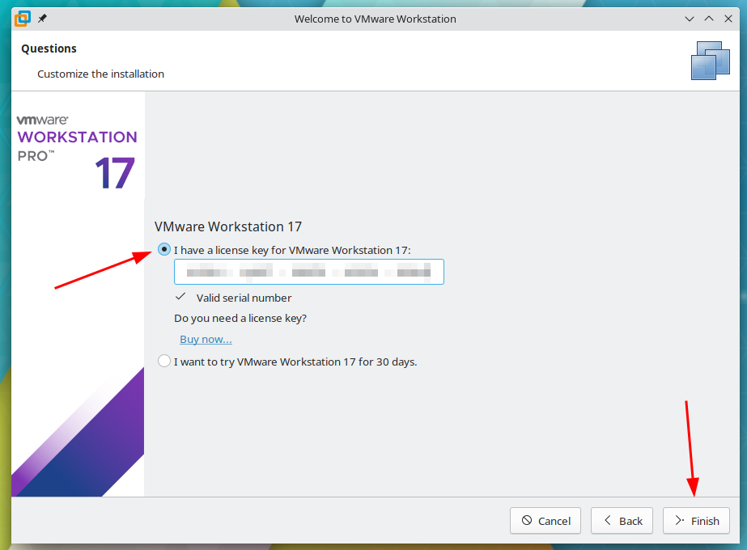](images/08.png)

**9** - Clique em **OK** e pronto, seu VMware Workstation estará pronto para uso.

[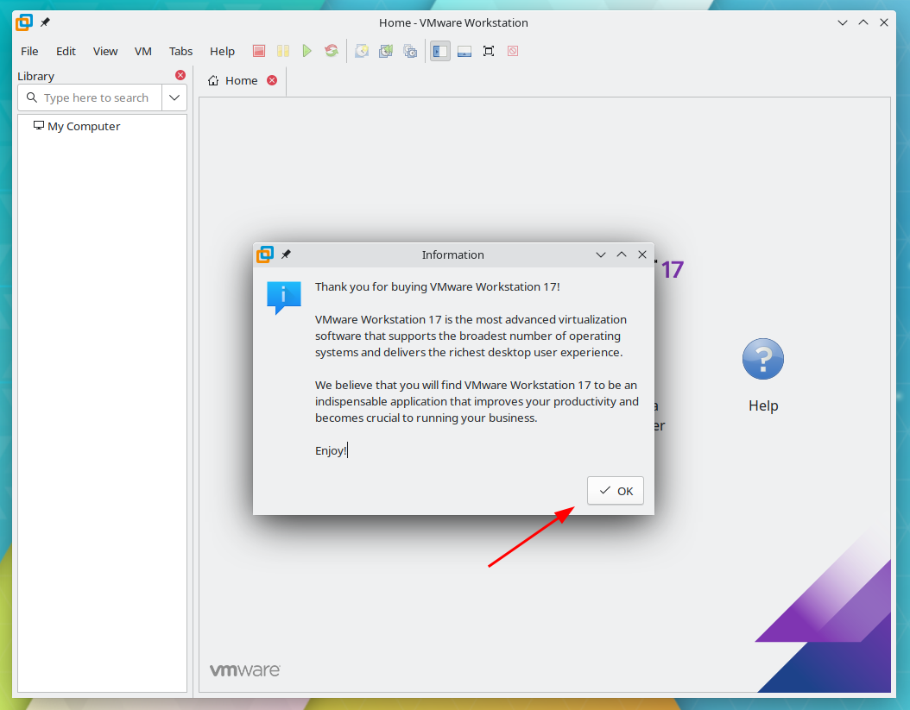](images/09.png)

Para os serviços do **VMware Workstartion** iniciarem junto com o seu **Slackware**, insira as seguintes linha no **/etc/rc.d/rc.local**.

```
# VMware Workstation 
if [ -x /etc/init.d/vmware ]; then 
 /etc/init.d/vmware start 
fi
```

[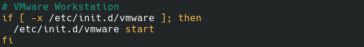](images/10.png) Até o próximo post!

:D
