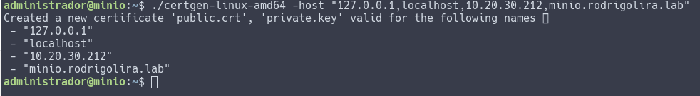
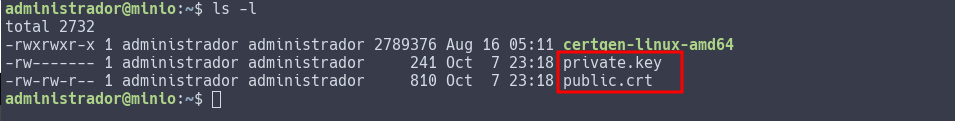
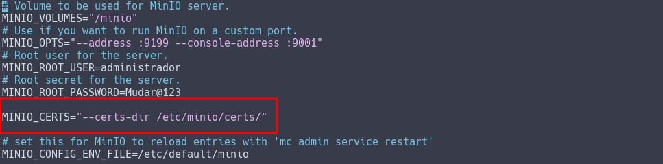
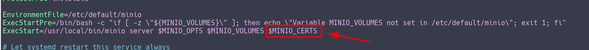
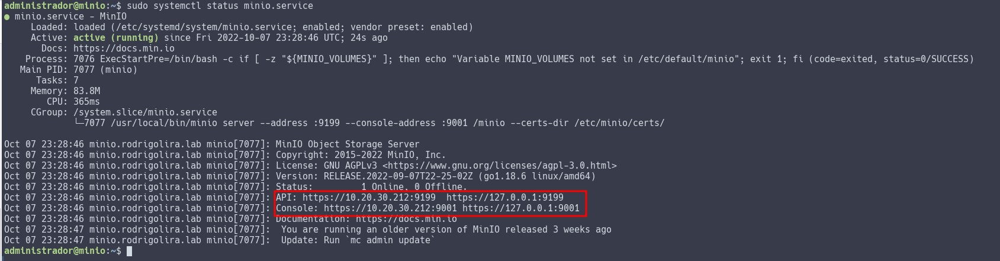
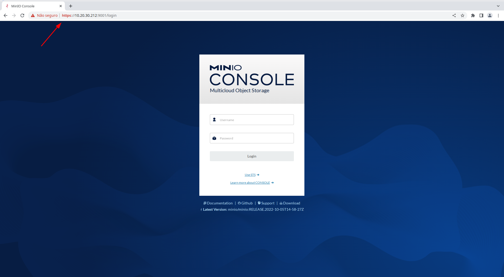

[](images/MINIO_wordmark.png)

Salve Salve Pessoal!

Nesse post vou mostrar como podemos configurar o acesso através de **SSL/TLS** no **MinIO**, o processo é bastante simples.

Para simplificar todo o processo e necessidades da criação do certificados auto assinados, o pessoal do **MinIO** desenvolveu uma ferramenta chamada **certgen**, ela simplemente gera os certificados de maneira bem fácil.

Ela está disponível no github através da seguinte url.

[https://github.com/minio/certgen](https://github.com/minio/certgen)

Vamos para o que interessa! :D

**1** - Primeira coisa que precisamos fazer é baixar o **certgen**, a ferramenta está disponível para diversas plataformas, baixe de acordo com sua plataforma e arquitetura.

```
# wget https://github.com/minio/certgen/releases/download/v1.2.1/certgen-linux-amd64
```

**2** - Vamos dá permissão de execução.

```
# chmod +x certgen-linux-amd64
```

**3** - Agora execute o **certgen** passando os endereços de acesso ao seu minio, no meu caso foi 127.0.0.1, localhost, 10.20.30.212, minio.rodrigolira.lab.

```
# ./certgen-linux-amd64 -host "127.0.0.1,localhost,10.20.30.212,minio.rodrigolira.lab"
```

[](images/2022-10-07_20-19.png)

Após a execução do certegn é gerado dois arquivos, **private.key** e **public.crt**.

[](images/2022-10-07_20-21.png)

**4** - Crie o diretório **/etc/minio/certs**.

```
# mkdir -p /etc/minio/certs
```

**5** - Agora mova os arquivos **private.key** e **public.crt** para dentro do diretório criado.

```
# mv private.key /etc/minio/certs/
```

```
# mv public.crt /etc/minio/certs/
```

**6** - Configure as permissões do diretório e arquivos.

```
# chown -fR minio-user:minio-user /etc/minio
```

**7** - Edite o arquivo **/etc/default/minio** e adicione a seguinte linha.

```
MINIO_CERTS="--certs-dir /etc/minio/certs/"
```

[](images/2022-10-07_20-26.png)

**8** - Agora edite o arquivo **/etc/systemd/system/minio.service** e adicione a variável **$MINIO\_CERTS** ao final da linha que inicia com o **ExecStart**.

[](images/2022-10-07_20-27.png)

**9** - Execute os seguinte comando, para o systemd reler as configurações e reiniciar o serviço do **MinIO**.

```
# systemctl daemon-reload
```

```
# systemctl restart minio.service
```

**10** - Verifique o status do serviço, observe que o serviço agora mostra **https** na **url**.

```
# systemctl status minio.service
```

[](images/2022-10-07_20-29.png)

Pronto, agora só abrir o navegador e ser feliz.

[](images/2022-10-07_20-30.png)

Até o próximo post pessoal!

:D
