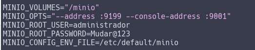
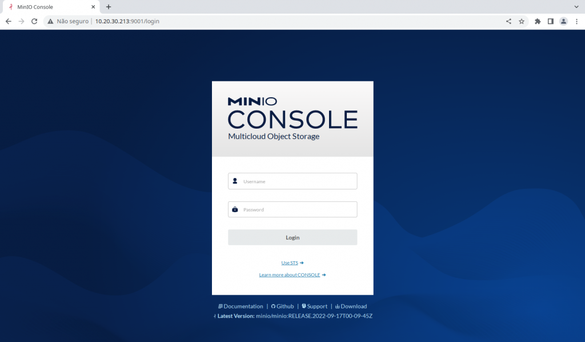
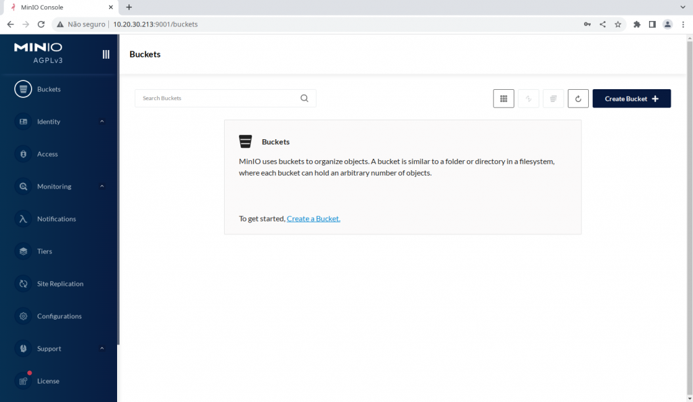

[](images/MINIO_wordmark.png)

Salve Salve Pessoal!

Hoje vamos ver como podemos instalar e configurar o **MinIO**.

O **MinIO** é um sistema de armazenamento do tipo **object storage**, compatível com as features de **API** do **S3** da **AWS**.

É um sistema  de alto desempenho, muito simples de instalar e usar, também é Kubernetes Native, ou seja, compatível com todas as soluções que usam kubernetes, seja em nuvens públicas ou ambientes on-primise.

O **MinIO** é um sistema definido por software, 100% de código aberto sob a licença GNU AGPL v3.

Para maiores informações sobre o **MinIO** acessem o link abaixo:

[https://min.io/](https://min.io/)

Agora vamos ao que interessa. :D

A instalação do **MinIO** pode ser feita de diversas formas, através de um **Kubernetes Operator** para ambientes **Kubernetes**, usando containers como **Docker** ou **Podman**, em sistemas operacionais **Linux**, **Windows** e **macOS.**

Para esse laboratório nós vamos fazer a instalação e configuração direto em um servidor Linux e vamos configurar ele como um serviço do systemd, nós podemos fazer a instalação usando o sistema de pacotes **apt** e **rpm**, porém vamos usar o **binário**.

**1** - Faça o download do binário do MinIO.

```
# wget https://dl.min.io/server/minio/release/linux-amd64/minio
```

**2** - Mova o binário para o **/usr/local/bin**.

```
# mv minio /usr/local/bin/
```

**3** - Crie um usuário chamado **minio-user**.

```
# useradd -M -s /bin/false minio-user
```

**4** - Configure a permissão para o usuário **minio-user** e de execução.

```
# chmod +x /usr/local/bin/minio
```

```
# chown minio-user: /usr/local/bin/minio
```

**5** - Crie um diretório que será usado para o armazenamentos dos dados, pode ser um nome qualquer de sua escolha.

```
# mkdir /minio
```

**6** -  Configure a permissão do diretório para o usuário **minio-user**.

```
# chown minio-user: /minio
```

**7** - Crie o arquivo **/etc/default/minio** com os seguinte conteúdo.

```
MINIO_VOLUMES="/minio" (Diretório que será usado pelo MinIO para armazenar os dados)
MINIO_OPTS="--address :9199 --console-address :9001" (Portas web e console de acesso ao MinIO)
MINIO_ROOT_USER=administrador (Usuário com permissões de root/administrador do MinIO)
MINIO_ROOT_PASSWORD=Mudar@123 (Senha do usuário root/administrador)
MINIO_CONFIG_ENV_FILE=/etc/default/minio (configura o MinIO reler as configurações através do minio cliente 'mc admin service restart') 
```

[](images/minio3.png)

**8** - Baixe o arquivo de configuração do systemd.

```
# wget https://raw.githubusercontent.com/minio/minio-service/master/linux-systemd/minio.service
```

**9** - Mova o arquivo **minio.service** para o diretório **/etc/systemd/system**.

```
# mv minio.service /etc/systemd/system
```

**10** - Execute os seguintes comandos para o systemd reconhecer, habilitar e iniciar o serviço do **MinIO**.

```
# systemctl daemon-reload
```

```
# systemctl enable minio.service
```

```
# systemctl start minio.service
```

**11** - Agora só abrir seu navegador e acessar o **IP** ou **FQDN** do servidor na porta **9001** e logar com o usuário e senha configurados no arquivos **/etc/default/minio.**

[](images/minio1.png)

[](images/minio2.png)

Pronto, MinIO instalado e configurado, no próximo post irei mostrar como podemos criar e configurar um certificado auto assinado no MinIO, e depois como podemos criar buckets, usuários e permissões.

Até o próximo post!

:D
