Salve Salve Pessoal!

Não é novidade para quem me segue aqui no blog que uso o **OpenWrt** nos meus equipamentos wifi, mas nesse post vou mostrar como podemos instalar e configurar a versão mais nova do **OpenWrt** no **ESXi 6.7** para podermos fazer testes antes de aplicar ao nosso ambiente de produção, no meu caso a minha casa. :D

Faça o download da imagem do **OpenWrt 19.07.2** no link abaixo:

[https://downloads.openwrt.org/releases/19.07.2/targets/x86/64/openwrt-19.07.2-x86-64-combined-ext4.img.gz](https://downloads.openwrt.org/releases/19.07.2/targets/x86/64/openwrt-19.07.2-x86-64-combined-ext4.img.gz)

[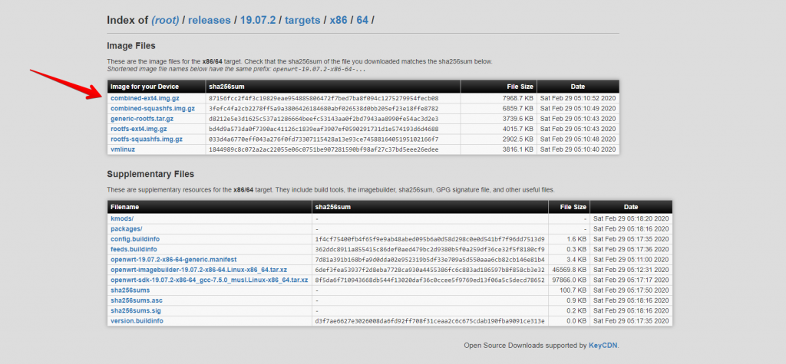](images/001.png)

Diferentemente dos Linux padrão que vem em formato **ISO** para instalação, essa imagem do **OpenWrt** vem no formato **IMG** e não precisamos fazer uma "instalaçao" do sistema no hardware, apenas precisamos converter a imagem para **VMDK**.

Para esse processo podemos usar a ferramenta **StarWind V2V Converter**, ela é free e além de converter o arquivo **.img** para **.vmdk** ela já envia e configura ela no nosso **ESXi**.

Faça o download do **StarWind V2V Converter** no link abaixo:

[https://www.starwindsoftware.com/starwind-v2v-converter#download](https://www.starwindsoftware.com/starwind-v2v-converter#download)

Faça a instalação do programa em seu computador e inicie o programa.

**1** - Selecione **Local file**:

[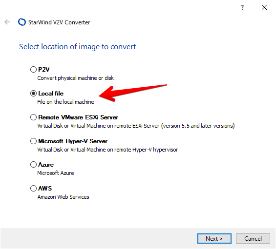](images/002.png)

**2** - Selecione o arquivo **.img** do OpenWrt.

[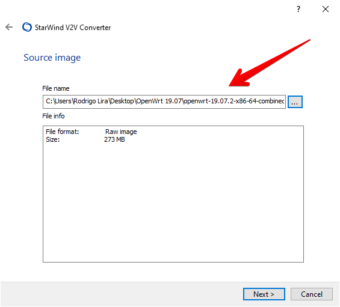](images/003.png)

**OBS:** Quando você fizer o download ele vem compactado em um arquivo **.gz** é preciso que você descompacte primeiro.

**3** - Selecione o destino, em nosso caso **Remote VMware ESXi Server**.

[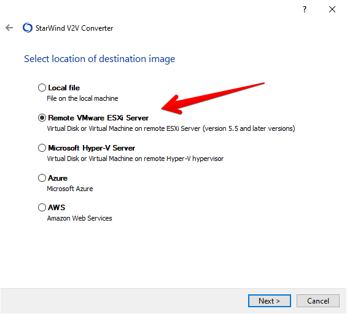](images/004.png)

**4** - Insira os dados do seu servidor ESXi.

[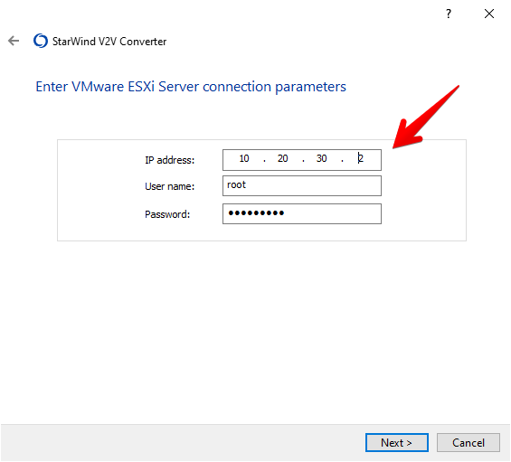](images/005.png)

**5** -  Clique em **Create new virtual machine**.               [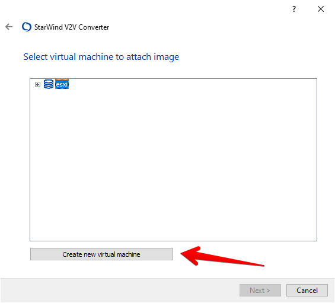](images/006.png)

**6** - Insira as configurações que a sua **VM OpenWrt** vai ter e o caminho(**datastore**) para os arquivos da vm e clique em **OK**.

[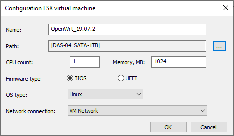](images/007.png)

**7** - Clique em **Next**.

[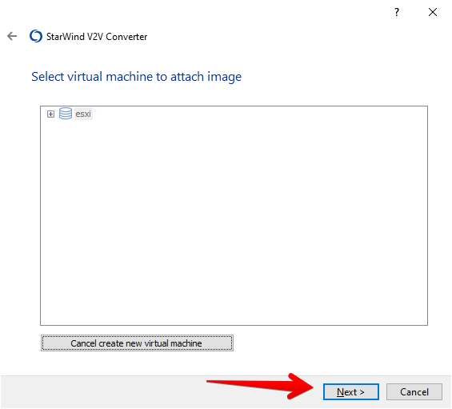](images/008.png)

**8** - Deixe o padrão e clique em **Next**.

[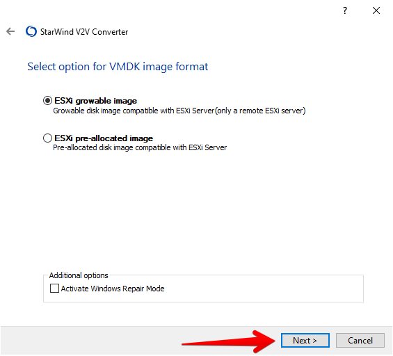](images/009.png)

**9** - Selecione o **destino(datastore)** do arquivo **.vmdk**, normalmente o mesmo diretório do **passo 6** e clique em **Convert**.

[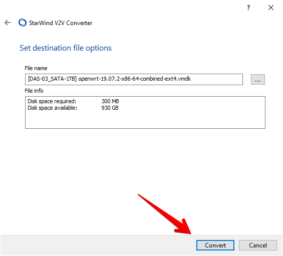](images/010.png)**10** - A imagem **.img** do **OpenWrt** foi convertida para **.vmdk** e enviada para o **ESXi**.

[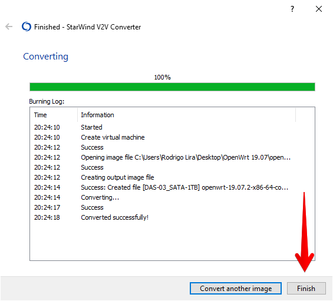](images/011.png)

**11** - Agora acesse seu ESXi.

[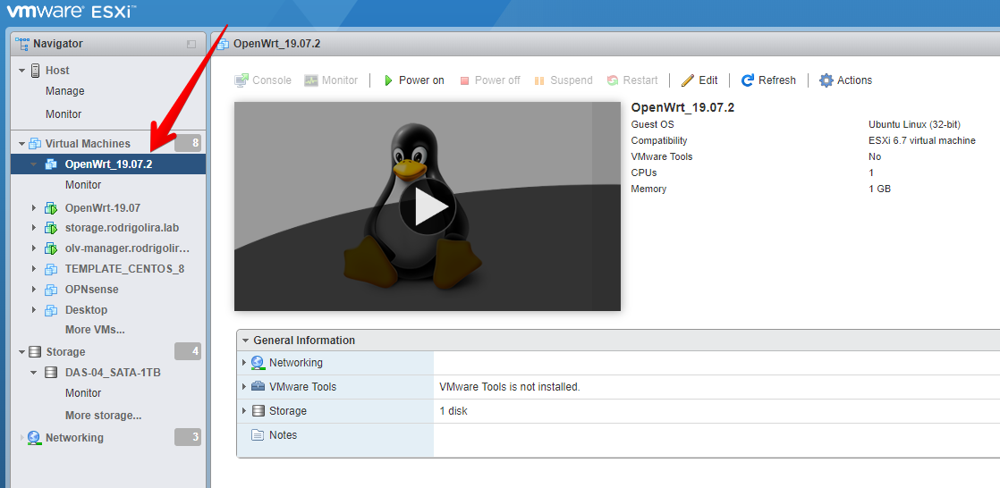](images/013.png)

**12** - Edite as configurações da **VM OpenWrt**.

[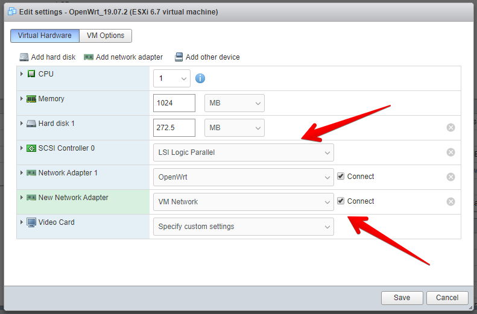](images/012.png)

Mude o Tipo de controladora de **LSI Logic SAS** para **LSI Logic Parallel** e adicione uma **nova interface**.

A primeira interface será a interface que o OpenWrt vai usar como **lan(rede local)**, por padrão o OpenWrt vem com um servidor **DHCP** configurado e ativo, então cuidado para não acabar tendo um servidor DHCP a mais na rede, a segunda interface é a interface **wan(internet)**, ou seja, por onde o OpenWrt vai receber um IP.

Agora só acessar o seu **OpenWrt** e se divertir.

Até a próxima!

:D
