Salve Salve Pessoal!

Nesse post vou mostrar como realizar a instalação e configuração do vCenter Server Appliance 6.5 (VCSA). Na versão 6.5 o processo está dividido em duas partes. A primeira é a parte de instalação e a segunda parte é a configuração.

Com a versão 6.5 o processo de instalação está bem mais fácil, visto que podemos fazer está instalação utilizando diversos sistemas operacionais, para ser mais especifico, Windows, Linux e MacOS e não precisamos de mais nenhum plugin ;)

As novidades que acompanham essa nova versão podem ser encontradas no link abaixo:

https://blogs.vmware.com/vsphere/2016/10/whats-new-in-vsphere-6-5-vcenter-server.html

Neste processo de instalação, estou utilizando o MacOS, a diferença básica para outro sistemas é como montar a ISO e o caminho do instalador.

Vamos ao que interessa :D

**Primeiro Parte - Instalação**

**1 -** Monte a ISO, o processo de montagem pode variar de acordo com o sistema operacional, no meu caso utilizei o **DiskImageMounter**, nativo do próprio MacOS.

[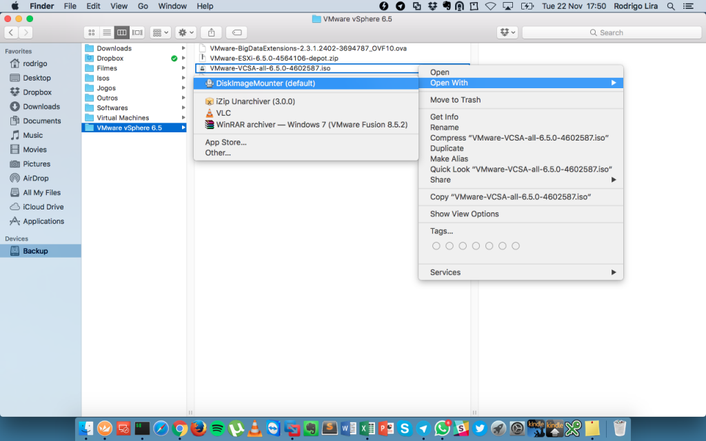](http://rodrigolira.eti.br/wp-content/uploads/2016/11/Screen-Shot-2016-11-22-at-17.50.13.png)

2 - Com a ISO montada, acesse o diretório **vcsa-ui-installer > mac** e clique em **Installer**:

[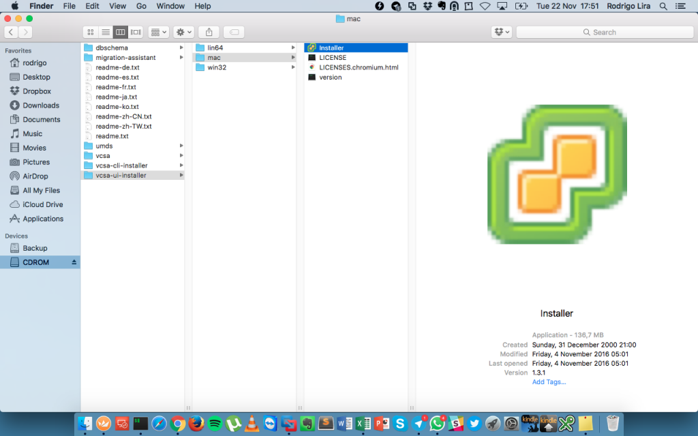](http://rodrigolira.eti.br/wp-content/uploads/2016/11/Screen-Shot-2016-11-22-at-17.51.04.png)

3 - Uma nova aba será aberta, clique em **Install**:

[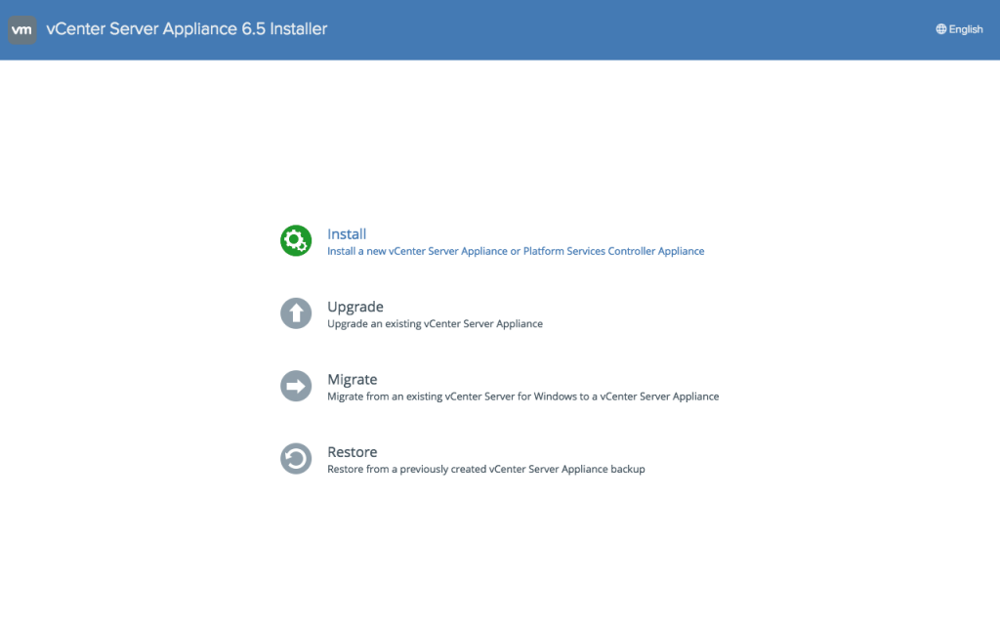](http://rodrigolira.eti.br/wp-content/uploads/2016/11/Screen-Shot-2016-11-22-at-17.51.56.png)

4 - Clique em **Next**:

[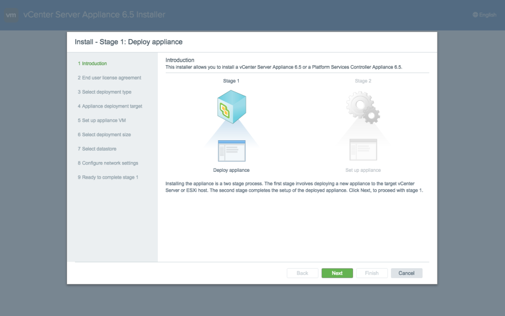](http://rodrigolira.eti.br/wp-content/uploads/2016/11/Screen-Shot-2016-11-22-at-17.52.10.png)

5 - Aceite as licenças de uso e clique em **Next**:

[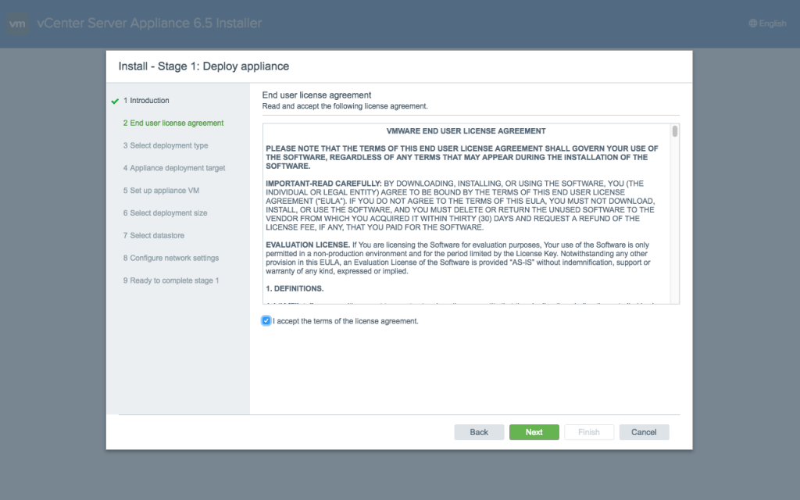](http://rodrigolira.eti.br/wp-content/uploads/2016/11/Screen-Shot-2016-11-22-at-17.52.25.png)

6 - Selecione o tipo de instalação, no meu caso será **Embedded Plataform Services Controller** e clique em **Next**:

[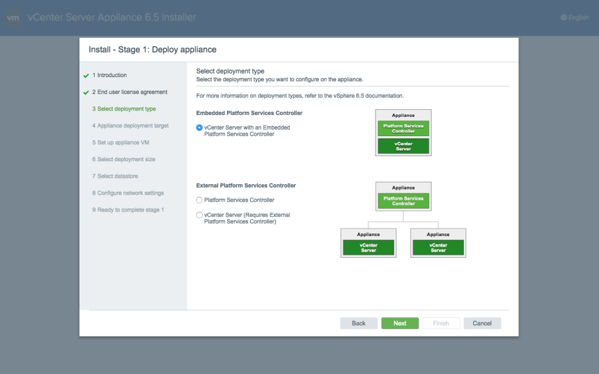](http://rodrigolira.eti.br/wp-content/uploads/2016/11/Screen-Shot-2016-11-22-at-17.52.29.png)

Para maiores informações sobre o tipo de instalação acesso o link abaixo:

[https://pubs.vmware.com/vsphere-60/index.jsp?topic=%2Fcom.vmware.vsphere.upgrade.doc%2FGUID-ACCD2814-0F0A-4786-96C0-8C9BB57A4616.html](https://pubs.vmware.com/vsphere-60/index.jsp?topic=%2Fcom.vmware.vsphere.upgrade.doc%2FGUID-ACCD2814-0F0A-4786-96C0-8C9BB57A4616.html)

7 - Informe o destino(host) onde a instalação será realizada e clique em **Next**:

[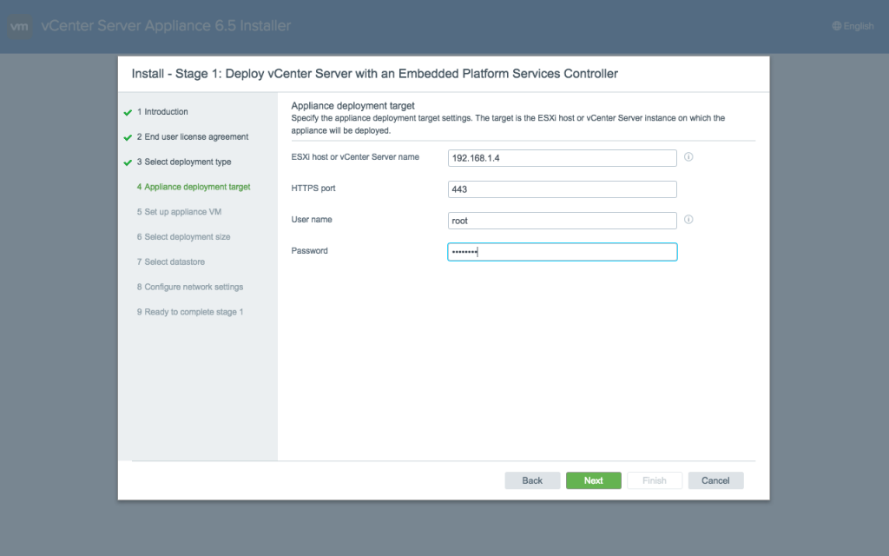](http://rodrigolira.eti.br/wp-content/uploads/2016/11/Screen-Shot-2016-11-22-at-17.52.43.png)

8 - Aceite o **certificado** do host clicando em **Yes**:

[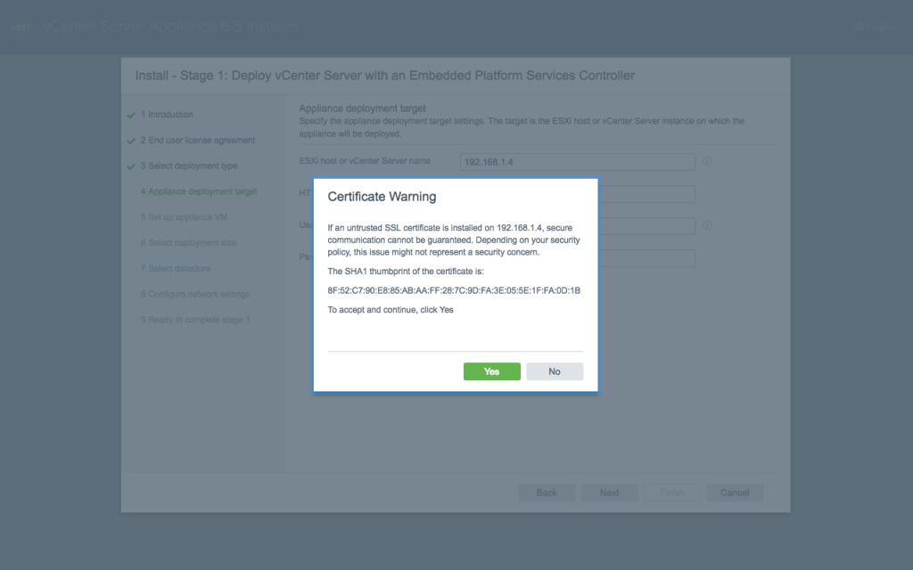](http://rodrigolira.eti.br/wp-content/uploads/2016/11/Screen-Shot-2016-11-22-at-17.52.48.png)

9 - Insira o **nome da VM** e a **senha de root** e clique em **Next**:

[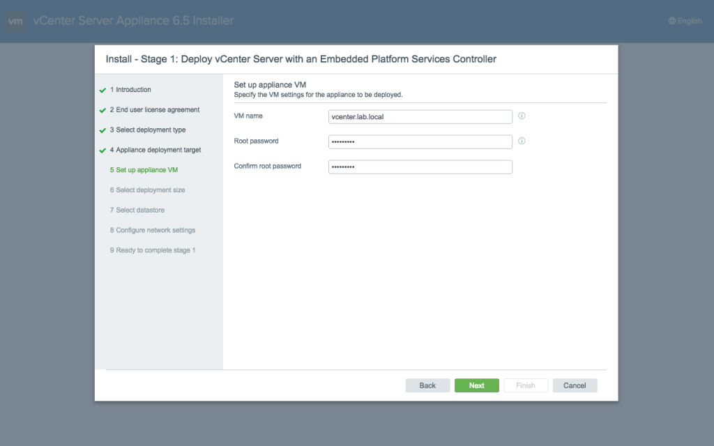](http://rodrigolira.eti.br/wp-content/uploads/2016/11/Screen-Shot-2016-11-22-at-17.53.53.png)

10 - Selecione o tamanho da instalação e clique em **Next**:

[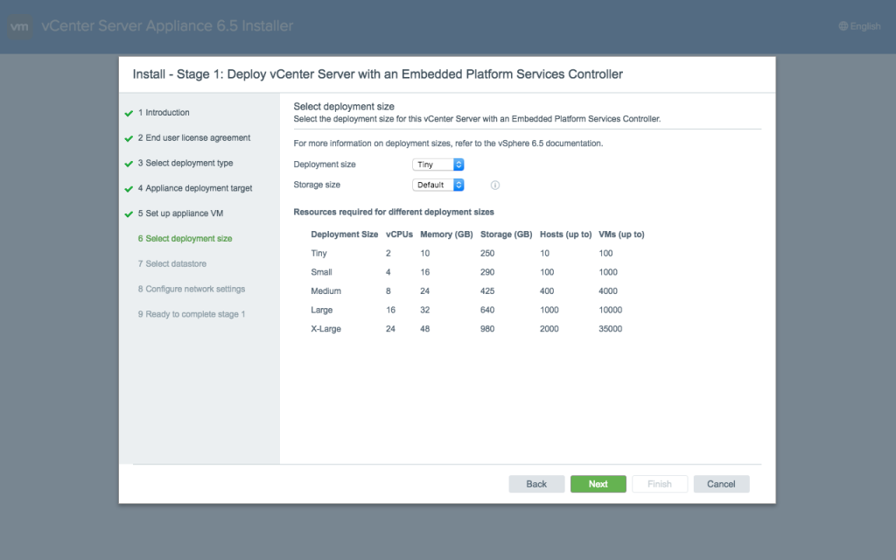](http://rodrigolira.eti.br/wp-content/uploads/2016/11/Screen-Shot-2016-11-22-at-19.17.22.png)

Isso vai váriar de acordo com seu ambiente, como meu ambiente é apenas para labs, o Tiny já é o suficiente. Tive problemas com essa parte da instalação utilizando o MacOS, o link abaixo mostra como resolver o problema:

http://rodrigolira.eti.br/deploy-vcenter-server-6-5-error-ovftool-is-not-available/

11 - Selecione o datastore onde será realizada a instalação e clique em **Next**:

[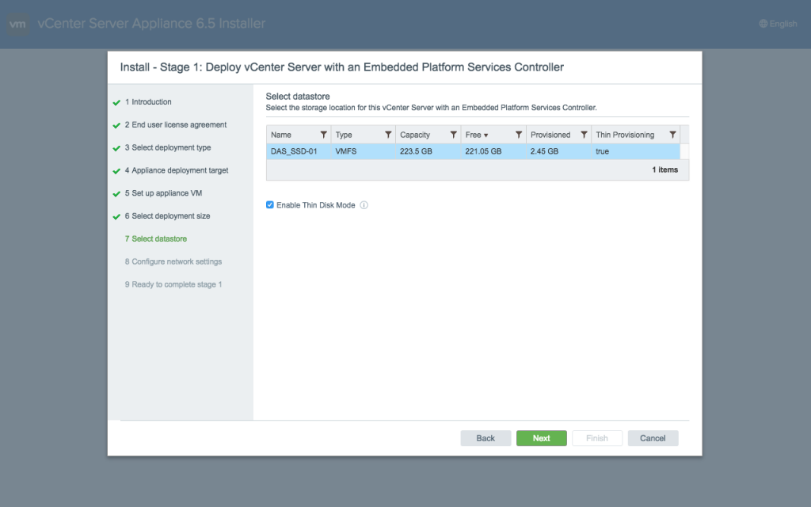](http://rodrigolira.eti.br/wp-content/uploads/2016/11/Screen-Shot-2016-11-22-at-19.17.27.png)

Caso deseje, pode habilitar o modo **Thin** para o disco de destino da instalação, para saber mais sobre o modo thin acesse o link abaixo:

[http://vmwarebrasil.blogspot.com.br/2013/04/qual-diferenca-entre-discos-thick-thin.html](http://vmwarebrasil.blogspot.com.br/2013/04/qual-diferenca-entre-discos-thick-thin.html)

12 - Insira as configurações de rede e clique em **Next**:

[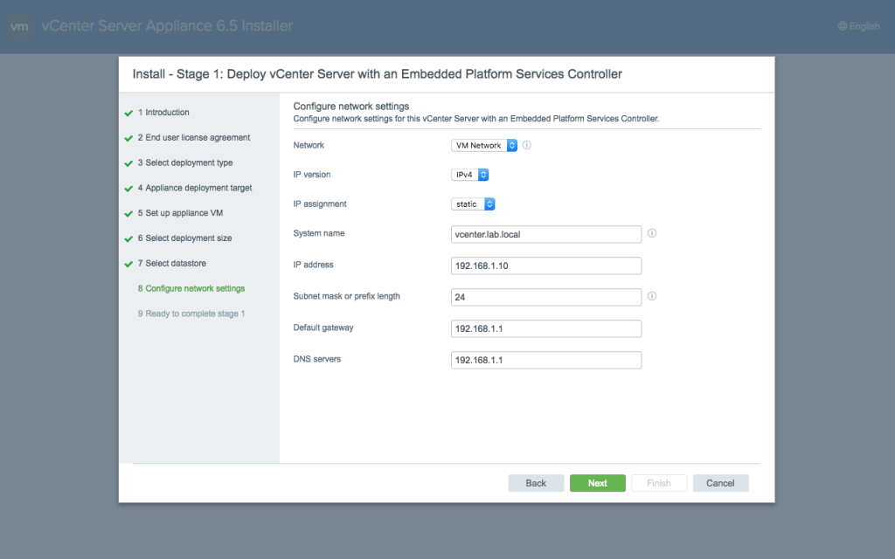](http://rodrigolira.eti.br/wp-content/uploads/2016/11/Screen-Shot-2016-11-22-at-19.17.57.png)

13 - Reveja as configurações e clique em **Finish**:

[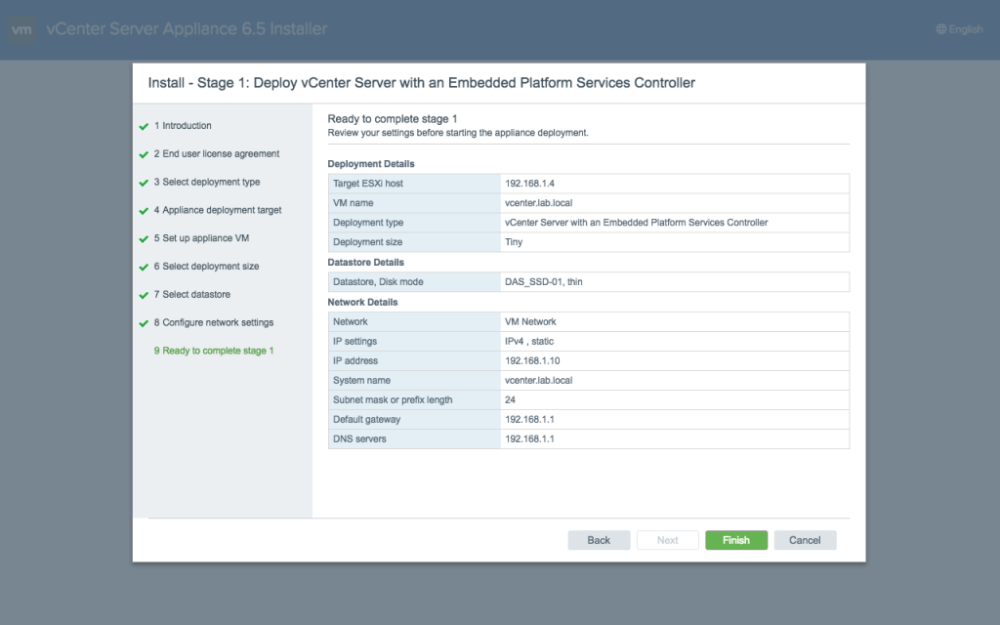](http://rodrigolira.eti.br/wp-content/uploads/2016/11/Screen-Shot-2016-11-22-at-19.18.04.png)

14 - O processo de instalação é iniciado:

[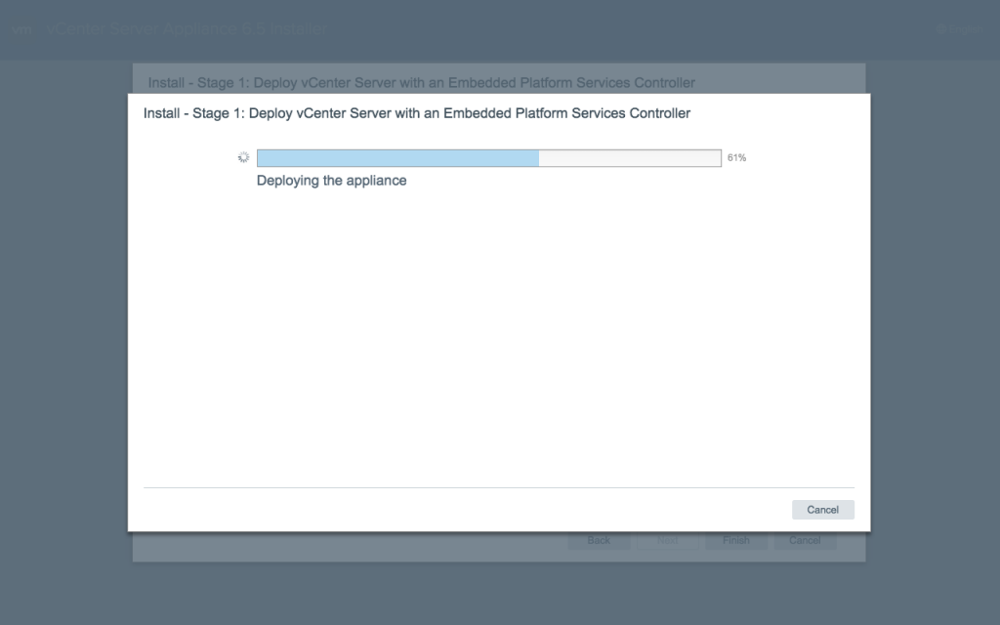](http://rodrigolira.eti.br/wp-content/uploads/2016/11/Screen-Shot-2016-11-22-at-19.18.49.png)

Obs: Tive problemas com a finalização do processo de instalação, acontecia que ficava em 80% e não passava disso, até que dava erro, mas o processo era concluído normalmente, quando acessava pelo navegador, tudo tinha ocorrido normalmente, não sei o que pode ser, fiz os testes do Windows e MacOS e dava o mesmo erro :(

15 - Processo de instalação finalizado, clique em **Continue** ou abra o navegador e digite o seguinte endereço **https://vcenter.lab.local:5480** para ir para a segunda parte:

[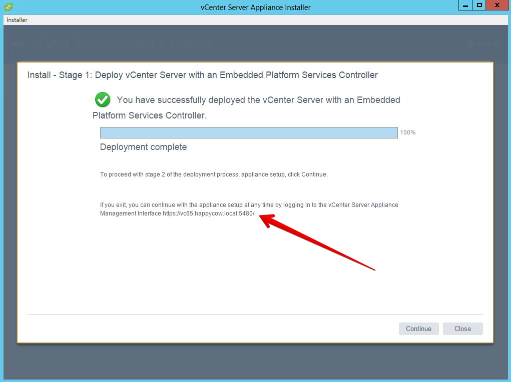](http://rodrigolira.eti.br/wp-content/uploads/2016/11/up10.png)

Créditos da imagem: https://3.bp.blogspot.com/-x4D1Y9TjKpI/WCtlNZfMrcI/AAAAAAAABaI/V8leQytGU80jAfjWd2ry3n3ICGLsg5tCACLcB/s1600/up10.JPG

Como podem perceber, a imagem anterior não foi produzida por mim, como disse anteriormente no meu caso a istalação ficava em 80% e não saia disso :(

**Segunda Parte - Configuração**

16 - Clique em **Set up vCenter Server Appliance**:

[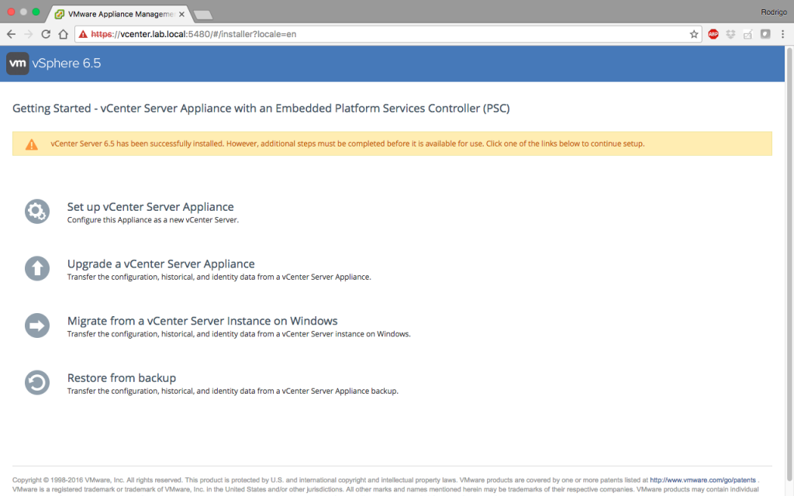](http://rodrigolira.eti.br/wp-content/uploads/2016/11/Screen-Shot-2016-11-22-at-19.59.48.png)

Obs: Como tive que continuar o processo de instalação pelo navegador, a imagem acima apareceu para mim, caso ocorra tudo bem com o processo de instalação, quando você clicar em Continue(passo 15) o seu já ira abrir como a imagem abaixo ;)

17 - Clique em **Next**:

[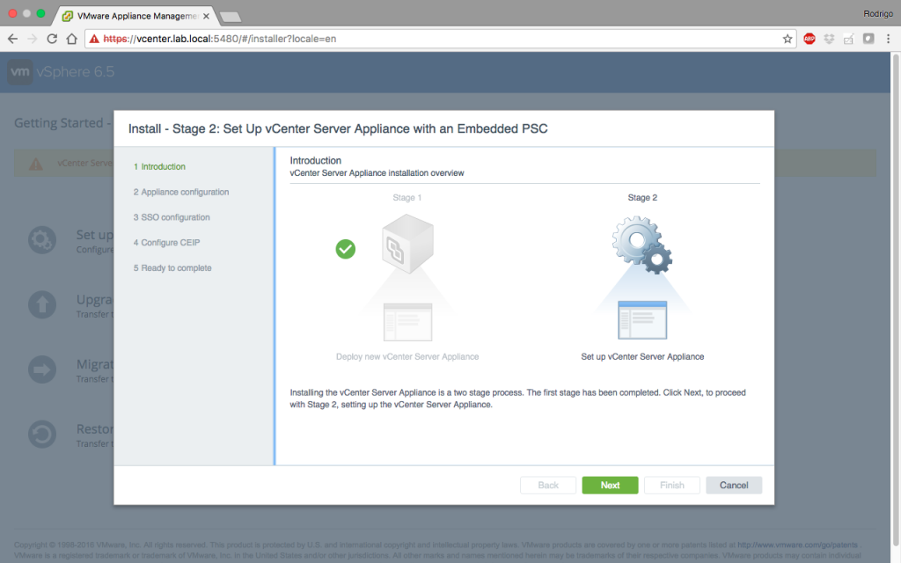](http://rodrigolira.eti.br/wp-content/uploads/2016/11/Screen-Shot-2016-11-22-at-20.00.16.png)

18 - As informações já serão preenchidas automaticamente de acordo com o que você fez anteriormente, insira apenas o **servidor NTP** e clique em **Next**:

[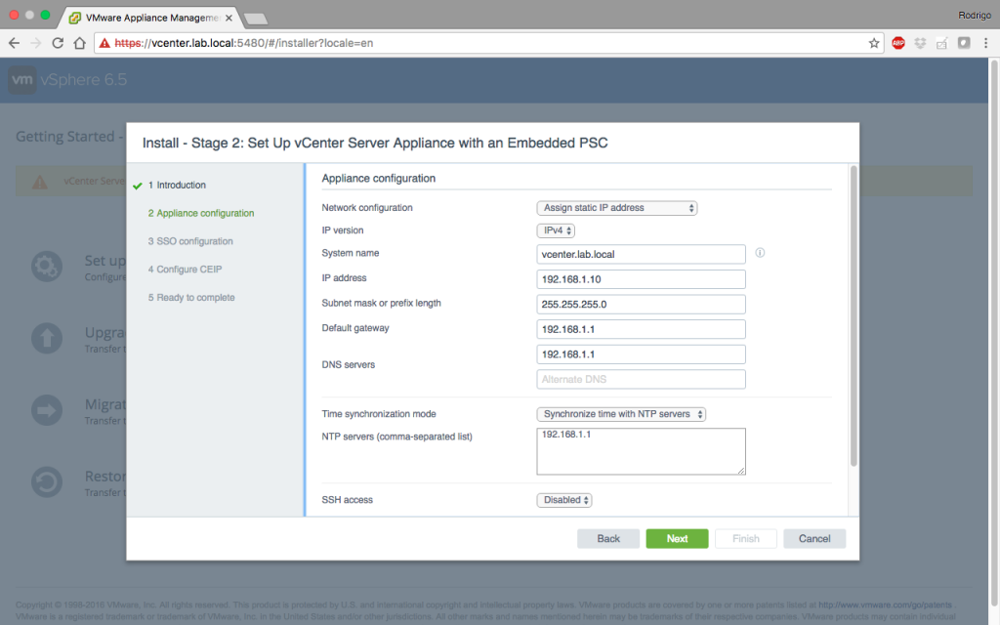](http://rodrigolira.eti.br/wp-content/uploads/2016/11/Screen-Shot-2016-11-22-at-20.00.58.png)

19 - Insira as configurações de **SSO**:

[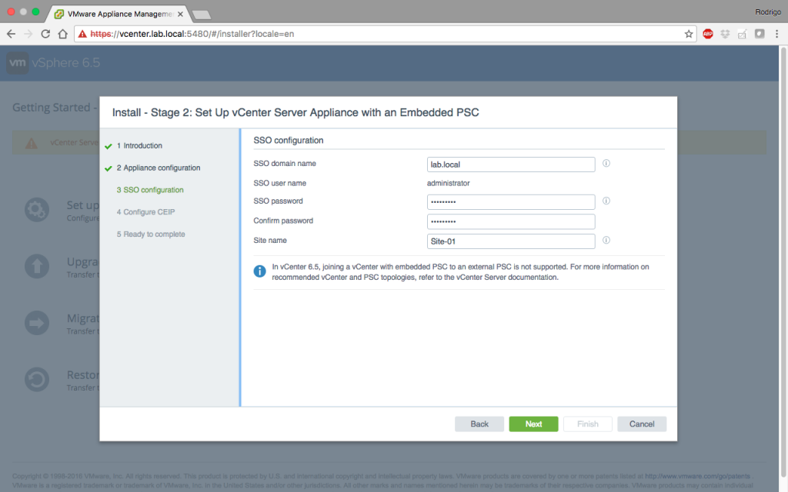](http://rodrigolira.eti.br/wp-content/uploads/2016/11/Screen-Shot-2016-11-22-at-20.01.46.png)

20 - Selecione a caixa se deseja participar do programa de experiência da VMware e clique em **Next**:

[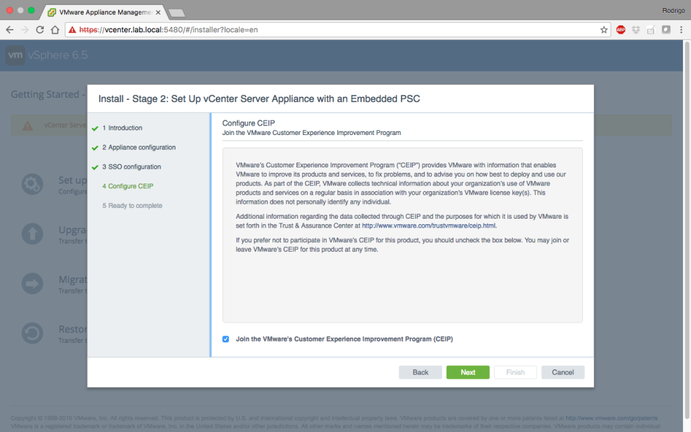](http://rodrigolira.eti.br/wp-content/uploads/2016/11/Screen-Shot-2016-11-22-at-20.01.56.png)

21 - Reveja as configurações e clique em **Finish**:

[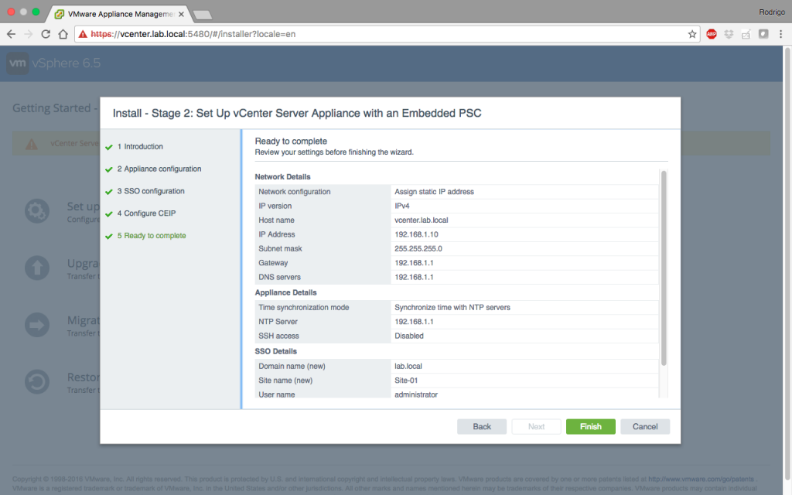](http://rodrigolira.eti.br/wp-content/uploads/2016/11/Screen-Shot-2016-11-22-at-20.02.08.png)

22 - O processo de configuração é iniciado:

[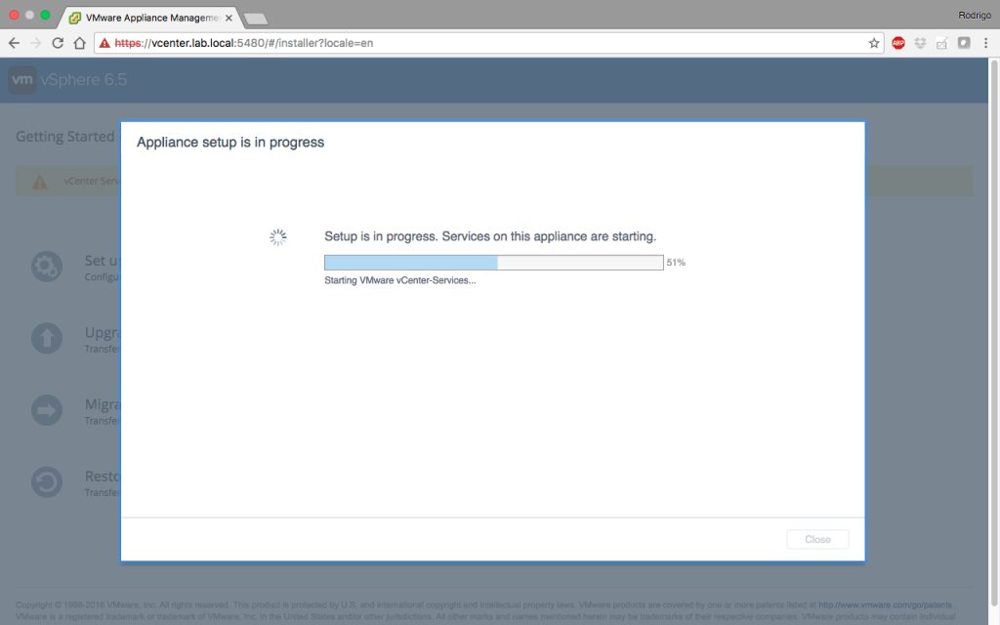](http://rodrigolira.eti.br/wp-content/uploads/2016/11/Screen-Shot-2016-11-22-at-20.05.37.png)

23 - Ao final da configuração, você pode abrir o vSphere Web Client ou a página do vCenter, ao qual vai ter acesso a versão em HTML 5 do Web Client:

[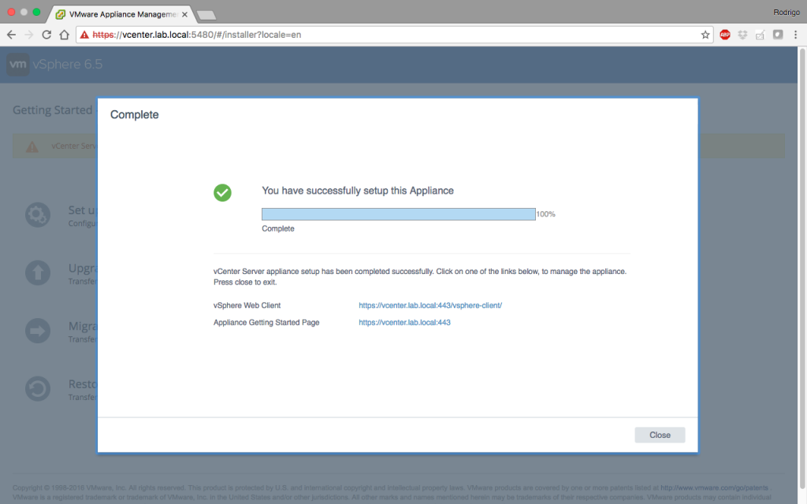](http://rodrigolira.eti.br/wp-content/uploads/2016/11/Screen-Shot-2016-11-22-at-20.48.06.png)

Pronto :D

vCenter Server Appliance 6.5 instalado e configurado, agora começa a brincadeira ;)

Página principal :D

[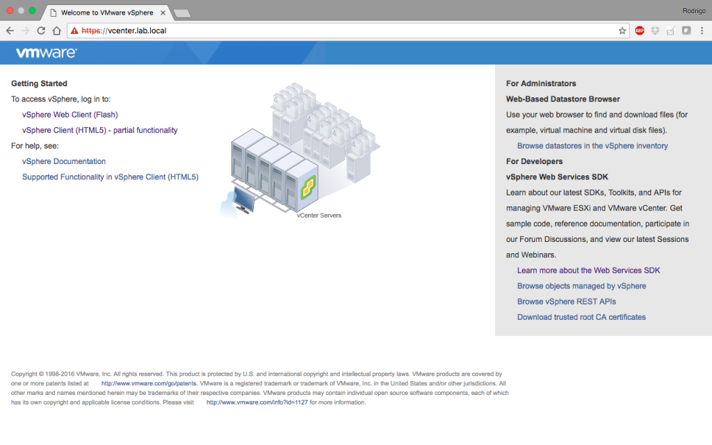](http://rodrigolira.eti.br/wp-content/uploads/2016/11/Screen-Shot-2016-11-22-at-22.18.55.png)

Espero que tenham gostado e até a próxima ;)

Documentação VMware vSphere 6.5

[http://pubs.vmware.com/vsphere-65/index.jsp](http://pubs.vmware.com/vsphere-65/index.jsp)
