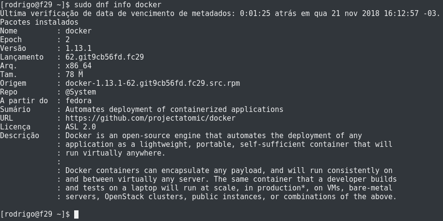
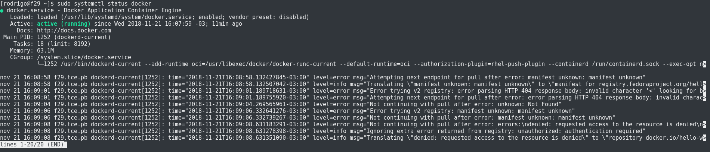
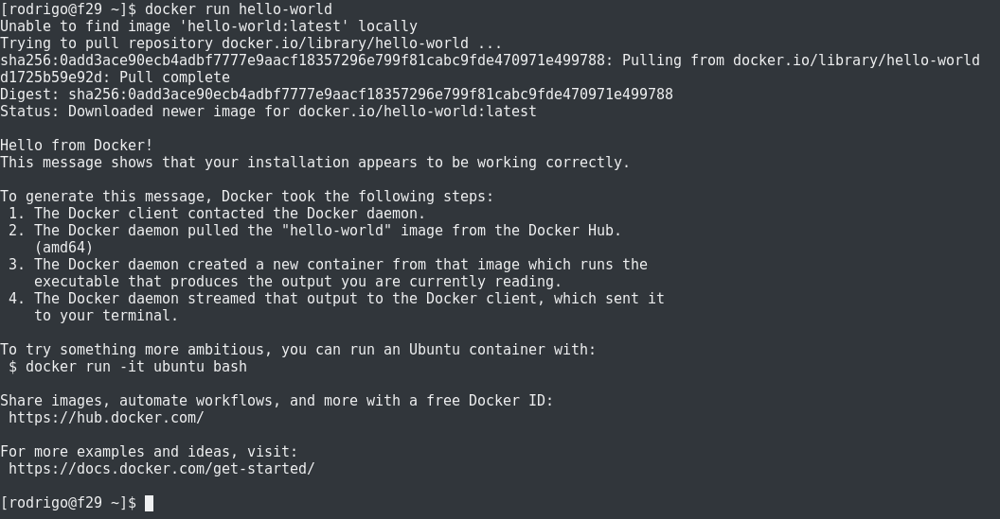
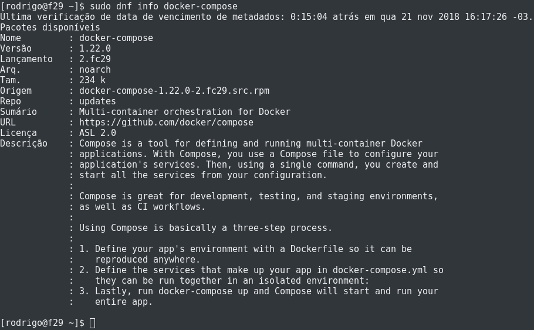

Salve Salve Pessoal!

Nesse post vou mostrar como podemos realizar a instalação do **Docker** e do **Docker Compose** no **Fedora 29**.

O **Docker** já está disponível por padrão nos repositórios do Fedora, ou seja, não precisamos adicionar nenhum repositório de terceiros para realizar a sua instalação.

Para termos mais informações sobre a versão do docker que vamos instalar, basta executarmos o comando abaixo:

```
# sudo dnf info docker
```

[](images/2018-11-21_16-15.png)

Agora que já temos mais informações sobre o pacote, execute o comando abaixo para realizar a instalação do Docker.

```
# sudo dnf install -y docker
```

Depois de Instalado inicie o serviço.

```
# sudo systemctl start docker
```

Verifique se o serviço está rodando.

```
# sudo systemctl status docker
```

[](images/2018-11-21_16-19.png)

Se deseja habilitar o serviço para que ele inicie junto com o sistema operacional, execute o comando.

```
# sudo systemctl enable docker
```

Pronto, docker instalado, mas para não ficarmos passando o comando **sudo** toda vez que vamos executar o docker, basta criarmos um grupo chamado docker e colocar nosso usuário nesse grupo.

```
# sudo groupadd docker (cria o grupo)
```

```
# sudo usermod -aG docker rodrigo (adiciona o usuário rodrigo ao grupo docker)
```

Agora podemos executar o docker sem passar o sudo.

```
# docker run hello-world
```

[](images/2018-11-21_16-25.png)

Com o docker instalado, agora só precisamos instalar o **Docker Compose**, assim como o docker o docker compose também está disponível nos repositórios do fedora, então para termos mais informações sobre a versão do docker compose que vamos instalar, basta executar o comando abaixo.

```
# sudo dnf info docker-compose
```

[](images/2018-11-21_16-32.png)Agora só instalar.

```
?# sudo dnf install -y docker-compose
```

Pronto, **docker** e **docker compose** instalados com sucesso.

Espero que tenham gostado e até o próximo post!

:D
