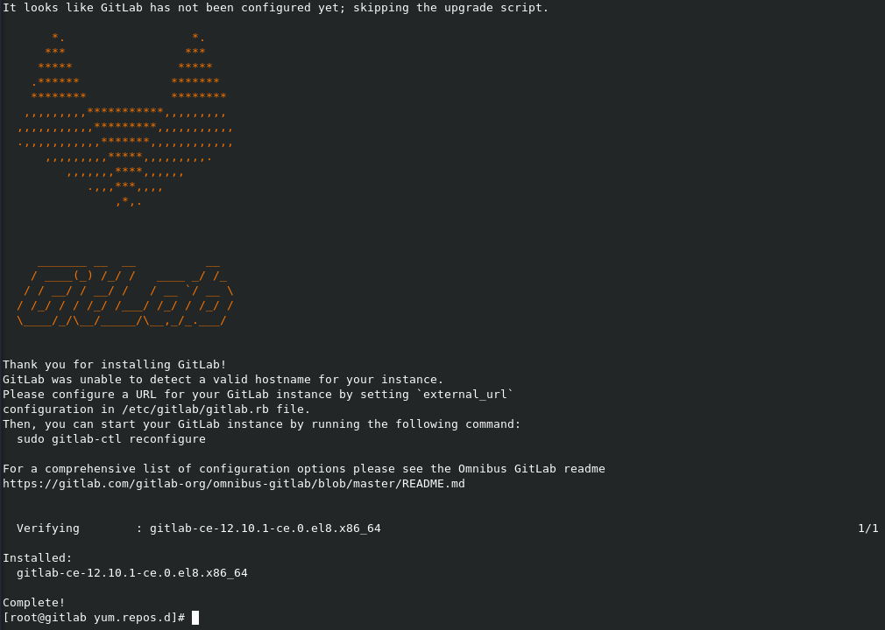
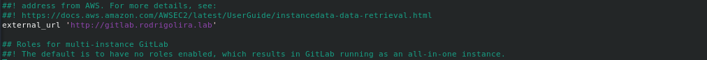
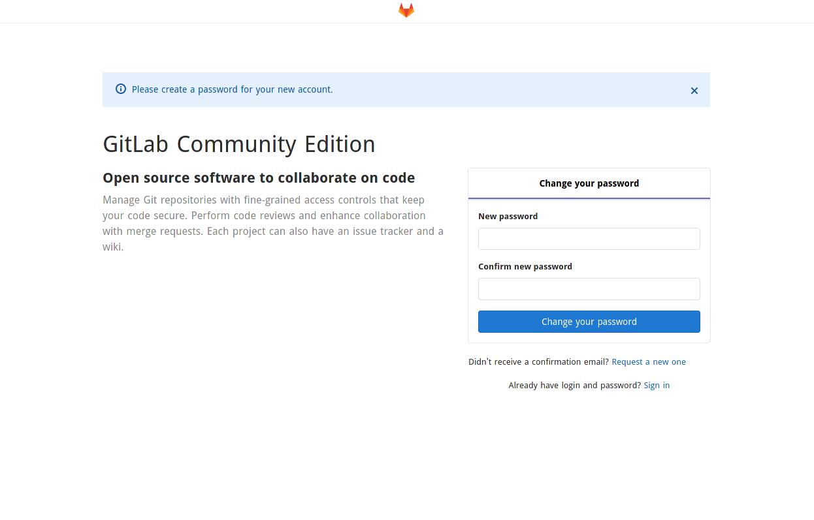
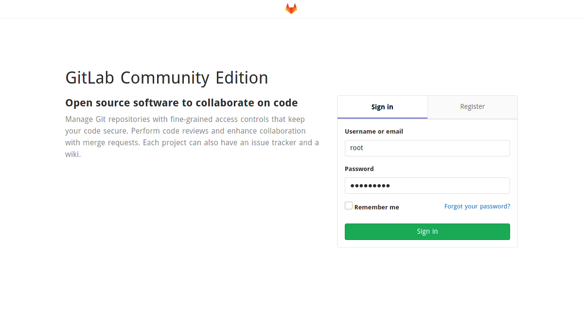
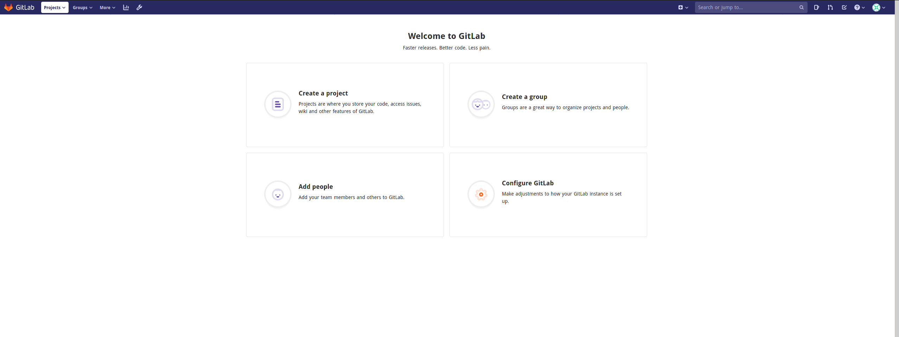

[](images/gitlab-1.png)

Salve Salve Pessoal!

Neste post vou mostrar como podemos fazer a instalação do **GitLab Community Edition no CentOS 8 / Oracle Linux 8 / RHEL 8**.

Para quem não conhece o GitLab é um gerenciador de repositório de software GIT, mas ele não se limita apenas em armazenar e versionar seus códigos, ele é uma caixa de ferramentas da prática DevOps completa.

Nós podemos utilizar tanto a plataforma online deles como podemos fazer a instalação local de nosso próprio servidor. Existem duas versões do **GitLab** a versão **Community Edition** e **Enterprise Edition**, a diferença entre os dois estão nas features disponíveis.

Existem diversas possibilidade de instalação do GitLab, Repositório, Docker, Kubernetes, Source e etc, para esse post vamos instalar usando o repositório oficial. Nós vamos fazer a instalação do **GitLab Omnibus Package**.

O **Omnibus Package** contém todos os recursos necessários para execução do GitLab em um único pacote(PostgreSQL, Ruby, Go, Nginx, Git e etc), é a maneira mais fácil de instalar e configurar e também é a maneira recomendada pela própria GitLab.

Acesse o link abaixo para ter acesso aos detalhes do **Omnibus** **Package**.

[https://docs.gitlab.com/omnibus/](https://docs.gitlab.com/omnibus/)

Os requisitos para instalação vão variar de acordo com a quantidade de usuários e quantidade de features que você deseja habilitar, mas para começar o indicado é pelo menos **8 GB de Mémoria RAM** e **1 Processador com 2 Cores**.

Acesse o link abaixo para ter acesso a mais detalhes dos requisitos de instalação.

[https://docs.gitlab.com/ce/install/requirements.html](https://docs.gitlab.com/ce/install/requirements.html)

Para maiores informações sobre o GitLab acessem os links abaixo:

[https://about.gitlab.com/](https://about.gitlab.com/)

[https://about.gitlab.com/install/ce-or-ee/](https://about.gitlab.com/install/ce-or-ee/)

[https://about.gitlab.com/features/](https://about.gitlab.com/features/)

Agora vamos ao que interessa! :D

1 - Vamos fazer a instalação das dependências, execute o comando abaixo.

```
# dnf install -y curl policycoreutils openssh-server postfix
```

2 - Agora vamos iniciar e habilitar o ssh e postfix para iniciar junto com o sistema operacional.

```
# systemctl enable sshd
```

```
# systemctl start sshd
```

```
# systemctl enable postfix
```

```
# systemctl start postfix
```

3 - Vamos configurar as regras de firewall, para permitir as conexões na porta 80(HTTP), 443(HTTPS) e 22(SSH).

```
# firewall-cmd --permanent --add-service=http
```

```
# firewall-cmd --permanent --add-service=https
```

```
# firewall-cmd --permanent --add-service=ssh
```

```
# firewall-cmd --reload
```

4 - Agora vamos configurar o repositório do GitLab.

```
# curl https://packages.gitlab.com/install/repositories/gitlab/gitlab-ce/script.rpm.sh | sudo bash
```

5 - E agora vamos instalar o GitLab

```
# dnf install -y gitlab-ce
```

Como estamos fazendo a instalação do **GitLab** **Omnibus Package** o pacote do GitLab é um pouco grande e pode demorar um pouco dependendo da sua internet.

Se tudo der certo seu terminal ficará como está a imagem abaixo:

[](images/gitlab.png)

6 - Agora precisamos configurar a **URL** de acesso, edite o arquivo **/etc/gitlab/gitlab.rb**.

```
# vim /etc/gitlab/gitlab.rb
```

Altere a linha **external\_url 'http://gitlab.example.com'** para a URL desejada, como no exemplo abaixo.

```
external_url 'http://gitlab.rodrigolira.lab'
```

[](images/2020-04-25_23-30.png)

**OBS:** Não esqueça de criar a entrada para o GitLab em seu DNS.

7 - Agora precisamos executar o comando abaixo para o GitLab reconfigurar a URL internamente.

```
# gitlab-ctl reconfigure
```

8 - Depois de reconfigurar o acesso web já vai estar disponível, quando você abrir o GitLab em seu navegador será solicitado **criar uma senha**.

[](images/2020-04-25_23-32.png)

9 - Agora só fazer o login com usuário **root** e a senha que você criou.

[](images/2020-04-25_23-42.png)

Pronto, GitLab instalado e configurado!

[](images/2020-04-25_23-34.png)

Pretendo fazer outros posts sobre o GitLab, mostrando como podemos configurar e habilitar as features do mesmo.

Até o próximo post!

:D
