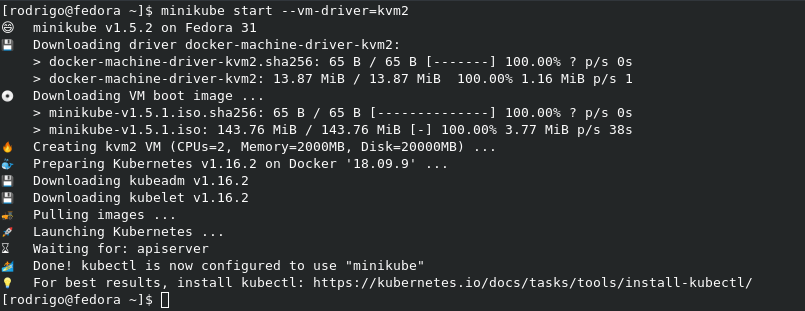
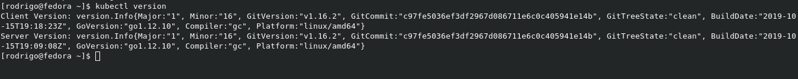
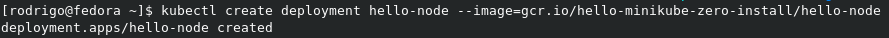
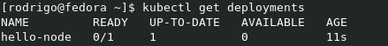
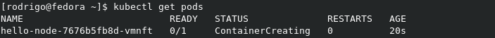
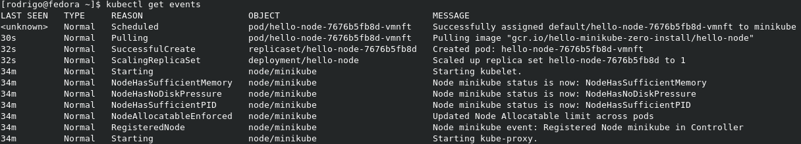
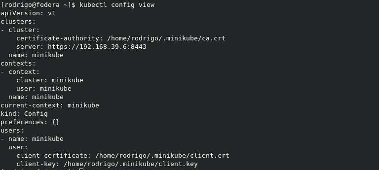

[](images/minikube.jpg)

Salve Salve Pessoal!

Neste post vou mostrar como podemos fazer a instalação do **Minikube** e do **Kubectl**.

Para quem não sabe o que é o Mikikube é uma ferramenta que facilita a criação e execução **Kubernetes**, ele executa um cluster Kubernetes em uma única maquina virtual, ele é essencial para as pessoas que estão aprendendo Kubernetes.

Para execução do minikube precisamos ter instalado em nosso computador o **KVM** ou o **VirtualBox**, nesse post vamos fazer a instalação usando o KVM.

Também é possível rodarmos diretamente em nosso host sem a necessidade de uma maquina virtual, porém é necessário que o sistema operacional seja um **Linux** e que tenha o **Docker** instalado.

Vamos ao que interessa! :D

**Instalação do Minukube**

**1** - Baixe as dependências necessárias, no nosso caso os pacotes do KVM.

```
# sudo dnf install -y @virtualization
```

**2** - Habilite e inicie o serviço.

```
# sudo systemctl enable libvirtd

# sudo systemctl start libvirtd
```

**3** - Faça o download do Minikube.

```
# curl -Lo minikube https://storage.googleapis.com/minikube/releases/latest/minikube-linux-amd64
```

**4** - Configure a permissão de execução.

```
# chmod +x minikube
```

**5** - Crie o diretório **/usr/local/bin/**.

```
# sudo mkdir -p /usr/local/bin/
```

**6** - Instale o Minikube.

```
# sudo install minikube /usr/local/bin/
```

**7** - Remova o instalador.

```
# rm minikube
```

**8** - Inicie o Mikikube.

```
# minikube start --vm-driver=kvm2
```

[](images/minikube.png)

**OBS:** Será solicitada a senha algumas vezes.

Pronto, com isso já temos a nossa maquina virtual rodando um cluster kubernetes.

**Vamos ao Kubectl**

O **kubectl** é a ferramenta de linha de comando do Kubernetes, com kubectl podemos executar comandos em nosso  clusters Kubernetes.

Podemos usar o kubectl para implantar aplicativos, inspecionar e gerenciar recursos de cluster, visualizar logse etc.

**1** - Faça o download.

```
# curl -LO https://storage.googleapis.com/kubernetes-release/release/`curl -s https://storage.googleapis.com/kubernetes-release/release/stable.txt`/bin/linux/amd64/kubectl
```

**2** - Configure a permissão de execução.

```
# chmod +x ./kubectl
```

**3** - Mova o kubectl para o diretório **/usr/local/bin/**.

```
# sudo mv ./kubectl /usr/local/bin/kubectl
```

Pronto, instalação realizada, para verificar se deu tudo certo, execute o comando abaixo.

```
# kubectl version
```

A saída dever ser como a imagem abaixo:

[](images/kubectl.png)

Agora vamos fazer um teste para ver se está tudo funcionando, vamos criar nosso primeiro pod, execute os comandos abaixo.

**1** - Crie um novo pod.

```
# create deployment hello-node --image=gcr.io/hello-minikube-zero-install/hello-node
```

[](images/01.png)

**2** - Veja o status do deployments.

```
# kubectl get deployments
```

 

[](images/02.png)

**3** - Veja as informações dos pods existentes.

```
# kubectl get pods
```

[](images/03.png)

**4** - Veja os eventos do cluster.

```
# kubectl get events
```

[](images/04.png)

**5** - Veja as configurações do kubctl.

```
# kubectl config view
```

[](images/05.png)

Pronto, com isso temos nosso ambiente instalado e configurado, agora só começar os estudos.

Para maiores informações verifiquem as referências.

Até a próxima e Bons estudos!

:D

**Referências:**

[https://kubernetes.io/docs/tasks/tools/install-minikube/](https://kubernetes.io/docs/tasks/tools/install-minikube/)

[https://kubernetes.io/docs/tasks/tools/install-kubectl/](https://kubernetes.io/docs/tasks/tools/install-kubectl/)
