[](http://rodrigolira.eti.br/wp-content/uploads/2015/06/openwrt21.jpg)Salve Salve Pessoal!

Para quem não conhece o OpenWRT ele é uma distribuição GNU/Linux para dispositivos embarcados, normalmente roteadores. Para maiores informações segue abaixo o link do projeto:

[http://wiki.openwrt.org/start](http://wiki.openwrt.org/start)

Sendo que nesse post vou mostrar como instalar ele no VMware Workstation, dessa forma você pode realizar laboratórios com o mesmo sem a necessidade de um roteador.

A versão atual é a Barrier Breaker 14.07, ela vem com o kernel 3.10 entre outros software, segue link para maiores informações:

[http://wiki.openwrt.org/doc/barrier.breaker](http://wiki.openwrt.org/doc/barrier.breaker)

Vamos ao que interessa, primeiramente é necessário você ter instalado em seu sistema o pacote **qemu-utils** para poder converter a imagem .img em .vmdk. Faça o download do OpenWRT para x86 no link abaixo:<!--more-->

[http://downloads.openwrt.org/barrier\_breaker/14.07/x86/generic/openwrt-x86-generic-combined-ext4.img.gz](http://downloads.openwrt.org/barrier_breaker/14.07/x86/generic/openwrt-x86-generic-combined-ext4.img.gz)

Depois do download feito descompacte a imagem:

```
# gunzip openwrt-x86-generic-combined-ext4.img.gz
```

Agora converta a imagem com o seguinte comando:

```
# qemu-img convert -f raw openwrt-x86-generic-combined-ext4.img -O vmdk openwrt-x86-generic-combined-ext4.vmdk
```

Agora crie uma pasta com o nome openwrt dentro da pasta padrão do VMware Workstation, normalmente essa pasta está em seu home com o nome vmware e mova o arquivo openwrt-x86-generic-combined-ext4.vmdk para dentro dela:

```
# mkdir ~/vmware/openwrt
```

```
# mv openwrt-x86-generic-combined-ext4.vmdk ~/vmware/openwrt
```

Agora vamos criar a maquina virtual.

1 - Click em **Create a New Virtual Machine**:

[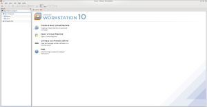](http://rodrigolira.eti.br/wp-content/uploads/2015/06/open1.png)

 

 

 

 

2 - Marque **Custom** e clique em **Next**:

[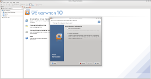](http://rodrigolira.eti.br/wp-content/uploads/2015/06/open2.png)

 

 

 

 

3 - Na seleção de compatibilidade de hardware deixe como padrão e clique em **Next**:

[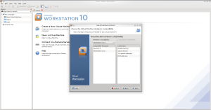](http://rodrigolira.eti.br/wp-content/uploads/2015/06/open3.png)

 

 

 

 

4 - Selecione **I will install the operating system later** e clique em **Next**:

[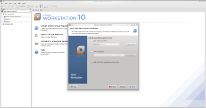](http://rodrigolira.eti.br/wp-content/uploads/2015/06/open4.png)

 

 

 

 

5 - Selecione a opção **2 Linux** e em **Version** selecione **Other Linux 3.x Kernel** e clique em **Next**:

[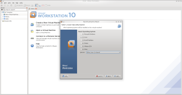](http://rodrigolira.eti.br/wp-content/uploads/2015/06/open5.png)

 

 

 

 

6 - Coloque um nome para a maquina virtual:

[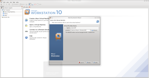](http://rodrigolira.eti.br/wp-content/uploads/2015/06/open6.png)

 

 

 

 

7 - Defina a quantidade de processadores e núcleos, pode deixar como está:

[](http://rodrigolira.eti.br/wp-content/uploads/2015/06/open7.png)

 

 

 

 

8 - Defina a quantidade de memoria, no meu caso deixei com 1GB, mas pode deixar com 256MB que já é o suficiente:

[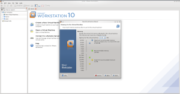](http://rodrigolira.eti.br/wp-content/uploads/2015/06/open8.png)

 

 

 

 

8 - Selecione **Use Bridged networking** para o tipo de conexão de rede e clique em **Next**:

[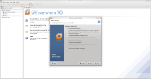](http://rodrigolira.eti.br/wp-content/uploads/2015/06/open9.png)

 

 

 

 

9 - Deixe como padrão, que nesse caso é o recomendado:

[](http://rodrigolira.eti.br/wp-content/uploads/2015/06/open10.png)

 

 

 

 

10 - Selecione o disco como  **sata**:

[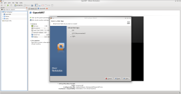](http://rodrigolira.eti.br/wp-content/uploads/2015/06/open11.png)

 

 

 

 

11 - Na seleção de disco marque **Use an existing virtual disk**, para podermos selecionar um disco já existente, no caso o disco que convertemos anteriormente:

[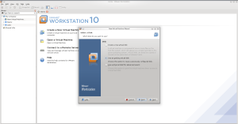](http://rodrigolira.eti.br/wp-content/uploads/2015/06/open12.png)

 

 

 

 

12 - Clique em **Browse,** procure e adicione o disco convertido e clique em **Next**:

[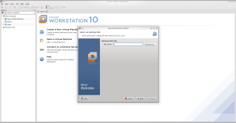](http://rodrigolira.eti.br/wp-content/uploads/2015/06/open13.png)

 

 

 

 

[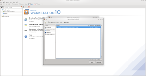](http://rodrigolira.eti.br/wp-content/uploads/2015/06/open14.png)

 

 

 

 

[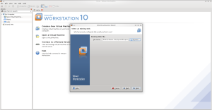](http://rodrigolira.eti.br/wp-content/uploads/2015/06/open15.png)

 

 

 

 

13 - Clique em **Finish**:

[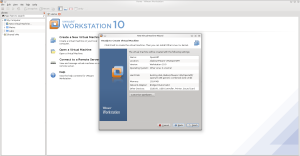](http://rodrigolira.eti.br/wp-content/uploads/2015/06/open16.png)

 

 

 

 

14 -  Inicie a VM:

[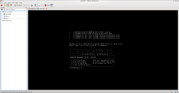](http://rodrigolira.eti.br/wp-content/uploads/2015/06/open22.png)

 

 

 

 

Para poder ter acesso ao sistema via interface web é necessário alterar as configurações da placa de rede, a mesma vem com o IP fixo (192.168.1.1) por padrão:

Edite o arquivo:

```
/etc/config/network
```

E coloque um IP que você consiga acessar da sua rede, depois reinicie o serviço:

```
# /etc/init.d/network restart
```

Pronto, basta acessar a interface web, ele vem sem senha por padrão:

[](http://rodrigolira.eti.br/wp-content/uploads/2015/06/open241.png)

 

 

 

 

Espero que tenham gostado e até a próxima :D

Referências:

[http://wiki.openwrt.org/doc/howto/vmware](http://wiki.openwrt.org/doc/howto/vmware)
