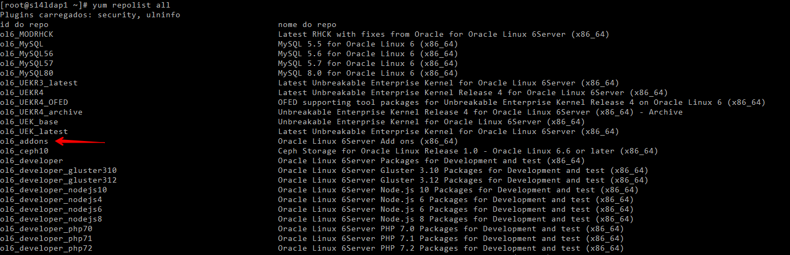
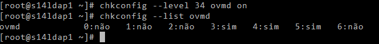
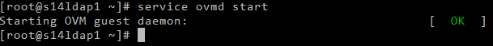
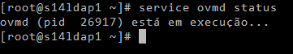

[](images/oracle_vm.gif)

Salve Salve Pessoal!

Primeiro post do ano, não tive tempo e acabei me esquecendo de passar por aqui e desejar boas festas para vocês, mas vou aproveitar esse post e desejar um Feliz Ano Novo a todos.

Neste post vou mostrar como podemos realizar a instalação do **Oracle VM Guest Additions** no **Oracle Linux 6**.

Para quem não conhece o **Oracle VM Guest Additions**, ele é um conjunto de pacotes que devem ser instalados no sistema operacional da maquina virtual(guest) execução no ambiente Oracle VM.

O Oracle VM Guest Additions permiti a comunicação bidirecional, entre o Oracle VM Manager e o sistema operacional da máquina virtual, no nosso caso aqui o Oracle Linux 6.

Com o Oracle VM Guest Additions temos controle refinado sobre a configuração e o comportamento dos componentes em execução na máquina virtual diretamente do Oracle VM Manager.

**Os recursos do Oracle VM Guest Additions incluem:**

- Informações aprimoradas sobre máquinas virtuais no Oracle VM Manager, como relatórios sobre endereçamento IP.
- Usar o recurso de configuração de templates, para configurar automaticamente as máquinas virtuais à medida que são iniciadas.
- Enviar mensagens diretamente para uma máquina virtual do Oracle VM Manager para acionar eventos.
- Consultar uma máquina virtual para obter informações relativas a mensagens anteriores.
- Capacidade de interagir com o comando ovm\_vmmessage do Oracle VM Utilities.

O Oracle VM Guest Additions permite a integração direta entre a máquina virtual e a camada de virtualização, auxiliando na orquestração e automação de implementações complexas com várias VMs.

Vamos ao que interessa, para instalar o Oracle VM Guest Additions precisamos habilitar o repositório ol6\_addons, verifique se o repositório está disponível no ambiente com o seguinte comando:

```
# yum repolist all
```

[](images/001.png)

Se não estiver disponível, atualize seu arquivo **.repo** com o comando abaixo:

```
# wget https://public-yum.oracle.com/public-yum-ol6.repo -O /etc/yum.repos.d/public-yum-ol6.repo
```

É necessário instalar os seguintes pacotes:

- libovmapi
- xenstoreprovider
- ovmd
- python-simplejson
- xenstoreprovider

Agora execute o comando abaixo para instalar os pacotes:

```
# yum install -y libovmapi xenstoreprovider ovmd python-simplejson xenstoreprovider --enablerepo=ol6_addons
```

Habilite o serviço para inicializar automaticamente junto com o sistema operacional.

```
# chkconfig --level 34 ovmd on
```

Verifique se esta habilitado

```
# chkconfig --list ovmd
```

[](images/002.png)

Inicie o serviço:

```
# service ovmd start
```

[](images/003.png)

Verifique se o serviço está em execução:

```
# service ovmd status
```

[](images/0054.png)

Pronto, Oracle VM Guest Additions instalado e configurado com sucesso.

Até a próxima!

:D
