[](images/powerdns.png-800x95-100-_001.png)

Salve Salve Pessoal!

Já faz algum tempo que venho usando o PowerDNS Authoritative como solução para DNS autoritativo em meus clientes.

Para que não conhece o **PowerDNS** é uma solução de **DNS autoritativo** e **recursivo** totalmente gratuita e 100% opensource, diferentemente do **bind** ou **unbound** o **PowerDNS** utiliza banco de dados para o armazenamento dos registros e suporta diversos tipos de bancos de dados (MySQL, PostgreSQL, SQLite3, Sybase, Microsoft SQL Server, etc).

O gerenciamento dos registros podem ser feitas diretamente no console do banco de dados, através de API em linha de comando ou interfaces web desenvolvidas normalmente desenvolvidas pela comunidade.

Para maiores informações e detalhes sobre o PowerDNS acessem o link abaixo:

[https://www.powerdns.com/](https://www.powerdns.com/)

Vamos a sua instalação e configuração! :D

Nessa instalação vamos usar o banco de dados **MariaDB.**

**1** - Instale o repositório EPEL com o seguinte comando:

```
# yum install -y https://dl.fedoraproject.org/pub/epel/epel-release-latest-8.noarch.rpm
```

**2** - Agora instale o repositório do PowerDNS Autoritativo com o seguinte comando:

```
# curl -o /etc/yum.repos.d/powerdns-auth-43.repo https://repo.powerdns.com/repo-files/centos-auth-43.repo
```

**3** - Agora vamos instalar os pacotes necessários.

```
# dnf install -y mariadb mariadb-server pdns pdns-backend-mysql pdns-tools
```

Vamos a configuração do banco de dados.

**4** - Inicie e habilite o MariaDB para iniciar junto com o sistema operacional.

```
# systemctl enable mariadb

# systemctl start mariadb
```

**5** - Vamos as configurações básicas do MariaDB.

Como acabamos de realizar a instalação do MariaDB o mesmo ainda não está com a senha de root configurada, aperte **ENTER** apenas.

[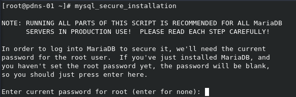](images/01.png)

Responda com **Y** para configurar uma **nova senha**.

[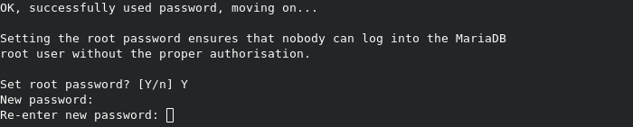](images/04-1.png)

Responda com **Y** para remover o usuário **anonymous**.

[](images/05-1.png)

Responda com **Y** para aceitar conexões locais apenas.

[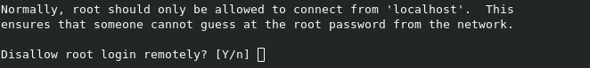](images/06-2.png)

Responda com **Y** para remover o banco de dados **test**.

[](images/07-1.png)

Responda com **Y** para dar um **reload** em todos os privilégios.

[](images/08-2.png)

 

Pronto, configurações básicas do MariaDB realizadas.

[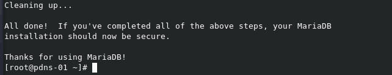](images/02.png)

Agora vamos a configuração do banco de dados do PowerDNS.

6 - Logue com o usuário root no MariaDB.

```
# mysql -u root -p
```

7 - Execute o comando abaixo para criar um banco de dados chamado **powerdns** esse será o banco que o PowerDNS vai utilizar.

```
# create database powerdns;
```

**OBS:** Você pode configurar o nome que desejar para o banco de dados, mude de acordo com a sua necessidade.

8 - Vamos criar um **usuário** e dar os **privilégios** sobre o banco de dados **powerdns**.

```
# grant all privileges on powerdns.* to pdnsuser@localhost identified by 'Mudar123';
```

9 - Agora saia do console do MariaDB

```
# quit;
```

Agora vamos executar o script para criação do esquema do banco, por padrão após a instalação o PowerDNS cria dois diretórios no **/usr/share/doc/**, esses diretórios contém diversos scripts **sql** para configuração ou migração do banco de dados.

[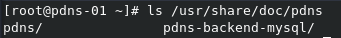](images/03.png)

O diretório que nos interessa no momento é o **/usr/share/doc/pdns-backend-mysql/** que contém o script **scheme.mysql.sql**.

[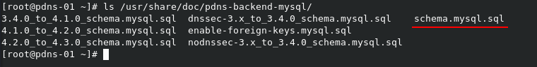](images/04.png)

**OBS:** O nome do diretório muda de acordo com o backend que você instalou no **passo 3**.

10 - Execute o script da seguinte forma:

```
# mysql -u pdnsuser -p powerdns < /usr/share/doc/pdns-backend-mysql/schema.mysql.sql
```

**OBS**: Coloque a senha do usuário **pdnsuser**.

Pronto, o banco de dados está instalado e configurado.

11 - Agora vamos configurar o PowerDNS, o arquivo de configuração padrão é o **/etc/pdns/pdns.conf**, vamos fazer uma copia do original dele antes de modifica-lo.

```
# cp /etc/pdns/pdns.conf /etc/pdns/pdns.conf-orig
```

12 - Agora edite o arquivo **/etc/pdns/pdns.conf** com seu editor favorito, no meu caso sempre uso o vim e insira as seguintes linhas referentes a conexão com o banco de dados e a interface que o PowerDNS deve escutar.

```
launch=gmysql 
gmysql-host=127.0.0.1 
gmysql-user=pdnsuser 
gmysql-dbname=powerdns 
gmysql-password=Mudar123 
local-address=10.20.30.220

```

[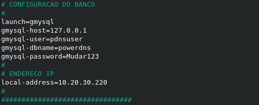](images/05.png)

13 - Vamos configurar as **permissões** no direretório.

```
# chmod 770 -fR /etc/pdns/
```

```
# chown -fR :pdns /etc/pdns/
```

14 - Vamos configurar nosso querido amigo **SELinux**. :D

```
# setsebool -P domain_can_mmap_files 1
```

```
# semanage fcontext -a -t abrt_helper_exec_t '/usr/share/p11-kit/modules/p11-kit-trust.module'
```

```
# restorecon -v '/usr/share/p11-kit/modules/p11-kit-trust.module'
```

15 - Agora vamos iniciar e habilitar o PowerDNS para iniciar junto com o sistema.

```
# systemctl enable pdns
```

```
# systemctl start pdns
```

16 - Vamos liberar a porta 53 no firewall.

```
# firewall-cmd --add-service=dns --permanent
```

```
# firewall-cmd --reload
```

**OBS:** Se você deseja que o PowerDNS use mais de uma interface basta inserir o endereço IP separado por vírgulas ou usar 0.0.0.0, porém para usar 0.0.0.0 você precisa desabilitar o systemd-resolved com os comandos abaixo:

```
# systemctl stop systemd-resolved.service
```

```
# systemctl disable systemd-resolved.service
```

Pronto nesse momento temos o PowerDNS instalado e configurado.

[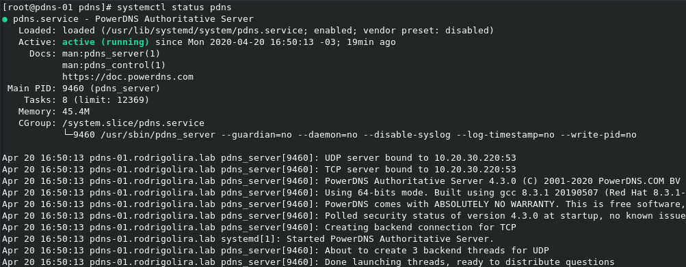](images/06.png)

Agora vamos começar a inserir nossos registros, vou usar o domínio **rodrigolira.lab** como exemplo.

Vamos começar fazendo uma consulta simples, sem registro nenhum e ver o que servidor nos retorna, para isso vou usar o utilitário **dig**.

[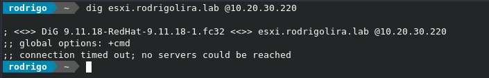](images/12.png)

Como esperado não retornou nenhum registro, agora vamos acessar nosso banco de dados e criar os registros.

```
# mysql -u pdnsuser -p powerdns
```

Crie o **domínio** com o comando abaixo:

```
# INSERT INTO domains (name, type) values ('rodrigolira.lab', 'NATIVE');
```

[](images/08.png)

Vamos criar o **SOA**:

```
# INSERT INTO records (domain_id, name, content, type,ttl,prio) VALUES (1,'rodrigolira.lab','localhost admin.rodrigolira.lab 1 10380 3600 604800 3600','SOA',86400,NULL);
```

[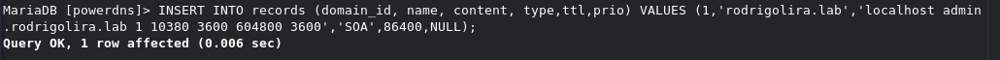](images/09.png)

Vamos criar um **NS**.

```
# INSERT INTO records (domain_id, name, content, type,ttl,prio) VALUES (1,'rodrigolira.lab','ns1.rodrigolira.lab','NS',86400,NULL);
```

[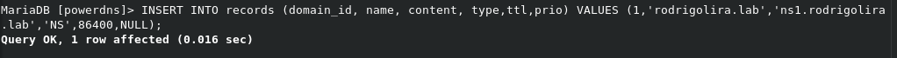](images/10.png)

Vou criar três registros do tipo **A** para serem resolvidos internamente no meu **homelab**.

```
# INSERT INTO records (domain_id, name, content, type,ttl,prio) VALUES (1,'firewall.rodrigolira.lab','10.20.30.1','A',120,NULL);
```

```
# INSERT INTO records (domain_id, name, content, type,ttl,prio) VALUES (1,'esxi.rodrigolira.lab','10.20.30.2','A',120,NULL);
```

```
# INSERT INTO records (domain_id, name, content, type,ttl,prio) VALUES (1,'www.rodrigolira.lab','10.20.30.1','A',120,NULL);
```

[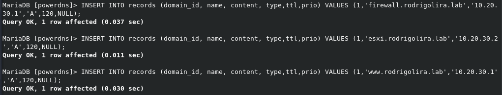](images/11.png)

Pronto, agora que já inserimos os registros vamos fazer a consulta novamente.

[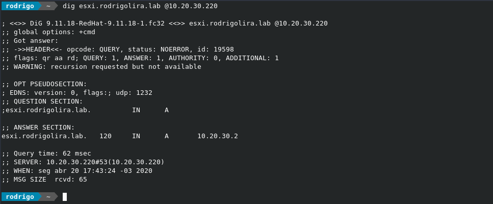](images/13.png)

[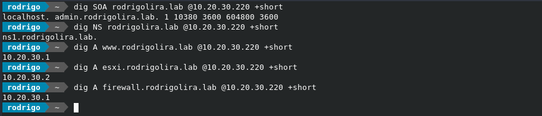](images/14.png)

Como podemos ver o servidor está resolvendo corretamente as nossas consultas, agora sim nosso servidor está pronto!

**Mas vamos ficar tendo esse trabalho manual para inserir os registros?**

**NÃO!**

No próximos post vou mostrar como podemos configurar uma interface de gerenciamento que vai facilitar muito a nossa vida.

Espero você no próximo post!

Até a próxima!

:D
