Salve Salve Pessoal!

Nesse post vou mostrar como instalar o VMware Workstation 15 no Fedora 29.

O processo de instalação do VMware Workstation é bem simples, apesar de ter pessoas que sempre passam por problemas, normalmente porque não instalam as dependências necessárias.

Vamos ao que interessa, antes de mais nada precisamos fazer a instalação das dependências, execute o comando abaixo para realizar a instalação:

```
# sudo yum install kernel-headers kernel-devel gcc glibc-headers elfutils-libelf-devel
```

Imagino que você já tenha feito o download do VMware Workstation, agora precisamos dar permissão de execução no mesmo:

```
# sudo chmod +x VMware-Workstation-Full-15.0.1-10737736.x86_64.bundle
```

**OBS:** O nome e versão podem estar diferente para você. ;)

Agora podemos executar o instalador, se executarmos ele direto sem passar nenhum parâmetro o mesmo irá iniciar a instalação em modo gráfico, porém podemos passar o parâmetro **\--help** no final do comando para ver tudo que podemos fazer.

```
# sudo ./VMware-Workstation-Full-15.0.1-10737736.x86_64.bundle --help
```

[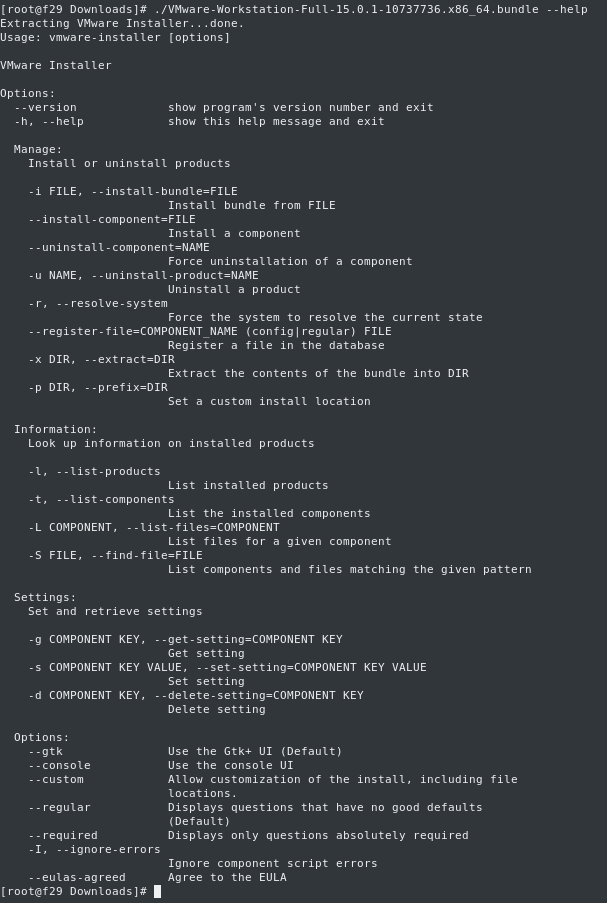](images/2018-11-19_10-40.png)Agora que já conhecemos as opções, vamos dar continuidade a instalação.

Execute o arquivo sem parâmetros.

```
# sudo ./VMware-Workstation-Full-15.0.1-10737736.x86_64.bundle
```

Aceite os termos de licença de uso do **VMware Workstation** e clique em **Next**. [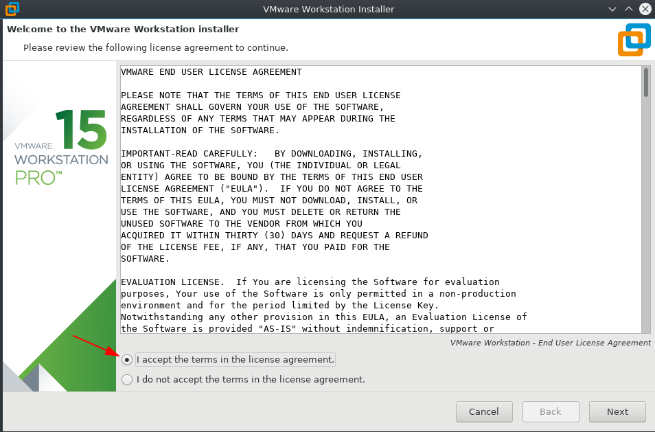](images/2018-11-19_10-45.png) Aceite os termos de licença de uso do **VMware OVF Tools**  e clique em **Next**. [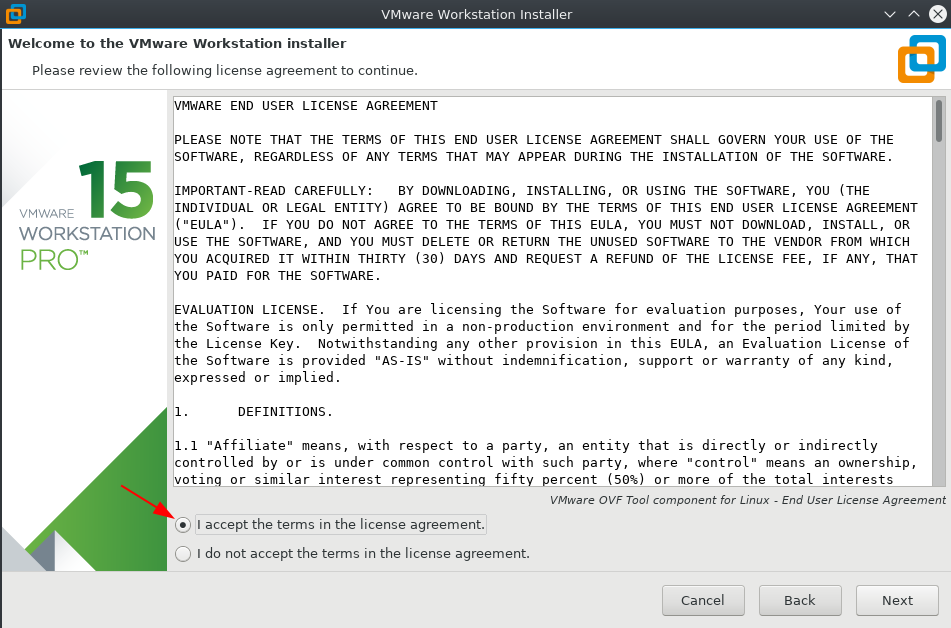](images/2018-11-19_10-49.png) Deixe o caminho de instalação padrão e clique em **Next**. [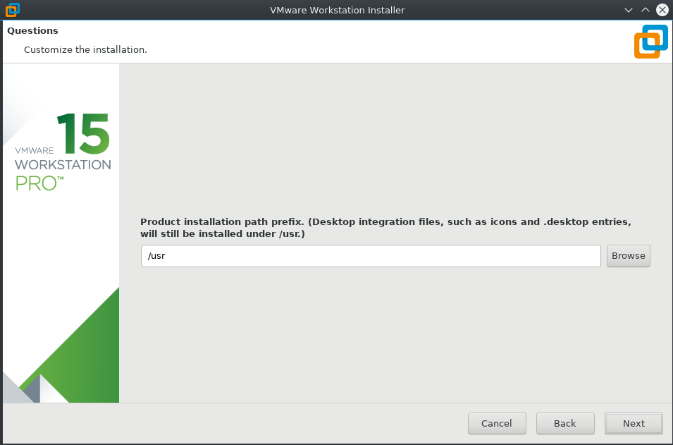](images/2018-11-19_10-50.png) Marque **Yes** para criar os atalhos e clique em **Next**. [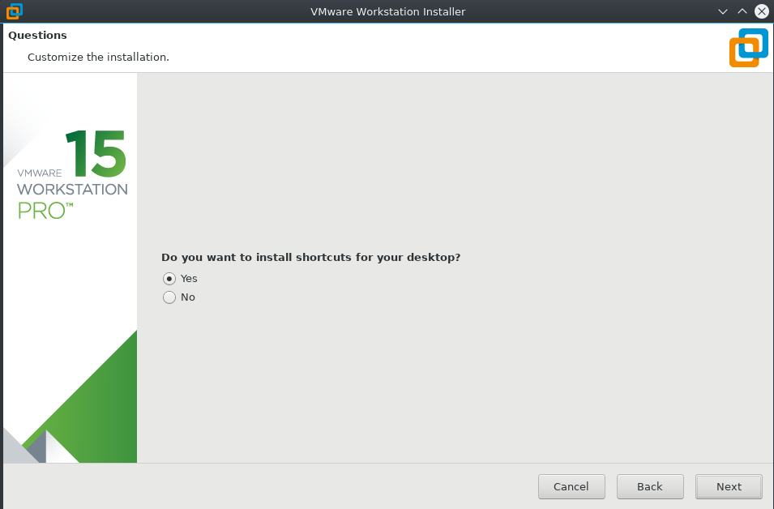](images/2018-11-19_10-52.png) Se **Yes** para verificar atualizações na inicialização do programa e clique em **Next**. [](images/2018-11-19_10-52_1.png) Se deseja ajudar com informações sobre do programa a VMware, marque **Yes** e clique em **Next**. [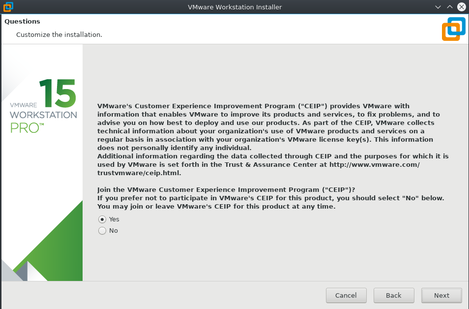](images/2018-11-19_10-53.png) **OBS:** Para maiores informações sobre o CEIP acesse o link abaixo: [https://www.vmware.com/br/solutions/trustvmware/ceip.html](https://www.vmware.com/br/solutions/trustvmware/ceip.html) Usuário de conexão, deixe seu usuário por padrão e clique em **Next**. [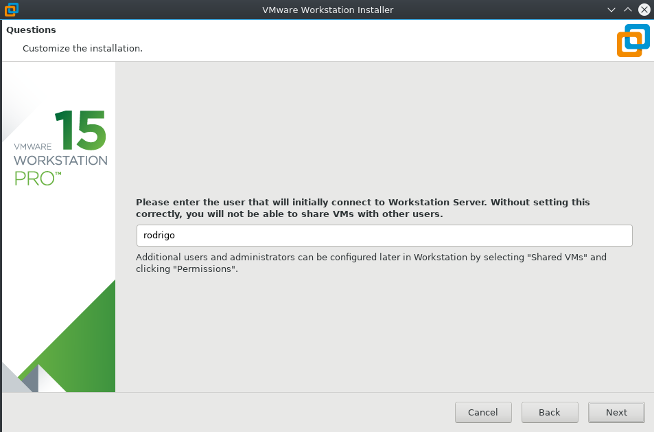](images/2018-11-19_10-54.png) Caminho para as máquinas compartilhadas, deixe o padrão e clique em **Next**. [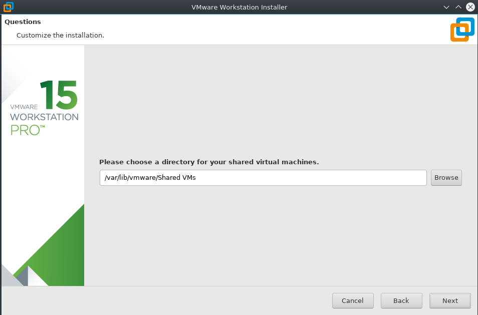](images/2018-11-19_10-55.png) Porta de acesso, deixe o padrão e clique em **Next**. [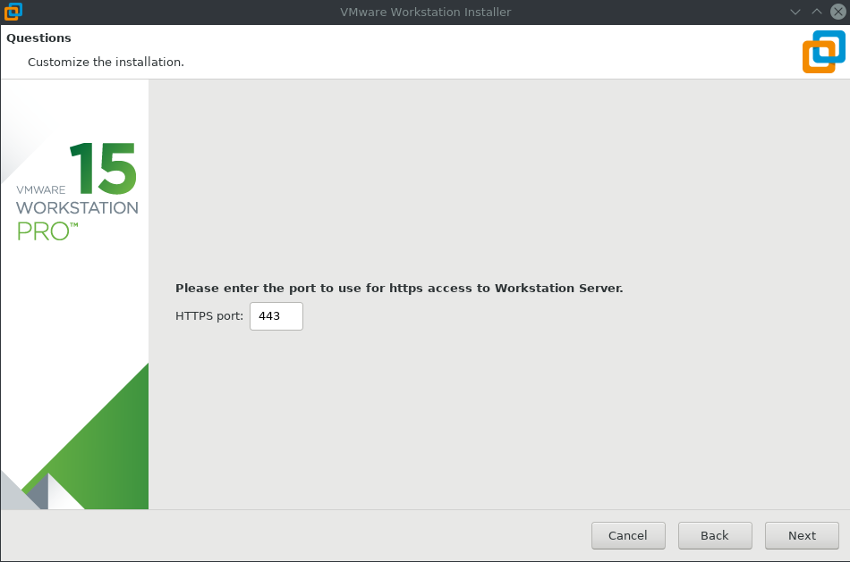](images/2018-11-19_10-56.png)Insira a sua licença e clique em **Next**. [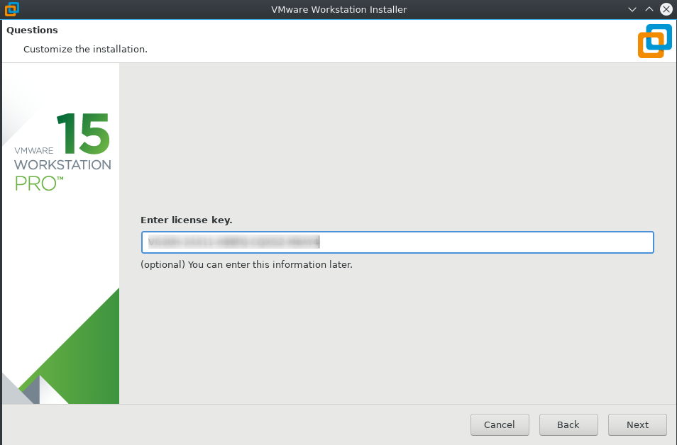](images/2018-11-19_10-59.png)Clique em **Install** para iniciar a instalação. [](images/2018-11-19_11-00.png)Se a instalação foi realizada corretamente, [](images/2018-11-19_11-02.png)Podemos verificar todos os componentes instalados em nosso sistema com o seguinte comando.

```
# sudo ./VMware-Workstation-Full-15.0.1-10737736.x86_64.bundle -t
```

[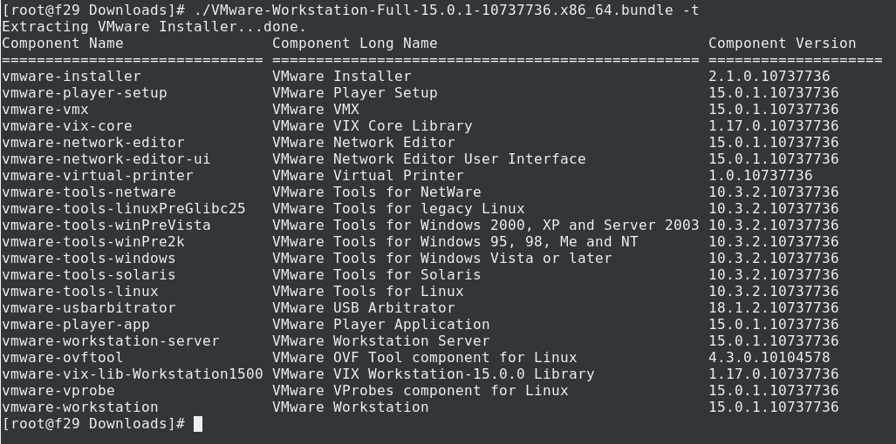](images/2018-11-19_11-03.png) Até a próxima! :D
