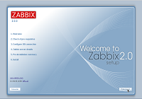
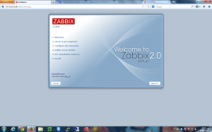

[](http://rodrigolira.eti.br/wp-content/uploads/2013/08/zabbix2.png)Salve Salve Pessoal!

Essa semana tive a necessidade de instalar um servidor de monitoramento na empresa, nunca tive essa necessidade até essa semana. Acabei escolhendo o Zabbix por conselho de amigos, por sua vasta compatibilidade com diversos equipamento e por sua versatilidade, ent"ao vamos para de conversa e meter a mão na massa:

Antes de mais nada faça uma instalação full do Slackware, caso queira deixar algum pacote de fora da instalação deixe os pacotes KDE, KDEI e XFCE.

Para rodar o Zabbix nós precisamos do Apache e do Mysql que por padrão já vem no slackware, masque no final da instalação do slackware os dois pacotes para que os mesmo sejam inicializados junto com o sistema.

A instalação do Zabbix é muito simples porém a necessidade de algumas dependências, são elas : iksemel, libssh2, jdk,(clique sobre o nome para fazer o download.

Instale as dependências:

```
#installpkg *.t?z
```

Agora vamos começar a instalar o zabbix.

Primeiro crie o usuário e o grupo zabbix:

```
# groupadd -g 228 zabbix
```

```
# useradd -d /dev/null -s /bin/false -u 228 -g 228 zabbix
```

Agora crie e instale o pacote .tgz do zabbix (obs: você só poderá criar o pacote para o zabbix após a criação do usuário e grupo zabbix.

```
#installpkg *.t?z
```

Agora vamos criar o banco de dados:

```
#mysql -u root -p (caso apresente erro 2002, siga os passos abaixo para resolver o problema, caso não apresente pule está parte)
```

```
# mysql_install_db
# chown -R mysql.mysql /var/lib/mysql
# mysqld_safe &
# mysqladmin -u root password NOVA_SENHA
```

Agora tente novamente:

```
#mysql -u root -p
```

Logado no banco crie p usuário e o banco de dados, execute os seguintes comando:

```
mysql> create database zabbix character set utf8;
```

```
mysql> use mysql; mysql> grant all on zabbix.* to zabbix@localhost identified by '<senha_usuario_zabbix>';
```

```
mysql> flush privileges;
```

```
mysql> quit
```

Agora entre na seguinte pasta:

```
#cd /tmp/SBo/zabbix-2.0.6/database/mysql
```

Logue no banco com o usuário zabbix

```
#mysql -u zabbix -p
```

Execute os seguintes comandos:

```
mysql> use zabbix
```

```
mysql> . schema.sql
```

```
mysql> . data.sql
```

```
mysql> . images.sql
```

```
mysql>  quit
```

Agora vamos configurar o PHP, edite o arquivo /etc/httpd/php.ini e altere os seguintes parametros:

```
post_max_size = 16M               (Padrão = 8M)
max_execution_time = 300          (Padrão = 30)
max_input_time = 300              (Padrão = 60)
date.timezone = America/Recife    (Descomentar a linha e colocar a localização)
```

Habilite o  **PHP** no **/etc/httpd/httpd.conf****:**

Adicione "**index.php**" no final da linha "**DirectoryIndex index.html**"

Descomentar a linha "**Include /etc/httpd/mod\_php.conf**"

Reinicie o Apache para que as alterações tenham efeito:

```
#/etc/rc.d/rc.httpd restart
```

Edite a configuração do arquivo **/etc/zabbix/zabbix\_server.conf**

```
DBUser=zabbix                        (Padrão é root)
DBPassword=<senha_usuario_zabbix>    (Descomentar a linha e colocar a senha do usuário zabbix)
```

De permissão de execução no arquivo:

```
#chmod +x /etc/rc.d/rc.zabbix_server
```

Inicie o servidor:

```
#/etc/rc.d/rc.zabbix_server start
```

Reinice o Apache:

```
#/etc/rc.d/rc.httpd restart
```

Feito tudo isso basta iniciar o navegador e colocar o seguinte endereço:

[http://ip\_servidor/zabbix](http://10.10.22.46/zabbix/setup.php)

[](http://rodrigolira.eti.br/wp-content/uploads/2013/08/zabbix.png)

Pronto, até a próxima!

 

Fontes:

[http://slackbuilds.org/repository/14.0/network/zabbix\_server/](http://slackbuilds.org/repository/14.0/network/zabbix_server/)

[http://docs.slackware.com/howtos:software:zabbix](http://docs.slackware.com/howtos:software:zabbix)

[http://blog.abimayu.com/2012/11/how-to-install-zabbix-server-v-203-on.html](http://blog.abimayu.com/2012/11/how-to-install-zabbix-server-v-203-on.html)

[http://www.vivaolinux.com.br/dica/Erro-2002-(HY000)-ao-conectar-ao-MySQL](http://www.vivaolinux.com.br/dica/Erro-2002-\(HY000\)-ao-conectar-ao-MySQL)
