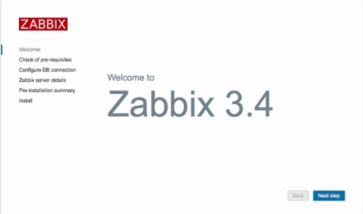
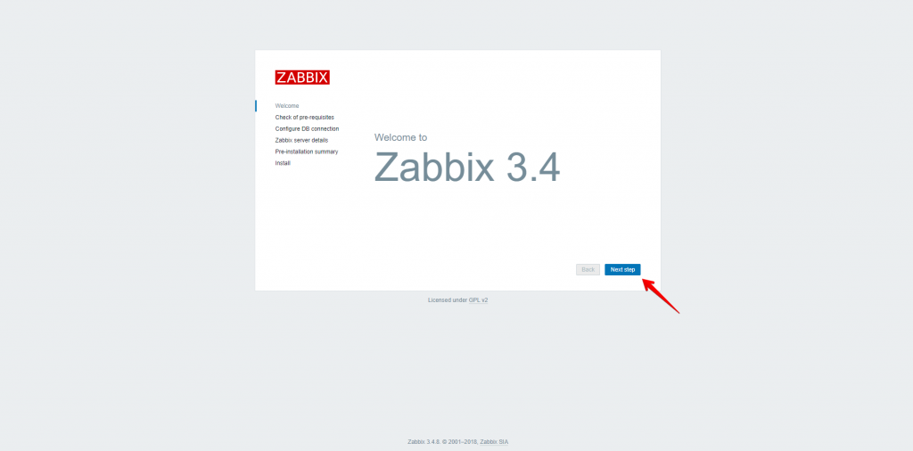
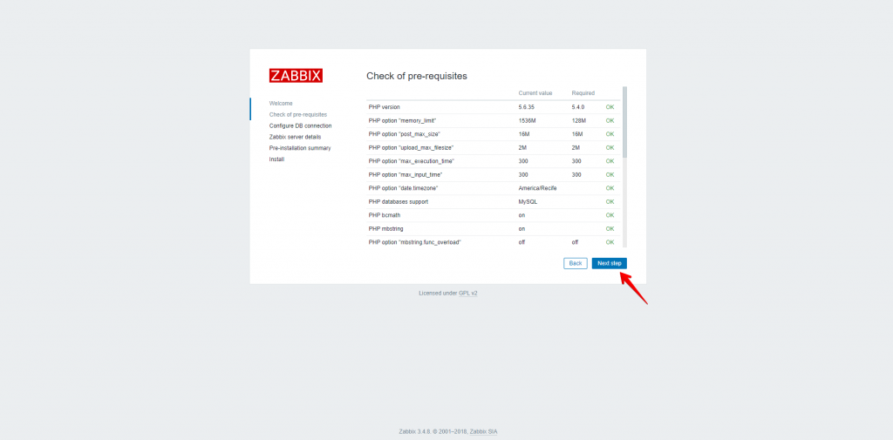
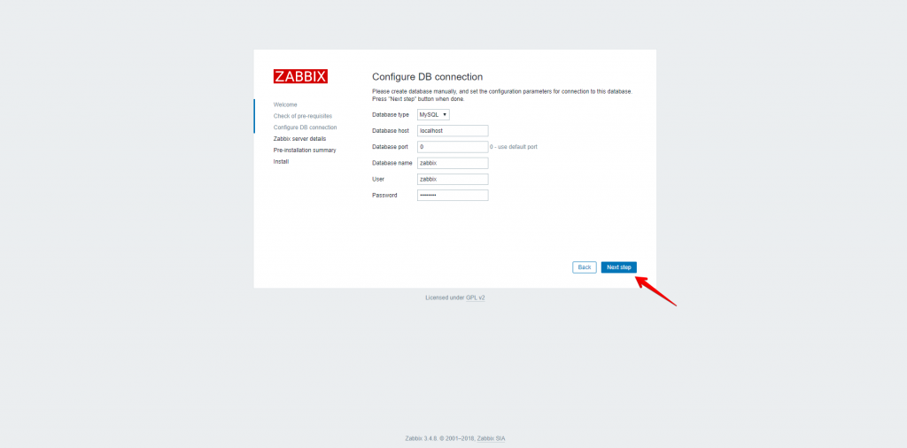
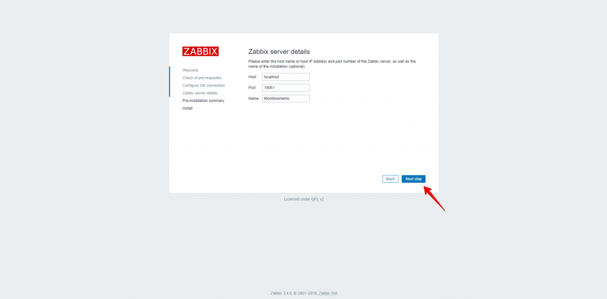
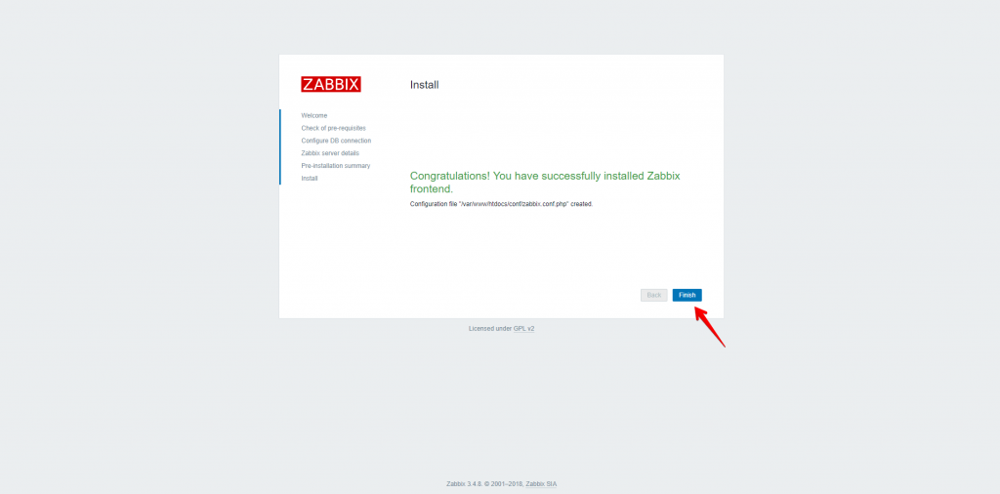
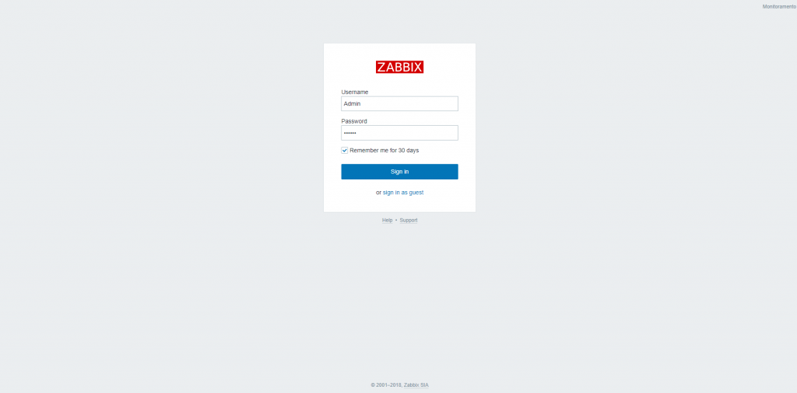
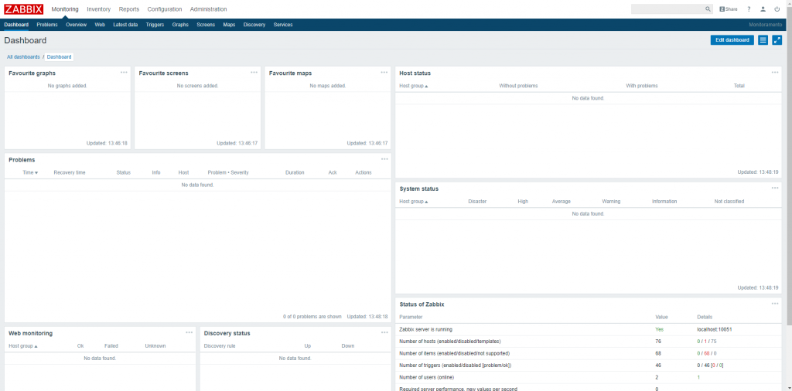

[](images/zabbix43.png)

Salve Salve Pessoal!

Alguns anos atrás fiz um post mostrando como realizar a instalação do Zabbix 2 no Slackware 14, segue o link abaixo do post.

http://rodrigolira.eti.br/instalando-o-zabbix-2-no-slackware-14-0/

Hoje vou mostrar como instalar o **Zabbix Server 3.4.\*** no **Slackware 14.2**.

É possível fazermos a instalação utilizando o **Slackbuils**, mas lá só encontra-se a versão **LTS**. Para quem não conhece o slackbuilds, segue o link abaixo sobre o projeto:

[http://slackbuilds.org/](http://slackbuilds.org/)

Veja também o **sbopkg**, que é um projeto que usa o **slackbuilds** e facilita muito a vida de usuários do Slackware.

[https://sbopkg.org/](https://sbopkg.org/)

Vamos ao que interessa :D

**1** - Crie uma pasta e entre nela, para podermos fazer todos os downloads dentro dela:

```
# mkdir /install-zabbix (cria a pasta)

# cd /install-zabbix (entra na pasta)
```

**2** - Vamos fazer o download das dependências necessárias, que no nosso caso são os pacotes **iksemel** e **openjdk**:

```
# wget https://slackonly.com/pub/packages/14.2-x86_64/libraries/iksemel/iksemel-1.4-x86_64-2_slonly.txz (download do iksemel)

# wget http://bear.alienbase.nl/mirrors/people/alien/sbrepos/14.2/x86_64/openjdk/openjdk-8u161_b12-x86_64-1alien.txz (download do openjdk)
```

**Obs:** Podemos usar pacotes prontos do iksemel e openjdk para facilitar a nossa vida, mas podemos criar nossos próprios com o slackbuilds. Outra dica legal, é o site slakfinder, onde encontramos diversos pacotes prontos.

**3** - Vamos fazer a instalação das dependências:

```
# installpkg *.txz
```

**4** - Vamos criar o usuário e grupo zabbix:

```
# groupadd -g 228 zabbix (cria o grupo)

# useradd -u 228 -g zabbix -d /dev/null -s /bin/false zabbix (cria o usuário)
```

**5** - Agora vamos fazer o download do Zabbix, caso tenha uma versão mais nova, fique a vontade para utiliza-lá:

```
# wget https://ufpr.dl.sourceforge.net/project/zabbix/ZABBIX%20Latest%20Stable/3.4.8/zabbix-3.4.8.tar.gz

```

**6** - Descompacte o zabbix e entre na pasta descompactada:

```
# tar -xzvf zabbix-3.4.8.tar.gz (descompacta o zabbix)

# cd zabbix-3.4.8/ (entra na pasta do zabbix)
```

**7** - Agora vamos fazer a instalação do Zabbix, por padrão não altero nenhum parâmetro de destino da instalação dos pacotes, sendo assim, o padrão é o diretório, **/usr/local/etc**.

```
# ./configure --enable-server --enable-agent --with-mysql --enable-ipv6 --with-net-snmp --with-libcurl --with-libxml2

# make install
```

**8** - Vamos configurar o MariaDB:

```
# mysql_install_db (configura o mariadb)

# chown -R mysql.mysql /var/lib/mysql (dá as permissões)

# chmod +x /etc/rc.d/rc.mysqld (dando permissão de execução ao mariadb)

# /etc/rc.d/rc.mysqld start (inicia o mariadb)

# mysqladmin -u root password 'Mudar123' (configura a senha de root do MariaDB, mude o Mudar123 para a senha que você desejar)
```

**9** - Agora vamos criar o banco e o usuário do banco do zabbix:

```
# mysql -u root -pMudar123 -e "create database zabbix character set utf8;" (cria o banco do zabbix)

# mysql -u root -pMudar123 -e "grant all on zabbix.* to zabbix@localhost identified by 'Mudar123';" (cria o usuário e da as permissões no banco zabbix, mude o Mudar123 para a senha que você desejar)

# mysql -u root -pMudar123 -e "flush privileges;" (atualiza os privilégios)
```

**10** - Vamos criar todas as tabelas necessárias do Zabbix:

```
# mysql -uzabbix -pMudar123 zabbix < database/mysql/schema.sql 

# mysql -uzabbix -pMudar123 zabbix < database/mysql/images.sql 

# mysql -uzabbix -pMudar123 zabbix < database/mysql/data.sql
```

**11** - Agora precisamos configurar o **php.ini**, procure e edite os seguintes campos deixando como está abaixo no arquivo **/etc/php.ini**:

```
memory_limit = 1536M 

post_max_size = 16M 

max_execution_time = 300 

max_input_time = 300 

date.timezone = America/Recife (Mude de acordo com sua região)

always_populate_raw_post_data = -1
```

**12** - Vamos configurar o **HTTPD**, edite o arquivo **/etc/httpd/httpd.conf**.

```
DirectoryIndex index.php index.html (insira o index.php no DirectoryIndex)

Include /etc/httpd/mod_php.conf (remova o comentário da linha)

# chmod +x /etc/rc.d/rc.httpd (dando permissão de execução ao httpd)

# /etc/rc.d/rc.httpd start (iniciando o serviço do httpd)
```

**13** - Copia os arquivos de configuração para os locais desejados:

```
# mkdir -p /etc/zabbix (cria o diretório zabbix no /etc)
```

```
# ln -s /usr/local/etc/zabbix_* /etc/zabbix/ (cria um link simbólico do /usr/local/etc para o /etc/zabbix)

# cp -R frontends/php/* /var/www/htdocs/ (copia os arquivos do frontend para o htdocs, o meu site principal passa a ser o zabbix)

# rm /var/www/htdocs/index.html* (remove todos os index.html que estão no diretório htdocs)

# chown -fR apache:apache /var/www/htdocs/ (dá as permissões aos arquivos)
```

**14** - Edite o arquivo de configuração do Zabbix Server, o **/ect/zabbix/zabbix\_server.conf** e altere os seguintes campos:

```
LogFile=/var/log/zabbix/zabbix_server.log

LogFileSize=1

DebugLevel=3

DBHost=localhost

DBName=zabbix

DBUser=zabbix

DBPassword=Mudar23

Timeout=4

LogsSlowQueries=3000
```

**OBS**: Existe várias possibilidades de configuração, para maiores detalhes acesse a documentação do zabbix.

**15** - Crie a pasta para o log.

```
# mkdir -p /var/log/zabbix (cria o diretório) 

# chown -fR zabbix:zabbix /var/log/zabbix (configura as permissões no diretório)

16 - Download do script de Inicialização.
```

```
# wget -O /etc/rc.d/rc.zabbix_server https://slackbuilds.org/slackbuilds/14.2/network/zabbix_server/rc.zabbix_server (faz o download para o /etc/rc.d/)
```

**17** - Edite o arquivo **/etc/rc.d/rc.zabbix\_server** e altere a variável **PRGDIR**, deixando como está abaixo:

```
PGRDIR=/usr/local/sbin/
```

**18** - Agora vamos mudar a permissão e vamos iniciar o Zabbix.

```
# chmod +x /etc/rc.d/rc.zabbix_server (muda as permissões)

# /etc/rc.d/rc.zabbix_server start (inicia o Zabbix Server)

```

**19** - Agora abra o navegador e digite o endereço do servidor para concluirmos a instalação, clique em **Next step**:

[](images/01.png)

**20** - Verifique se todos os pré-requisitos estão **OK** e clique em **Next step**.

[](images/02-1.png)

**21** - Configure a conexão com o banco de dados, em nosso caso, basta inserir a senha do banco, no meu caso usei a senha **Mudar123** e clique em **Next step**.

[](images/03.png)

 

**22** - Configure um nome para o servidor e clique em **Next step**.

[](images/04-1.png)

**23** - Verifique se todos os pré-requisitos estão corretos e cliquem e **Next step**.

[](images/05-1.png)

**24** - Pronto, instalação concluída com sucesso, clique em **Finish**.

[](images/06.png)

**25** - Agora basta logar no **Zabbix**.

Username = **Admin**

Password = **zabbix**

[](images/07.png)

**26** - Agora só começar a monitorar seu ambiente :D

[](images/08.png)

Estou desenvolvendo um script para facilitar todo o processo ;)

Até a próxima :D

**Referências:**

https://www.zabbix.com/documentation/3.4/manual/installation/install

http://slackbuilds.org/repository/14.2/network/zabbix\_server/
