[](images/zabbix.jpg)

Salve Salve Pessoal!

Nesse post vou mostrar como fazer a instalação do **Zabbix Server no CentOS 8 com o SELinux habilitado**.

Sei que para algumas pessoas isso é algo trivial, porém vejo que algumas pessoas ainda tem dificuldade principalmente quando fazemos a instalação deixando o SELinux habilitado.

Acesse o link abaixo e veja porque deixar o **SELinux** habilitado.

**Stop Disabling SELinux :D**

[https://stopdisablingselinux.com/](https://stopdisablingselinux.com/)

Vamos ao que interessa!

Primeira coisa a fazer é atualizarmos o sistema operacional.

```
# dnf update -y
```

Ops, cadê o **yum**?

Para quem não sabe o **yum** foi substituído pelo **dnf**, hoje existe apenas links simbólicos para os comandos, como mostra a imagem abaixo:

[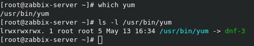](images/01-1.png)

Olhem o **man** do **yum**:

[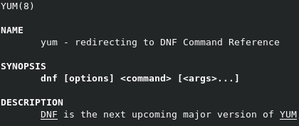](images/02.png)

Na próxima versão do **CentOS** o **yum** deve ser removido totalmente, assim como aconteceu com o **Fedora**.

Caso tenha havido atualização do kernel reinicie o sistema operacional.

Com o sistema atualizado vamos aos passos de instalação.

**1** - Adicione o repositório do Zabbix 4.4.

```
# rpm -Uvh https://repo.zabbix.com/zabbix/4.4/rhel/8/x86_64/zabbix-release-4.4-1.el8.noarch.rpm
```

**2** - Limpe os arquivos temporários dos repositórios.

```
# dnf clean all
```

**3** - Vamos fazer a instalaçãod o Zabbix Server, Zabbix Agent, Apache e MariaDB.

```
# dnf -y install zabbix-server-mysql zabbix-web-mysql zabbix-apache-conf zabbix-agent httpd mariadb mariadb-server
```

**4** - Habilite e inicie o serviços do MariaDB.

```
# systemctl enable mariadb

# systemctl start mariadb
```

**5** - Vamos as configurações básicas do MariaDB, execute o comando abaixo.

```
# mysql_secure_installation
```

Como acabamos de realizar a instalação do MariaDB o mesmo ainda não está com a senha de root configurada, aperte ENTER apenas.

[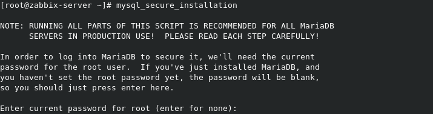](images/03-1.png)

Responda com **Y** para configurar uma **nova senha**.

[](images/04-1.png)

Responda com **Y** para remover o usuário **anonymous**.

[](images/05-1.png)

Responda com **Y** para aceitar conexões locais apenas.

[](images/06-2.png)

Responda com **Y** para remover o banco de dados **test**.

[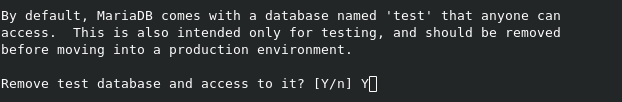](images/07-1.png)

Responda com **Y** para dar um **reload** em todos os privilégios.

[](images/08-2.png)

Pronto, configurações básicas do MariaDB realizadas.

[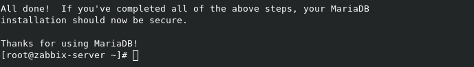](images/09-2.png)

**6** - Agora vamos a configuração do banco de dados do Zabbix Server.

Logue com o usuário root no MariaDB.

```
# mysql -u root -p
```

Execute o comando abaixo para criar um banco de dados chamado **banco-zabbix** esse será o banco que o Zabbix Server vai utilizar.

```
# create database banco_zabbix character set utf8 collate utf8_bin;
```

**OBS:** Você pode configurar o nome que desejar para o banco de dados, mude de acordo com a sua necessidade.

Vamos criar um **usuário** e dar os **privilégios** sobre o banco de dados **banco-zabbix**.

```
# grant all privileges on banco_zabbix.* to usuario_zabbix@localhost identified by 'MudarSenha123';
```

Agora vamos sair do console do MariaDB.

```
# quit;
```

**OBS:** Você pode configurar o nome que desejar para o usuário, mude o usuário e a senha de acordo com a sua necessidade.

Agora vamos importar os dados e esquemas das tabelas para nosso banco.

```
# zcat /usr/share/doc/zabbix-server-mysql*/create.sql.gz | mysql -u usuario_zabbix -p banco_zabbix
```

Será solicitada a senha do usuário **usuario\_zabbix**.

**7** - Vamos editar o arquivo de configuração do Zabbix Server.

Faça uma copia do arquivo de configuração.

```
# cp /etc/zabbix/zabbix_server.conf /etc/zabbix/zabbix_server.conf-orig
```

Abra o arquivo com seu editor de texto favorito, no meu caso é o vim.

```
# vim /etc/zabbix/zabbix_server.conf
```

Não vou entrar em detalhes sobre o arquivo de configuração, mas normalmente gosto de deixar o meu da seguinte forma:

```
LogFile=/var/log/zabbix/zabbix_server.log
LogFileSize=1
DebugLevel=3
PidFile=/var/run/zabbix/zabbix_server.pid
SocketDir=/var/run/zabbix
DBHost=localhost
DBName=banco_zabbix
DBUser=usuario_zabbix
DBPassword=MudarSenha123
SNMPTrapperFile=/var/log/snmptrap/snmptrap.log
Timeout=4
AlertScriptsPath=/usr/lib/zabbix/alertscripts
ExternalScripts=/usr/lib/zabbix/externalscripts
LogSlowQueries=3000
StatsAllowedIP=127.0.0.1
```

OBS: Nem todos os campos que estão na configuração são necessários pois estão com o valor padrão, mas por gosto particular deixo eles. ;)

Os campos que são necessários realizar alguma alteração são os campos com destaque abaixo:

[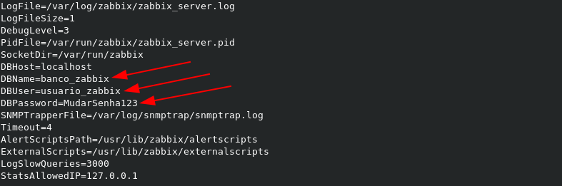](images/10-1.png)

**8** - Configure o php do frontend do Zabbix Server removendo o comentário e deixando de acordo com a sua região.

```
# vim /etc/php-fpm.d/zabbix.conf
```

[](images/11-1.png)

**9** - Por padrão o acesso ao Zabbix Server é o IP ou hostname **/zabbix**, exemplo:

**http://zabbix.rodrigolira.lab/zabbix**

Vamos configurar o **httpd** para que o acesso seja:

**http://zabbix.rodrigolira.lab/**

Edite o arquivo de configuração do httpd.

```
# vim /etc/httpd/conf/httpd.conf
```

Mude o campo **DocumentRoot "/var/www/html"** para **DocumentRoot "/usr/share/zabbix"**

[](images/12-1.png)

**10** - Agora vamos habilitar e iniciar o serviço do **httpd**.

```
# systemctl enable httpd

# systemctl start httpd
```

**11** - Agora vamos habilitar e iniciar o serviço do **php-fpm**.

```
# systemctl enable php-fpm

# systemctl start php-fpm
```

**12** - Agora vamos habilitar e iniciar o serviço do **Zabbix Server**.

```
# systemctl enable zabbix-server

# systemctl start zabbix-server
```

Se seu **Zabbix Server** não iniciar e provavelmente ele não vai, **99,9%** de chance de ser o **SELinux**, para resolver vamos executar o seguinte comando.

```
# sealert -a /var/log/audit/audit.log
```

[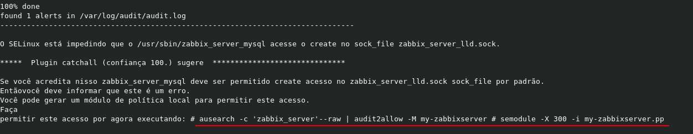](images/14.png)

A execução do comando pode demorar um pouco, mas a saída deve ser como a imagem acima, observe que o próprio sealert informa o que fazer para resolver o problema.

Agora só executar os comanos informados, como já passei pelo problema vou deixar os comandos que executei para poder trabalhar com o SELinux habilitado.

```
# setsebool -P httpd_can_connect_zabbix on

# setsebool -P daemons_enable_cluster_mode 1

# ausearch -c 'zabbix_server' --raw | audit2allow -M my-zabbixserver

# semodule -i my-zabbixserver.pp
```

**OBS:** Não vou entrar em detalhes sobre os comandos do SELinux, para maiores esclarecimentos acessem o link abaixo.

[https://access.redhat.com/documentation/en-us/red\_hat\_enterprise\_linux/7/html/selinux\_users\_and\_administrators\_guide/index](https://access.redhat.com/documentation/en-us/red_hat_enterprise_linux/7/html/selinux_users_and_administrators_guide/index)

Depois disso só tentar iniciar novamente o Zabbix Server.

```
# systemctl restart zabbix-server
```

**13** - Libere o acesso no firewalld.

```
# firewall-cmd --add-service=zabbix-server --permanent 
# firewall-cmd --add-service=zabbix-server --permanent 

# firewall-cmd --reload
```

**14** - Abra o navegador e digite o **endereço IP** ou **hostname** do servidor, clique em **Next step**.

[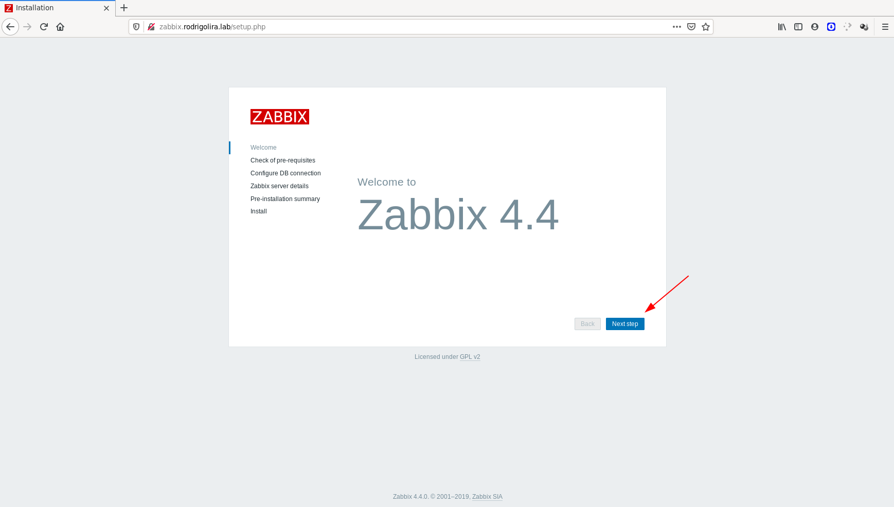](images/16.png)

**15** - Verifique se todos os requisitos estão **OK** e clique em **Next step**.

[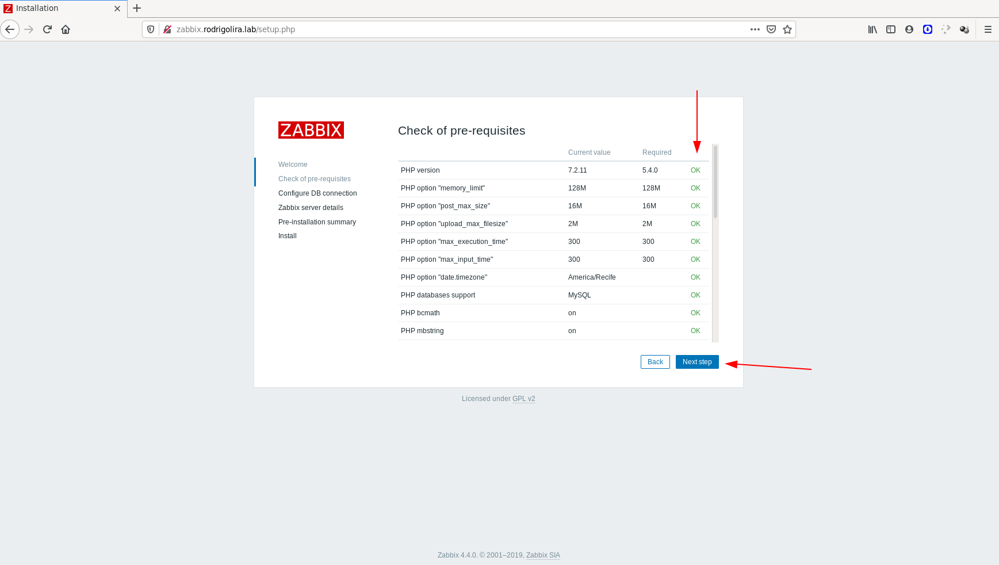](images/17.png)

**16** - Preencha os campos de acordo como o arquivo de configuração do Zabbix Server e clique em **Next step**.

[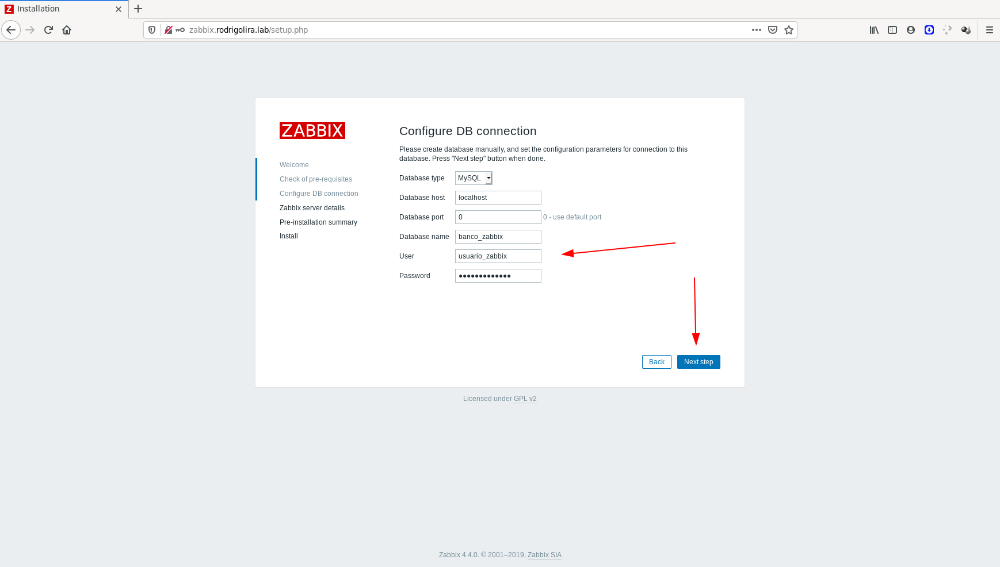](images/18.png)

**17** - Configure um **nome** para o servidor e clique em **Next step**.

[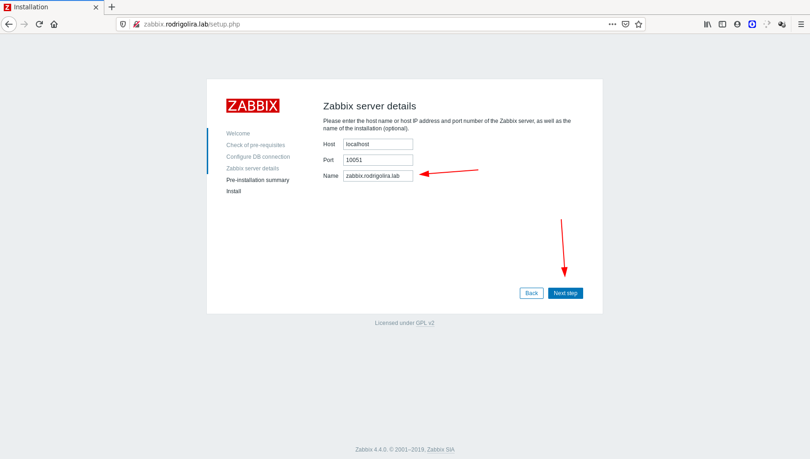](images/19.png)

**18** - Veja os detalhes e clique em **Next step** se estiver tudo correto.

[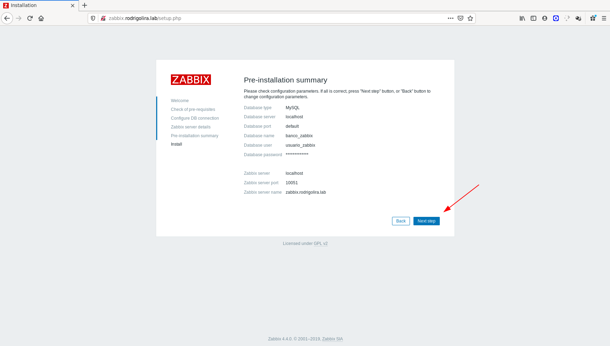](images/20.png)

**19** - Clique em **Finish** para finalizar a instalação.

[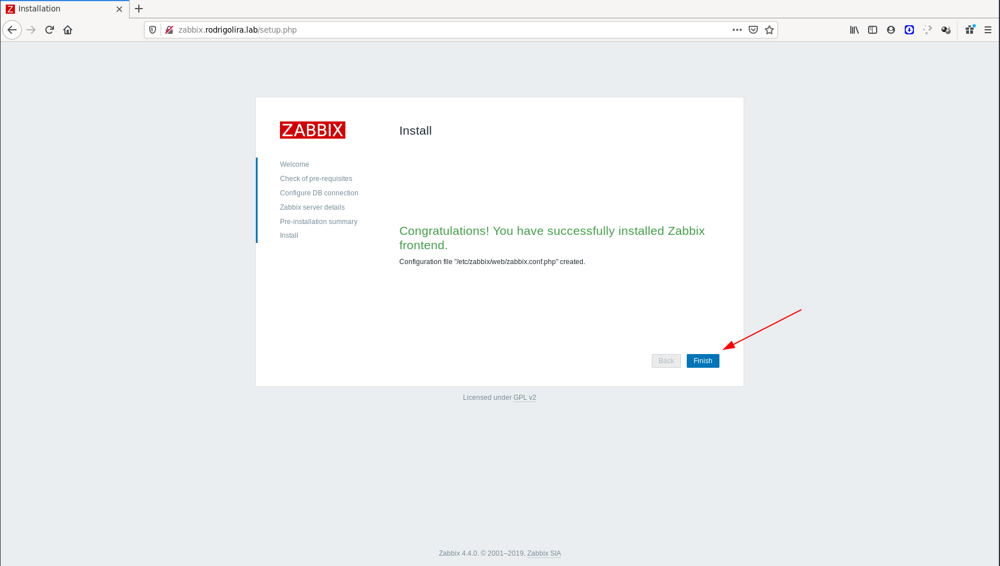](images/21.png)

Pronto, Zabbix Server instalado e configurado com sucesso!

Agora vamos logar no mesmo, insira o usuário e senha, por padrão o usuário é **Admin** e a senha é **zabbix**.

[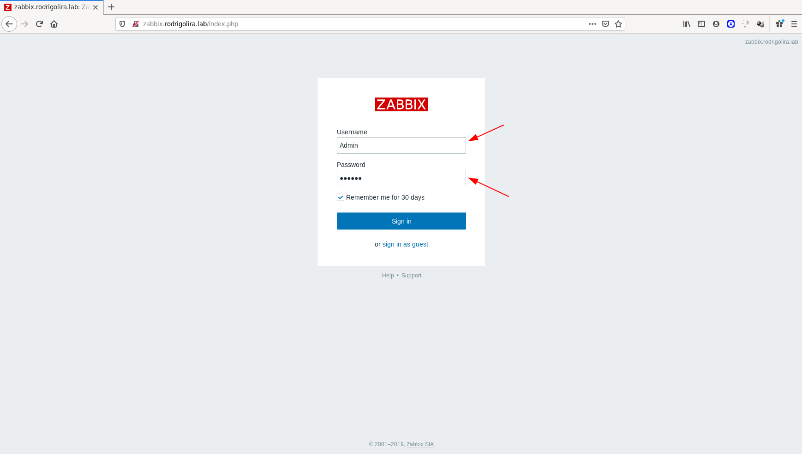](images/22.png)

Sistema rodando com sucesso e com o SELinux habilitado :D

[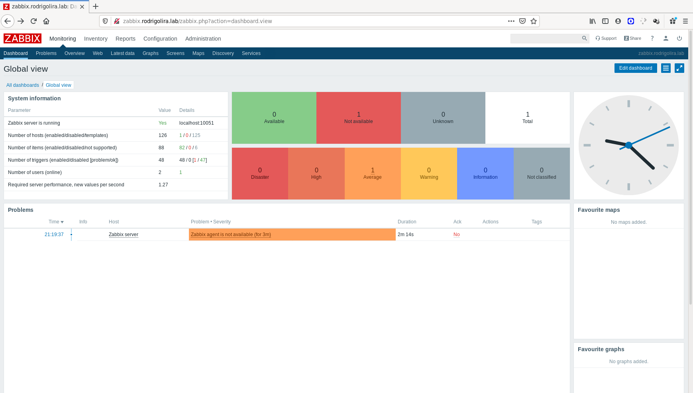](images/23.png)

Se você observou vem nós já estamos com um problema, o **Zabbix agent** não está sendo executado, agora que já configuramos o Zabbix Server vamos configurar o **Zabbix Agent**.

**1** - Faça uma copia do arquivo de configuração do **Zabbix Agent**.

```
# cp /etc/zabbix/zabbix_agentd.conf /etc/zabbix/zabbix_agentd.conf-orig
```

**2** - Edite o arquivo de configuração com seu editor de texto favorito.

```
# vim /etc/zabbix/zabbix_agentd.conf
```

Assim como no Zabbix Server não vou entrar em detalhes sobre o arquivo de configuração, mas normalmente gosto de deixar o meu da seguinte forma:

```
PidFile=/var/run/zabbix/zabbix_agentd.pid
LogFile=/var/log/zabbix/zabbix_agentd.log
LogFileSize=1
DebugLevel=3
Server=127.0.0.1
ServerActive=127.0.0.1
Hostname=Zabbix server
Timeout=3
Include=/etc/zabbix/zabbix_agentd.d/*.conf
```

[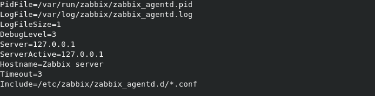](images/24.png)

**3** - Depois do arquivo configurado só habilitar e iniciar o serviço.

```
# systemctl enable zabbix-agent

# systemctl start zabbix-agent
```

**4** - Agora só acessar o Zabbix Server e confirmar se o Zabbix Agent está em execução, **Configuration** > **Hosts**.

[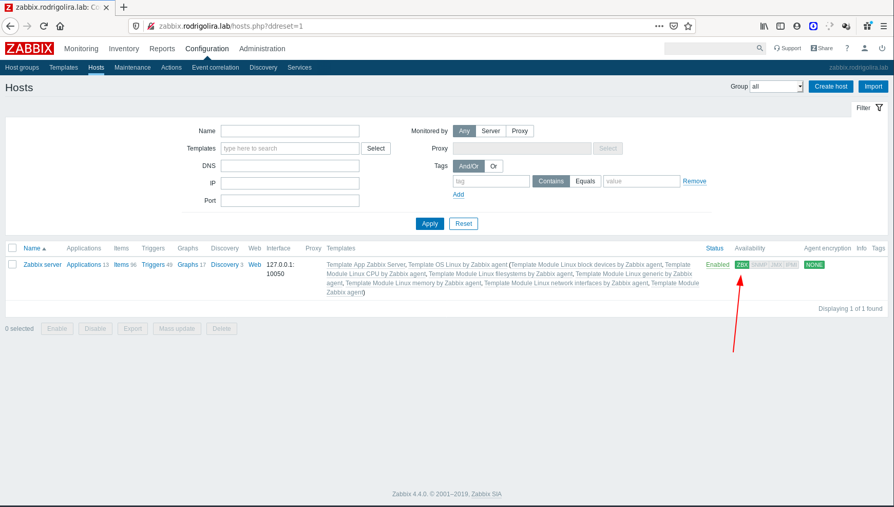](images/25.png)

Pronto, agora está tudo configurando e rodando.

Espero que você tenha gostado.

Até o próximo post!

:D
