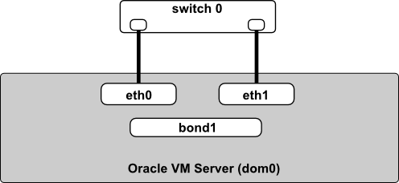
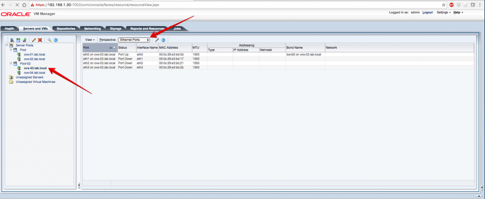
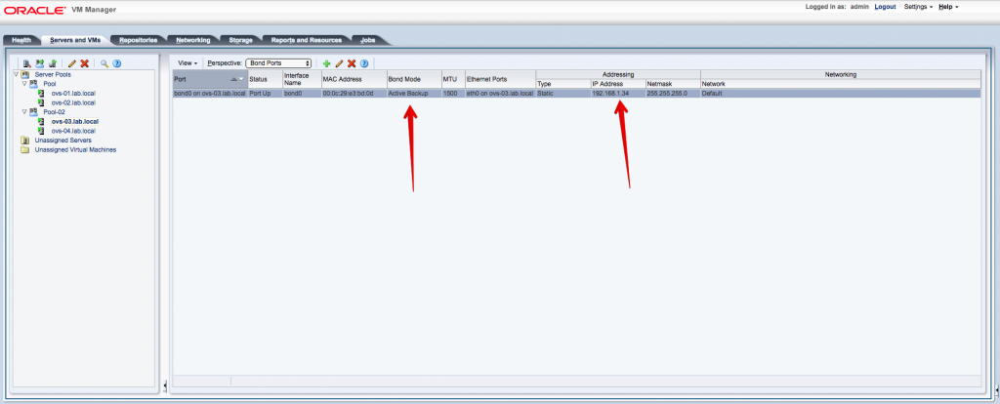
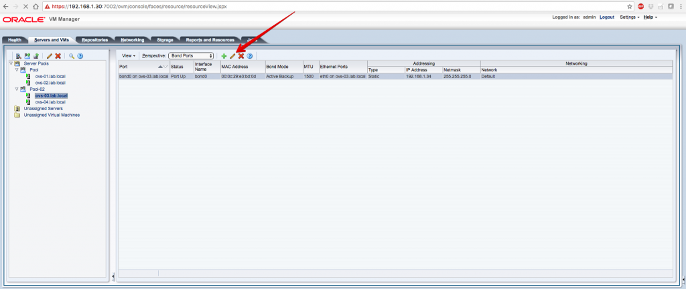
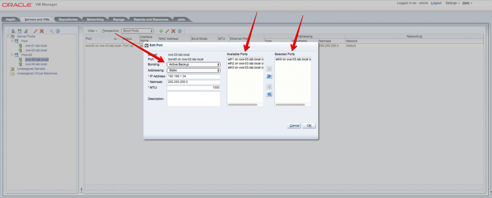
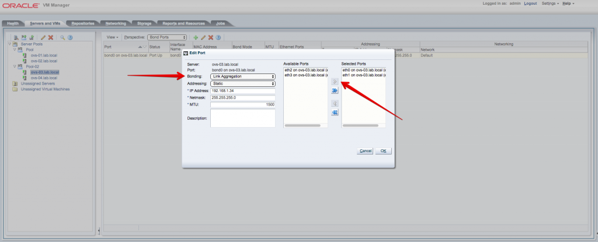
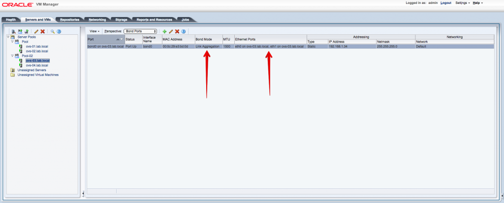
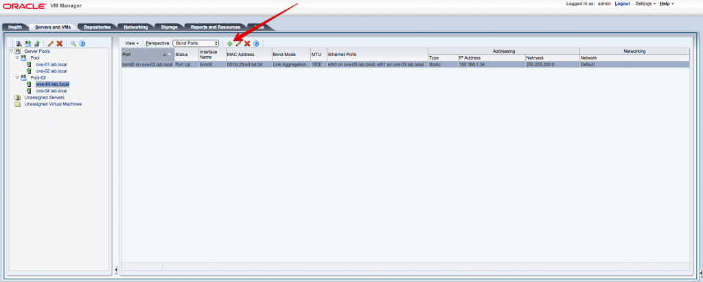
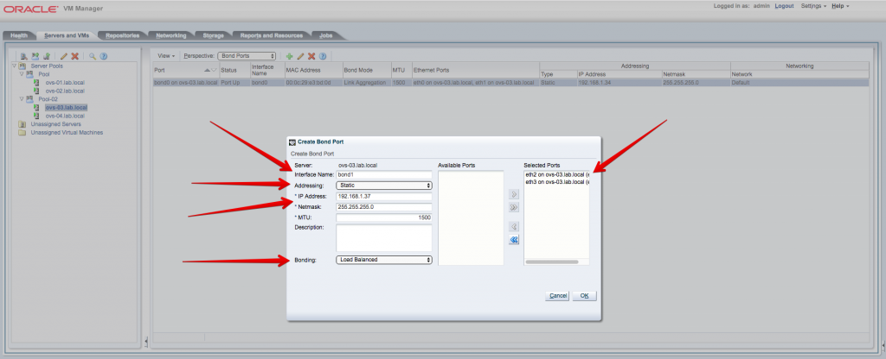
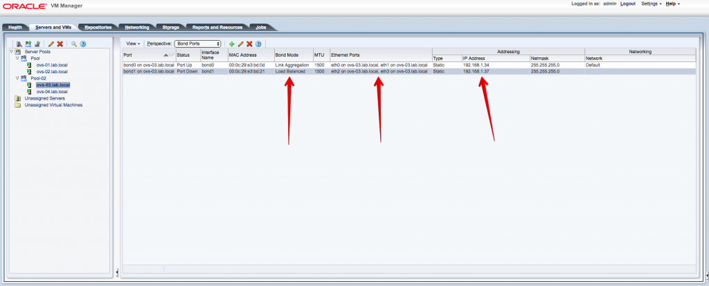

Salve Salve Pessoal!

Nesse post vou mostrar as opções de configuração da interface bond no Oracle VM Server.

O bond é o responsável por fazer a agregação de interfaces no Oracle VM, na versão atual (3.4.2) é possível configurar o bond com as seguintes opções:

**Active Backup:** Usa apenas uma interface do bond, caso a interface ativa falhe, outra interface assume o lugar da interface que falhou.

**Link Aggregation:** Faz uma agregação das interfaces, que resulta em um maior throughput.

**Load Balanced:** Faz um balanceamento de carga, dividindo o pacotes trafegados entre as interfaces.

Vamos ao que interessa :D

Acesse o **Oracle VM Manager** e verifique as interfaces disponíveis no host, clique em cima do host e depois selecione **Ethernet Ports** em **Perspective**, como podemos verificar, o host **ovs-03.lab.local** possui **4 interfaces** de rede, sendo que a interface **eth0** já faz parte do **bond0**, outro detalhe é que apenas a **eth0** está com o status **Port UP**.

Agora em **Perspective** selecione **Bond Ports**, podemos verificar agora qual o tipo de configuração que o nosso bond está utilizando, nessa caso é o **Active Backup** e o endereço **IP** que está configurado na interface.

**Active Backup é a configuração padrão do bond do Oracle VM Server** ;)

Selecione a interface bond e clique em **editar,** ou clique com o botão direito do mouse sobre a interface bond e clique em **editar**.

Na aba que se abriu, temos várias informações, o **host** que estamos configurando, o **bond** que nesse caso é o **bond0**, endereço **IP** e etc, o que temos que modificar nesse caso é apenas o tipo de **Bonding** e quais interfaces vão fazer parte dele.

No nosso caso já estamos com a interface **eth0** fazendo parte do **bond0** e o tipo de bond, configurado como **Active Backup**.

Vamos configurar o nosso **bond0** como **Link Aggreation** e Inserir a interface **eth1** ao nosso **bond0**, em **Bonding** selecione **Link Aggregation**, depois selecione a interface **eth1** e clique no ícone com **seta para a direita**, feito isso clique em **OK**.

Agora podemos verificar que o **Bond Mode** está como **Link Aggregation** e em **Ethernet Ports** temos **eth0** e **eth1**.

Agora vamos criar um novo bond e configurar como **Load Balance** usando as interfaces **eth2** e **eth3**. Clique em cima do ícone com o sinal de adição.

Na aba que se abri configure de seguinte forma:

**Interface Name:** bond1

**Addresing:** Static

**IP:** 192.168.1.37 (Pode ser diferente acordo com seu lab)

**Netmask:** 255.255.255.0 (Pode ser diferente acordo com seu lab)

**Bonding:** Load Balanced

**Selected Ports:** eth2 e eth3

Depois de tudo configurado clique em **OK**.

Pronto, um novo bond foi criado, como podemos ver na imagem abaixo.

Espero que tenham gostado do post!

Até a próxima :D
