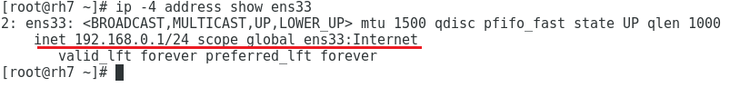

Salve Salve Pessoal!

Faz tempo que venho querendo falar sobre o **iproute2.**

Quando o **Debian 9** foi lançado, várias pessoas tiveram dificuldade em realizar as configurações de rede porque pacote **net-tools** foi retirado da arvore do sistema, vi várias pessoas sem saber o que fazer, ou seja, não sabiam como configurar a rede.

O **iproute2** é o kit de ferramentas padrão para configuração de redes no Linux desde o ano 2000, ele substitui o antigo **net-tools**, que foi descontinuado e existe apenas como modo de compatibilidade para versões mais antigas de Linux.

Apesar de ser a ferramenta padrão do Linux para configuração de rede e ter várias features que o net-tools não tem, o iproute2 não é tão famoso quanto o net-tools, ou pelo menos não era. :P

Nessa serie de posts, vou mostrar todas as possibilidade de uso do iproute2, não vou fazer posts fazendo comparações entre o iproute2 e o net-tools, mas abaixo mostro alguns dos comandos de cada uma das ferramentas:

| **net-tools** | **iproute2** |
| --- | --- |
| arp | ip neigh |
| ifconfig | ip addr |
| route | ip route |
| mii-tool | ethtool |

Vamos ao que interessa :D

Nesse primeiro post, vamos ver como visualizar as informações, adicionar e remover configurações as interfaces de rede.

#### Visualizar

Para visualizar as informações de rede atual de todos os dispositivos, usamos:

```
# ip address show
```

Podemos especificar um único dispositivo:

```
# ip address eth0
```

Podemos também especificar a versão do protocolo:

```
# ip -4 address show (IPv4)

# ip -6 address show (IPv6)
```

Para visualizar apenas as interfaces que estão em ativas:

```
# ip address show up
```

Podemos verificar se um IP está configurado de forma dinâmica ou estaticamente:

```
# ip address show eth0 dynamic (dinâmico)

# ip address show eth0 permanent (estático)
```

#### Adicionar

Podemos adicionar um endereço IP a uma interface, da seguinte maneira:

```
# ip address add 192.168.0.1/24 dev eth0
```

**Obs:** Podemos adicionar mais de um endereço IP a interface, sem a necessidade de criarmos interfaces virtuais como era com o ifconfig.

Também podemos colocar uma descrição para interface, facilitando a identificação do uso da mesma:

```
# ip address add 192.168.0.1/24 dev eth0 label eth0:Internet
```

#### [](http://rodrigolira.eti.br/wp-content/uploads/2017/12/Sem-título.png)

#### Deletar

Para deletar um endereço IP, da seguinte maneira:

```
# ip address delete 192.168.0.1/24 dev eth0
```

Podemos remover todos os endereços IP configurados em uma interface de uma vez da seguinte maneira:

```
# ip address flush dev eth0
```

Por enquanto é só, até o próximo post :D
