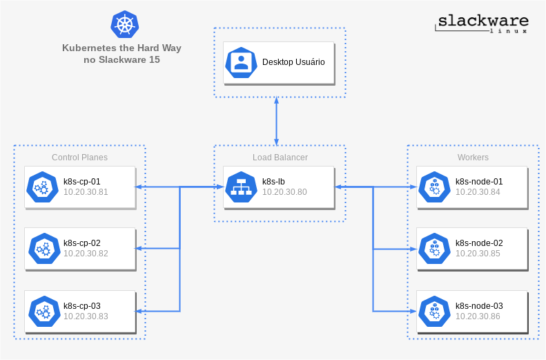

Salve Salve Pessoal!

Que tal a gente criar um cluster Kubernetes usando Slackware e da maneira díficil?

Bem, para quem não conhece, existe um famoso projeto no GitHub chamado **Kubernetes the Hard Way**, onde é mostrado como criar um cluster Kubernetes sem nenhum utiliário como kubeadm, kind, k3s, etc. Onde baixamos os binários de todos os componentes e criamos todos os arquivos de configuração manualmente. O projeto utiliza o **GCP** para criar todo o ambiente de maquinas virtuais e o load balance, além de usar Ubuntu Server como sistema operacional.

Link para o projeto:

[https://github.com/kelseyhightower/kubernetes-the-hard-way](https://github.com/kelseyhightower/kubernetes-the-hard-way)

Então a ídeia é a seguinte, criar todo o ambiente localmente usando o Slackware 15, usar as versões mais recentes dos componentes e criar todos os scripts para o Slackware.

Basicamente esse é o cenário que vamos trabalhar, teremos três servidores que são os **Control Planes** e mais três que serão os **Works**, além de uma máquina que será um **Load Balancer** para os control planes.

Como mencionado anteriormente todas as máquinas virtuais com Slackware 15 como sistema operacional, para o load balancer nós vamos usar o Apache que já vem nativamente no Slackware.

Por enquanto é isso pessoal, até o próximo post onde vamos criar todas as máquinas virtuais.

:D
