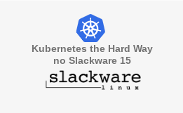
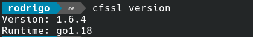
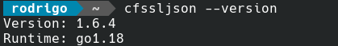
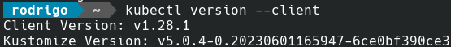

[](images/k8s-slackware.png)

Salve Salve Pessoal!

Dando continuidade a nossa serie **Kubernetes The Hard Way no Slackware 15**, nesse post vamos instalar os utilitários **cfssl** e **cfssljson**, que vão ser usados para gerar todas as chaves e certificados e o **kubectl** que é o utilitário de linha de comando usado para interagir com o servidor de API do Kubernetes.

Se vocês observarem vão ver que os utilitários estão em suas versões mais recentes, como havia falado no post anteior.

Para quem não viu o post anteior acesse o link abaixo.

[Kubernetes The Hard Way no Slackware 15 – Parte 01](https://rodrigolira.eti.br/kubernetes-the-hard-way-no-slackware-15-parte-01/)

Uma coisa que não falei no post anterior, vou tentar seguir a mesma quantidade páginas/posts que o projeto original, então devemos ter **13 posts**, não iremos fazer o último que é a limpeza porque não vamos usar uma cloud.

Vamos ao que interessa!

Execute os comandos abaixo para fazer o download dos utilitários  **cfssl**, **cfssljson** e **kubectl**.

```
# curl -LO https://github.com/cloudflare/cfssl/releases/download/v1.6.4/cfssl_1.6.4_linux_amd64
```

```
# curl -LO https://github.com/cloudflare/cfssl/releases/download/v1.6.4/cfssljson_1.6.4_linux_amd64
```

```
# curl -LO https://dl.k8s.io/release/v1.28.1/bin/linux/amd64/kubectl
```

Renomei os arquivos **cfssl** e **cfssljson**.

```
# mv cfssl_1.6.4_linux_amd64 cfssl
```

```
# mv cfssljson_1.6.4_linux_amd64 cfssljson
```

Agora vamos configurar a permissão de execução nos utilitários baixados.

```
# chmod +x kubectl cfssl cfssljson
```

Agora vamos mover eles para o diretório **/usr/local/bin**, para que entrem no **PATH** do usuário.

```
# sudo mv {cfssl,cfssljson,kubectl} /usr/local/bin/
```

Para validar a versão de cada um dos utilitários você pode executar os seguintes comandos.

```
# cfssl version
```

[](images/Screenshot_20230923_222254.png)

```
# cfssljson --version
```

[](images/Screenshot_20230923_222309.png)

```
# kubectl version --client
```

[](images/Screenshot_20230923_222320.png)

Pronto, feito isso já temos os utilitários necessários para começarmos a criar nosso cluster.

Uma observação importante, todos esses comandos foram executados na máquina "**Desktop Usuário**" na arquitetura do post anterior.

Até o próximo post!

:D

Referência:

[https://github.com/kelseyhightower/kubernetes-the-hard-way/blob/master/docs/02-client-tools.md](https://github.com/kelseyhightower/kubernetes-the-hard-way/blob/master/docs/02-client-tools.md)
