[](images/k8s-slackware.png)

Salve Salve Pessoal!

Dando continuidade a nossa serie de posts **Kubernetes The Hard Way no Slackware 15**, nesse post nos vamos ver como criar toda a infraestrutura PKI, usando as ferramentas **cfssl** e **cfssljson** para provisionar uma **CA** e gerar todos os **Certificados TLS**.

Para quem ainda não leu os posts anteriores, só clicar nos links abaixo.

[Kubernetes The Hard Way no Slackware 15 – Parte 01](https://rodrigolira.eti.br/kubernetes-the-hard-way-no-slackware-15-parte-01/)

[Kubernetes The Hard Way no Slackware 15 – Parte 02](https://rodrigolira.eti.br/kubernetes-the-hard-way-no-slackware-15-parte-02/)

[Kubernetes The Hard Way no Slackware 15 – Parte 03](https://rodrigolira.eti.br/kubernetes-the-hard-way-no-slackware-15-parte-03/)

Nós vamos gerar os certificados para os seguintes componentes do cluster, lembrando que toda a comunicação dos componentes do kubernetes é atráves de certificados.

- - **etcd**
    - **kube-apiserver**
    - **kube-controller-manager**
    - **kube-scheduler**
    - **kubelet**
    - **kube-proxy**

Para começar vamos gerar a autoridade certificadora, que será usada para gerar todos os demais certificados.

Se você estiver olhando o post original no GitHub, observe que alguns comandos  vão ser diferentes, ele provisionou a infraestrutura dele usando a Cloud do Google e nós estamos provisionando localmente.

### **Autoridade Certificadora (CA)**

Execute o seguinte código em seu terminal:

```
{

cat > ca-config.json <<EOF
{
  "signing": {
    "default": {
      "expiry": "8760h"
    },
    "profiles": {
      "kubernetes": {
        "usages": ["signing", "key encipherment", "server auth", "client auth"],
        "expiry": "8760h"
      }
    }
  }
}
EOF

cat > ca-csr.json <<EOF
{
  "CN": "Kubernetes",
  "key": {
    "algo": "rsa",
    "size": 2048
  },
  "names": [
    {
      "C": "US",
      "L": "Portland",
      "O": "Kubernetes",
      "OU": "CA",
      "ST": "Oregon"
    }
  ]
}
EOF

cfssl gencert -initca ca-csr.json | cfssljson -bare ca

}
```

Arquivos esperados:

[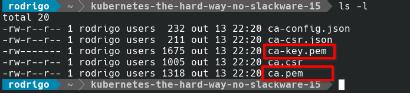](images/Screenshot_20231013_224054.png)Agora vamos gerar os **certificados cliente** e **servidor** para todos os componentes do cluster, além de gerarmos um certificado para um usuário **admin**.

### **Certificado para o usuário admin**

Execute o seguinte código em seu terminal:

```
{

cat > admin-csr.json <<EOF
{
  "CN": "admin",
  "key": {
    "algo": "rsa",
    "size": 2048
  },
  "names": [
    {
      "C": "US",
      "L": "Portland",
      "O": "system:masters",
      "OU": "Kubernetes The Hard Way",
      "ST": "Oregon"
    }
  ]
}
EOF

cfssl gencert \
  -ca=ca.pem \
  -ca-key=ca-key.pem \
  -config=ca-config.json \
  -profile=kubernetes \
  admin-csr.json | cfssljson -bare admin

}
```

Arquivos esperados:

[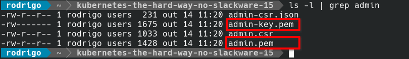](images/Screenshot_20231014_112229.png)

### **Certificados para o Kubelet**

Execute o seguinte código em seu terminal, será necessário executar o comando **três vezes**, uma vez para cada node, observer que coloquei o **nome** e o **IP** de cada host no início do código, basta substituir e de acordo com seu ambiente.

```
HOST="k8s-node-01"
IP="10.20.30.84"

cat > ${HOST}-csr.json <<EOF
{
  "CN": "system:node:${HOST}",
  "key": {
    "algo": "rsa",
    "size": 2048
  },
  "names": [
    {
      "C": "US",
      "L": "Portland",
      "O": "system:nodes",
      "OU": "Kubernetes The Hard Way",
      "ST": "Oregon"
    }
  ]
}
EOF

cfssl gencert \
  -ca=ca.pem \
  -ca-key=ca-key.pem \
  -config=ca-config.json \
  -hostname=${HOST},${IP} \
  -profile=kubernetes \
  ${HOST}-csr.json | cfssljson -bare ${HOST}

```

Arquivos esperados:

[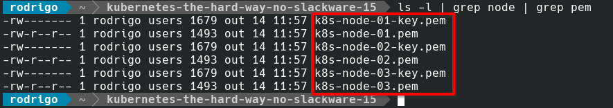](images/Screenshot_20231014_115908.png)

### **Certificado para o Controller Manager** 

Execute o seguinte código em seu terminal:

```
{

cat > kube-controller-manager-csr.json <<EOF
{
  "CN": "system:kube-controller-manager",
  "key": {
    "algo": "rsa",
    "size": 2048
  },
  "names": [
    {
      "C": "US",
      "L": "Portland",
      "O": "system:kube-controller-manager",
      "OU": "Kubernetes The Hard Way",
      "ST": "Oregon"
    }
  ]
}
EOF

cfssl gencert \
  -ca=ca.pem \
  -ca-key=ca-key.pem \
  -config=ca-config.json \
  -profile=kubernetes \
  kube-controller-manager-csr.json | cfssljson -bare kube-controller-manager

}
```

Arquivos esperados:

[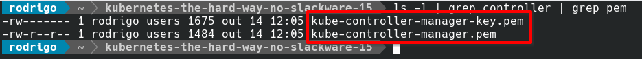](images/Screenshot_20231014_120709.png)

### **Certificado para o Kube Proxy**

Execute o seguinte código em seu terminal:

```
{

cat > kube-proxy-csr.json <<EOF
{
  "CN": "system:kube-proxy",
  "key": {
    "algo": "rsa",
    "size": 2048
  },
  "names": [
    {
      "C": "US",
      "L": "Portland",
      "O": "system:node-proxier",
      "OU": "Kubernetes The Hard Way",
      "ST": "Oregon"
    }
  ]
}
EOF

cfssl gencert \
  -ca=ca.pem \
  -ca-key=ca-key.pem \
  -config=ca-config.json \
  -profile=kubernetes \
  kube-proxy-csr.json | cfssljson -bare kube-proxy

}
```

Arquivos esperados:

[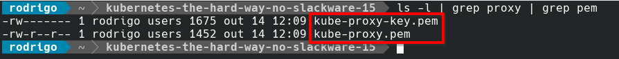](images/Screenshot_20231014_121005.png)

### **Certificado para o Kube Scheduler**

Execute o seguinte código em seu terminal:

```
{

cat > kube-scheduler-csr.json <<EOF
{
  "CN": "system:kube-scheduler",
  "key": {
    "algo": "rsa",
    "size": 2048
  },
  "names": [
    {
      "C": "US",
      "L": "Portland",
      "O": "system:kube-scheduler",
      "OU": "Kubernetes The Hard Way",
      "ST": "Oregon"
    }
  ]
}
EOF

cfssl gencert \
  -ca=ca.pem \
  -ca-key=ca-key.pem \
  -config=ca-config.json \
  -profile=kubernetes \
  kube-scheduler-csr.json | cfssljson -bare kube-scheduler

}
```

Arquivos esperados:

[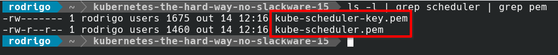](images/Screenshot_20231014_121858.png)

### **Certificado para o API Server**

Execute o seguinte código em seu terminal, observe que temos os endereços IP dos control planes, modifique de acordo com seu ambiente.

```
{

cat > kubernetes-csr.json <<EOF
{
  "CN": "kubernetes",
  "key": {
    "algo": "rsa",
    "size": 2048
  },
  "names": [
    {
      "C": "US",
      "L": "Portland",
      "O": "Kubernetes",
      "OU": "Kubernetes The Hard Way",
      "ST": "Oregon"
    }
  ]
}
EOF

cfssl gencert \
  -ca=ca.pem \
  -ca-key=ca-key.pem \
  -config=ca-config.json \
  -hostname=10.32.0.1,10.20.30.81,10.20.30.82,10.20.30.83,127.0.0.1,kubernetes,kubernetes.default,kubernetes.default.svc,kubernetes.default.svc.cluster,kubernetes.svc.cluster.local \
  -profile=kubernetes \
  kubernetes-csr.json | cfssljson -bare kubernetes

}
```

Arquivos esperados:

[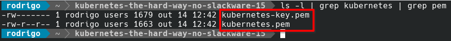](images/Screenshot_20231014_124418.png)

### **Chaves para Service Account**

Execute o seguinte código em seu terminal, o Controller Manager usa um par de chaves para gerar e assinar tokens de contas de serviço.

```
{

cat > service-account-csr.json <<EOF
{
  "CN": "service-accounts",
  "key": {
    "algo": "rsa",
    "size": 2048
  },
  "names": [
    {
      "C": "US",
      "L": "Portland",
      "O": "Kubernetes",
      "OU": "Kubernetes The Hard Way",
      "ST": "Oregon"
    }
  ]
}
EOF

cfssl gencert \
  -ca=ca.pem \
  -ca-key=ca-key.pem \
  -config=ca-config.json \
  -profile=kubernetes \
  service-account-csr.json | cfssljson -bare service-account

}
```

Arquivos esperados:

[](images/Screenshot_20231014_130306.png)

### **Enviar certificados para os Servidores**

Vamos começar enviando os certificados e chaves para os nodes workes.

Envie primeiro para o **k8s-node-01**.

```
scp ca.pem k8s-node-01-key.pem k8s-node-01.pem root@10.20.30.84:/root
```

[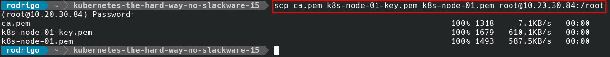](images/Screenshot_20231030_163845.png)

Faça o mesmo processo com **k8s-node-02**.

```
scp ca.pem k8s-node-02-key.pem k8s-node-02.pem root@10.20.30.85:/root
```

[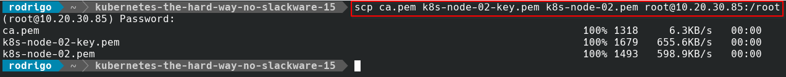](images/Screenshot_20231030_164224.png)

Agora com o **k8s-node-03**.

```
scp ca.pem k8s-node-03-key.pem k8s-node-03.pem root@10.20.30.86:/root
```

[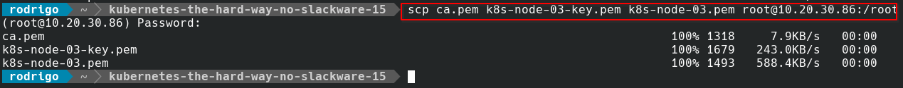](images/Screenshot_20231030_164512.png)

Agora vamos enviar os certificados e chaves para os **control planes**.

Envie primeiro para o **k8s-cp-01**.

```
scp ca.pem ca-key.pem kubernetes-key.pem kubernetes.pem service-account-key.pem service-account.pem root@10.20.30.81:/root
```

[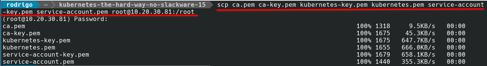](images/Screenshot_20231030_165508.png)

Faça o mesmo processo com **k8s-cp-02**.

```
scp ca.pem ca-key.pem kubernetes-key.pem kubernetes.pem service-account-key.pem service-account.pem root@10.20.30.82:/root
```

[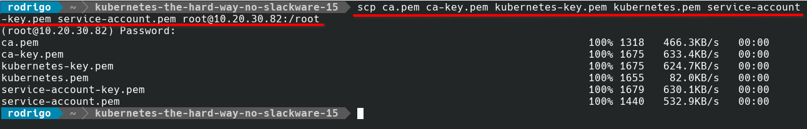](images/Screenshot_20231030_165628.png)

Agora com o **k8s-node-03**.

```
scp ca.pem ca-key.pem kubernetes-key.pem kubernetes.pem service-account-key.pem service-account.pem root@10.20.30.83:/root
```

[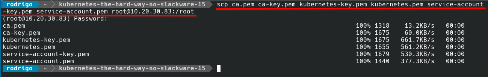](images/Screenshot_20231030_165749.png)

É isso pessoal, até o próximo post!

:D

Referência:

[https://github.com/kelseyhightower/kubernetes-the-hard-way/blob/master/docs/04-certificate-authority.md](https://github.com/kelseyhightower/kubernetes-the-hard-way/blob/master/docs/04-certificate-authority.md)
