[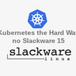](images/k8s-slackware.png)

Salve Salve Pessoal!

Dando continuidade a nossa serie de posts Kubernetes The Hard Way no Slackware 15, neste post vamos ver como gerar os arquivos de configurações para autenticação dos componentes do kubernetes, nós vamos gerar os arquivos para o **controller manager**, **kubelet**, **kube-proxy**, **kube-scheduler** e para o usuário **admin**.

Observem que quando necessário estou passando uma varivável no inicio do script com o endereço IP do **Load Balancer**.

Se você não viu os outros posts, você pode ler nos links abaixo.

[Kubernetes The Hard Way no Slackware 15 – Parte 01](https://rodrigolira.eti.br/kubernetes-the-hard-way-no-slackware-15-parte-01/) [Kubernetes The Hard Way no Slackware 15 – Parte 02](https://rodrigolira.eti.br/kubernetes-the-hard-way-no-slackware-15-parte-02/) [Kubernetes The Hard Way no Slackware 15 – Parte 03](https://rodrigolira.eti.br/kubernetes-the-hard-way-no-slackware-15-parte-03/) [Kubernetes The Hard Way no Slackware 15 – Parte 04](https://rodrigolira.eti.br/kubernetes-the-hard-way-no-slackware-15-parte-04/)

### **Arquivo de configuração do Kubelet**

Execute o seguinte script na linha de comando.

```
KUBERNETES_PUBLIC_ADDRESS="10.20.30.80"

for instance in k8s-node-01 k8s-node-02 k8s-node-03; do
  kubectl config set-cluster kubernetes-the-hard-way \
    --certificate-authority=ca.pem \
    --embed-certs=true \
    --server=https://${KUBERNETES_PUBLIC_ADDRESS}:6443 \
    --kubeconfig=${instance}.kubeconfig

  kubectl config set-credentials system:node:${instance} \
    --client-certificate=${instance}.pem \
    --client-key=${instance}-key.pem \
    --embed-certs=true \
    --kubeconfig=${instance}.kubeconfig

  kubectl config set-context default \
    --cluster=kubernetes-the-hard-way \
    --user=system:node:${instance} \
    --kubeconfig=${instance}.kubeconfig

  kubectl config use-context default --kubeconfig=${instance}.kubeconfig
done
```

Arquivos esperados:

[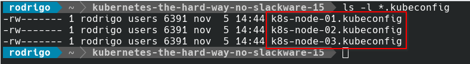](images/Screenshot_20231105_144800.png)

### **Arquivo de configuração do Kube Proxy**

Execute o seguinte script na linha de comando.

```
KUBERNETES_PUBLIC_ADDRESS="10.20.30.80"

{
  kubectl config set-cluster kubernetes-the-hard-way \
    --certificate-authority=ca.pem \
    --embed-certs=true \
    --server=https://${KUBERNETES_PUBLIC_ADDRESS}:6443 \
    --kubeconfig=kube-proxy.kubeconfig

  kubectl config set-credentials system:kube-proxy \
    --client-certificate=kube-proxy.pem \
    --client-key=kube-proxy-key.pem \
    --embed-certs=true \
    --kubeconfig=kube-proxy.kubeconfig

  kubectl config set-context default \
    --cluster=kubernetes-the-hard-way \
    --user=system:kube-proxy \
    --kubeconfig=kube-proxy.kubeconfig

  kubectl config use-context default --kubeconfig=kube-proxy.kubeconfig
}
```

Arquivo esperado:

[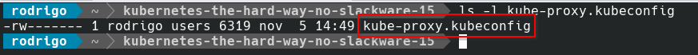](images/Screenshot_20231105_145250.png)

### **Arquivo de configuração do Controller Manager**

Execute o seguinte script na linha de comando.

```
{
  kubectl config set-cluster kubernetes-the-hard-way \
    --certificate-authority=ca.pem \
    --embed-certs=true \
    --server=https://127.0.0.1:6443 \
    --kubeconfig=kube-controller-manager.kubeconfig

  kubectl config set-credentials system:kube-controller-manager \
    --client-certificate=kube-controller-manager.pem \
    --client-key=kube-controller-manager-key.pem \
    --embed-certs=true \
    --kubeconfig=kube-controller-manager.kubeconfig

  kubectl config set-context default \
    --cluster=kubernetes-the-hard-way \
    --user=system:kube-controller-manager \
    --kubeconfig=kube-controller-manager.kubeconfig

  kubectl config use-context default --kubeconfig=kube-controller-manager.kubeconfig
}
```

Arquivo esperado:

[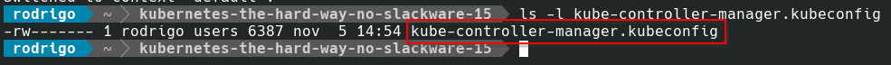](images/Screenshot_20231105_145558.png)

### **Arquivo de configuração do Kube Scheduler**

Execute o seguinte script na linha de comando.

```
{
  kubectl config set-cluster kubernetes-the-hard-way \
    --certificate-authority=ca.pem \
    --embed-certs=true \
    --server=https://127.0.0.1:6443 \
    --kubeconfig=kube-scheduler.kubeconfig

  kubectl config set-credentials system:kube-scheduler \
    --client-certificate=kube-scheduler.pem \
    --client-key=kube-scheduler-key.pem \
    --embed-certs=true \
    --kubeconfig=kube-scheduler.kubeconfig

  kubectl config set-context default \
    --cluster=kubernetes-the-hard-way \
    --user=system:kube-scheduler \
    --kubeconfig=kube-scheduler.kubeconfig

  kubectl config use-context default --kubeconfig=kube-scheduler.kubeconfig
}
```

Arquivo esperado:

[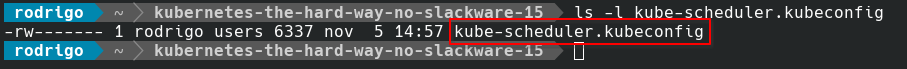](images/Screenshot_20231105_145808.png)

### **Arquivo de configuração do usuário admin**

Execute o seguinte script na linha de comando.

```
{
  kubectl config set-cluster kubernetes-the-hard-way \
    --certificate-authority=ca.pem \
    --embed-certs=true \
    --server=https://127.0.0.1:6443 \
    --kubeconfig=admin.kubeconfig

  kubectl config set-credentials admin \
    --client-certificate=admin.pem \
    --client-key=admin-key.pem \
    --embed-certs=true \
    --kubeconfig=admin.kubeconfig

  kubectl config set-context default \
    --cluster=kubernetes-the-hard-way \
    --user=admin \
    --kubeconfig=admin.kubeconfig

  kubectl config use-context default --kubeconfig=admin.kubeconfig
}
```

Arquivo esperado:

[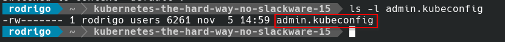](images/Screenshot_20231105_150014.png)

Pronto, acabamos de gerar todos os arquivos necessários, agora vamos enviar os arquivos para os devidos servidores.

### **Enviar os arquivos para os Servidores**

Envie primeiro para o **k8s-node-01**.

```
scp k8s-node-01.kubeconfig kube-proxy.kubeconfig root@10.20.30.84:/root
```

[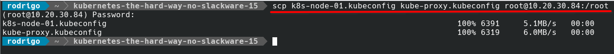](images/Screenshot_20231105_150624.png)Agora para o **k8s-node-02**.

```
scp k8s-node-02.kubeconfig kube-proxy.kubeconfig root@10.20.30.85:/root
```

[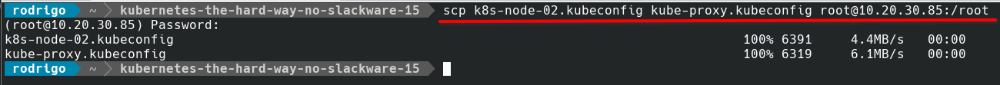](images/Screenshot_20231105_150712.png)Agora para o **k8s-node-03**.

```
scp k8s-node-03.kubeconfig kube-proxy.kubeconfig root@10.20.30.86:/root
```

[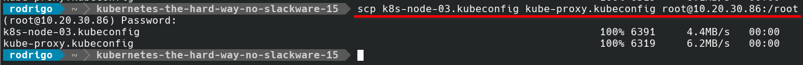](images/Screenshot_20231105_150820.png)Agora para o **k8s-cp-01**.

```
scp admin.kubeconfig kube-controller-manager.kubeconfig kube-scheduler.kubeconfig root@10.20.30.81:/root
```

[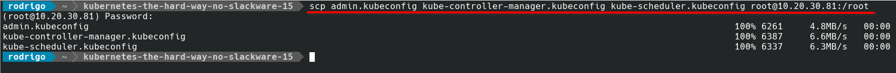](images/Screenshot_20231105_151111.png)Agora para o **k8s-cp-02**.

```
scp admin.kubeconfig kube-controller-manager.kubeconfig kube-scheduler.kubeconfig root@10.20.30.82:/root
```

[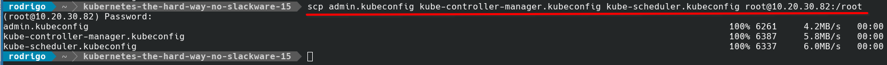](images/Screenshot_20231105_151255.png)Agora para o **k8s-cp-03**.

```
scp admin.kubeconfig kube-controller-manager.kubeconfig kube-scheduler.kubeconfig root@10.20.30.83:/root
```

[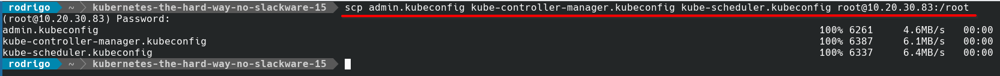](images/Screenshot_20231105_151333.png)Pronto, arquivos criados e enviados para os devidos hosts.

Até o próximo post pessoal

:D

Referência:

[https://github.com/kelseyhightower/kubernetes-the-hard-way/blob/master/docs/05-kubernetes-configuration-files.md](https://github.com/kelseyhightower/kubernetes-the-hard-way/blob/master/docs/05-kubernetes-configuration-files.md)
