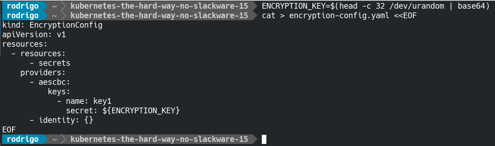
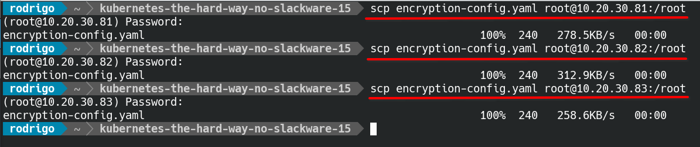

[](images/k8s-slackware.png)

Salve Salve Pessoal!

Dando continuidade a nossa serie de posts Kubernetes The Hard Way no Slackware 15, esse post é bem curto, vamos gerar uma chave e a configuração de criptografia para criptografar os dados do Kubernetes.

Se você não viu os outros posts, você pode ler nos links abaixo.

[Kubernetes The Hard Way no Slackware 15 – Parte 01](https://rodrigolira.eti.br/kubernetes-the-hard-way-no-slackware-15-parte-01/) [Kubernetes The Hard Way no Slackware 15 – Parte 02](https://rodrigolira.eti.br/kubernetes-the-hard-way-no-slackware-15-parte-02/) [Kubernetes The Hard Way no Slackware 15 – Parte 03](https://rodrigolira.eti.br/kubernetes-the-hard-way-no-slackware-15-parte-03/) [Kubernetes The Hard Way no Slackware 15 – Parte 04](https://rodrigolira.eti.br/kubernetes-the-hard-way-no-slackware-15-parte-04/) [Kubernetes The Hard Way no Slackware 15 – Parte 05](https://rodrigolira.eti.br/kubernetes-the-hard-way-no-slackware-15-parte-05/)

Gere a chave com o seguinte comando:

```
ENCRYPTION_KEY=$(head -c 32 /dev/urandom | base64)
```

Agora vamos criar o arquivo de configuração.

```
cat > encryption-config.yaml <<EOF
kind: EncryptionConfig
apiVersion: v1
resources:
  - resources:
      - secrets
    providers:
      - aescbc:
          keys:
            - name: key1
              secret: ${ENCRYPTION_KEY}
      - identity: {}
EOF
```

[](images/Screenshot_20231120_134936.png)

Pronto, agora basta enviarmos para os control planes.

Para o **k8s-cp-01**.

scp `encryption-config.yaml` root@10.20.30.81:/root

Para o **k8s-cp-02**.

scp `encryption-config.yaml` root@10.20.30.82:/root

Para o **k8s-cp-03**.

scp `encryption-config.yaml` root@10.20.30.83:/root

[](images/Screenshot_20231120_135440.png)Pronto, até o próximo post!

:D
