Salve Salve Pessoal!

Dando continuidade ao nosso lab sobre Oracle VM Server, nesse post vou mostrar como realizar a instalação e configurações iniciais do mesmo, a instalação e configuração é bem tranquila, as maquinas(VMs) estão configuradas de como eu falei no primeiro post, caso não tenha visto o mesmo, pode acessa-lo através do link abaixo:<!--more-->

http://rodrigolira.eti.br/oracle-vm-server-lab-01/

Vamos começar :D

01 - Após dar o boot com a imagem, basta apenas teclar **ENTER**:

[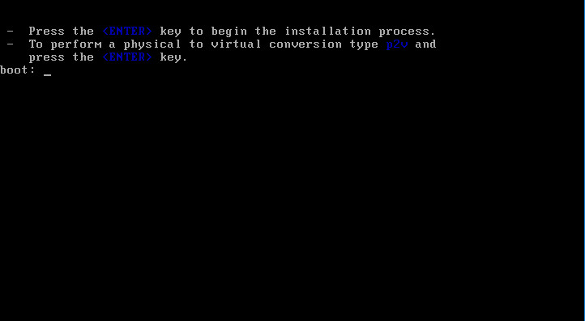](http://rodrigolira.eti.br/wp-content/uploads/2016/06/01.png)

02 - Selecione **Skip** para pular o teste da imagem:

[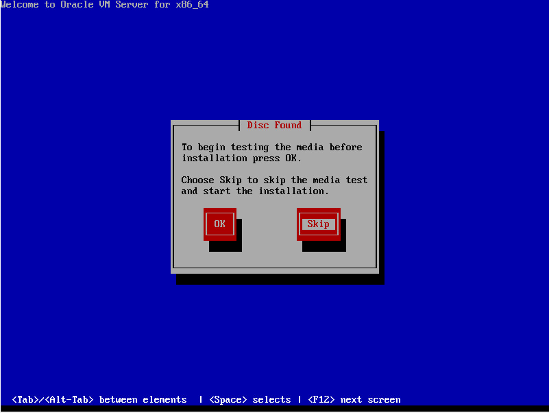](http://rodrigolira.eti.br/wp-content/uploads/2016/06/02.png)

3-Tecle **ENTER** na tela de boas vindas:

[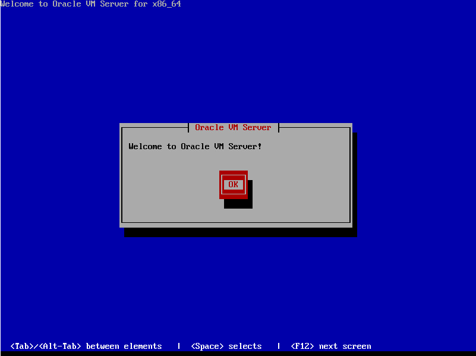](http://rodrigolira.eti.br/wp-content/uploads/2016/06/03.png)

4 - Selecione a linguagem e tecle **ENTER**:

[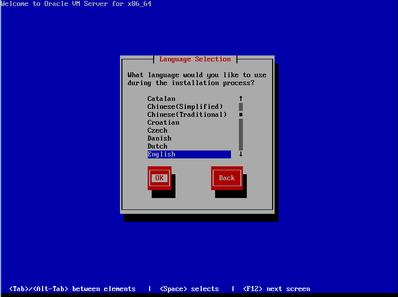](http://rodrigolira.eti.br/wp-content/uploads/2016/06/04.png)

5 - Selecione o mapa do teclado e tecle **ENTER**:

[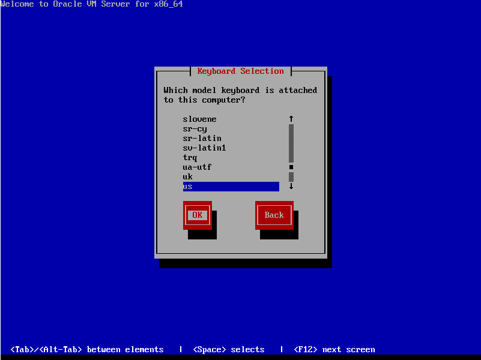](http://rodrigolira.eti.br/wp-content/uploads/2016/06/05.png)

6 - Selecione **Accept** para aceitar a licença e depois tecle **ENTER**:

[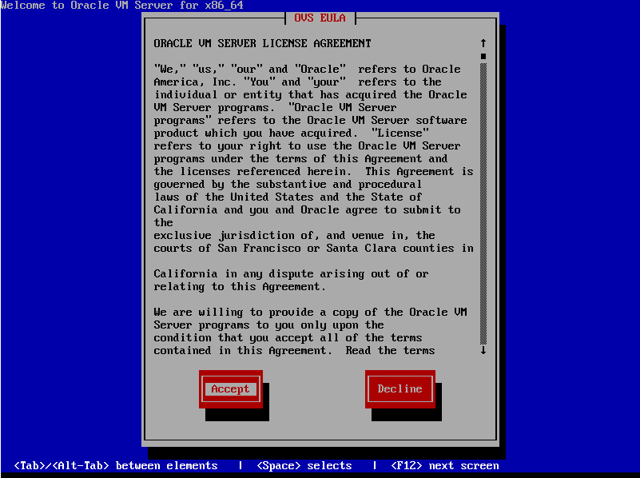](http://rodrigolira.eti.br/wp-content/uploads/2016/06/06.png)

7 - Selecione o disco de instalação, selecione **Use entire drive** para usar o disco inteiro e depois tecle **ENTER**:

[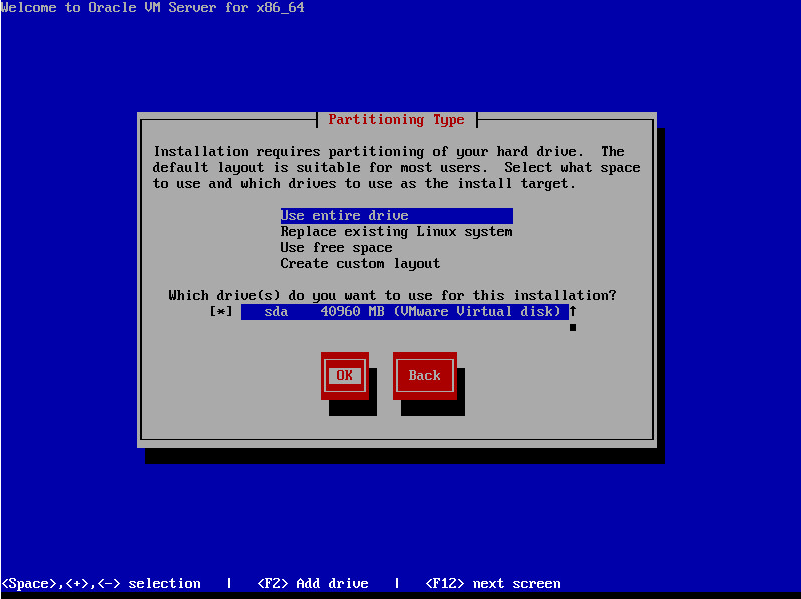](http://rodrigolira.eti.br/wp-content/uploads/2016/06/07.png)

8 - Selecione **No** e tecle **ENTER**:

[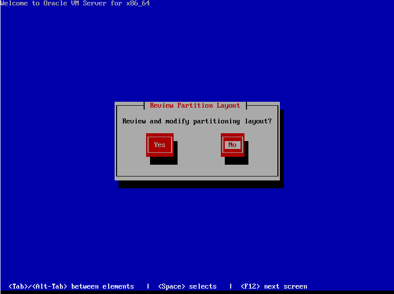](http://rodrigolira.eti.br/wp-content/uploads/2016/06/08.png)

9 - Selecione **Write changes to disk** e tecle **ENTER**:

[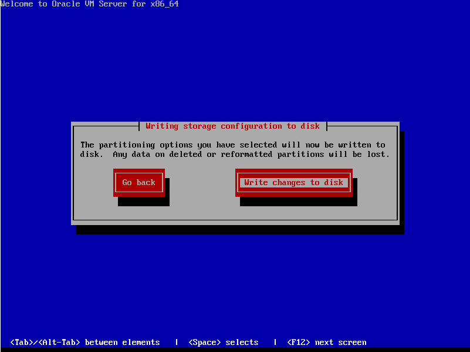](http://rodrigolira.eti.br/wp-content/uploads/2016/06/09.png)

10 - Deixe o padrão, selecione **OK** e tecle **ENTER**:

[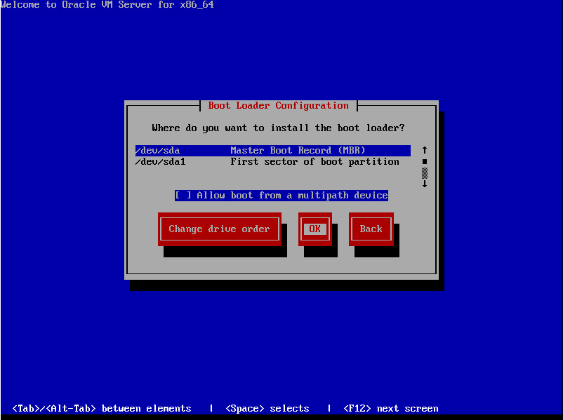](http://rodrigolira.eti.br/wp-content/uploads/2016/06/10.png)

11 - Selecione **No** para não habilitar o kdump e tecle **ENTER**:

[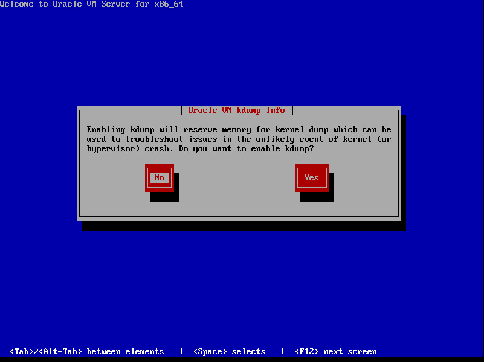](http://rodrigolira.eti.br/wp-content/uploads/2016/06/11.png)

12 - Selecione a **eth0** e tecle **ENTER**:

[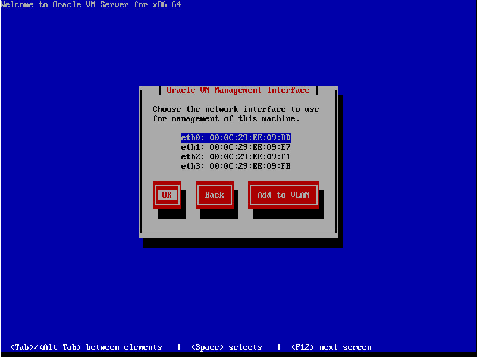](http://rodrigolira.eti.br/wp-content/uploads/2016/06/12.png)

13 - Marque **Manual address configuration**, preencha o endereço **IP** e a **mascara** e tecle **ENTER**:

[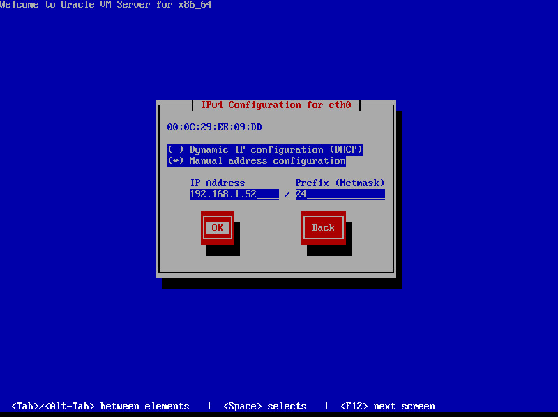](http://rodrigolira.eti.br/wp-content/uploads/2016/06/13.png)

14 - Configure o **gateway** e o **DNS** e tecle **ENTER**:

[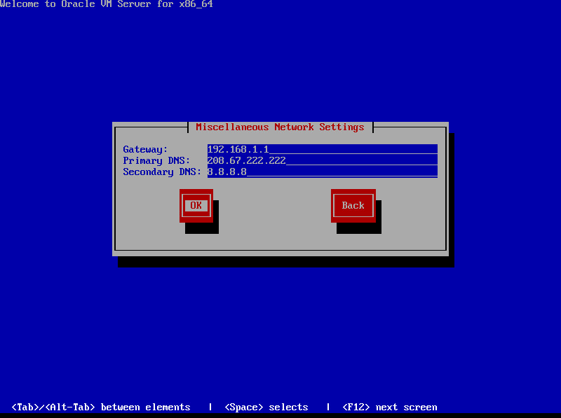](http://rodrigolira.eti.br/wp-content/uploads/2016/06/14.png)

15 -selecione **manually** e configure o **hostname**, depois tecle **ENTER**:

[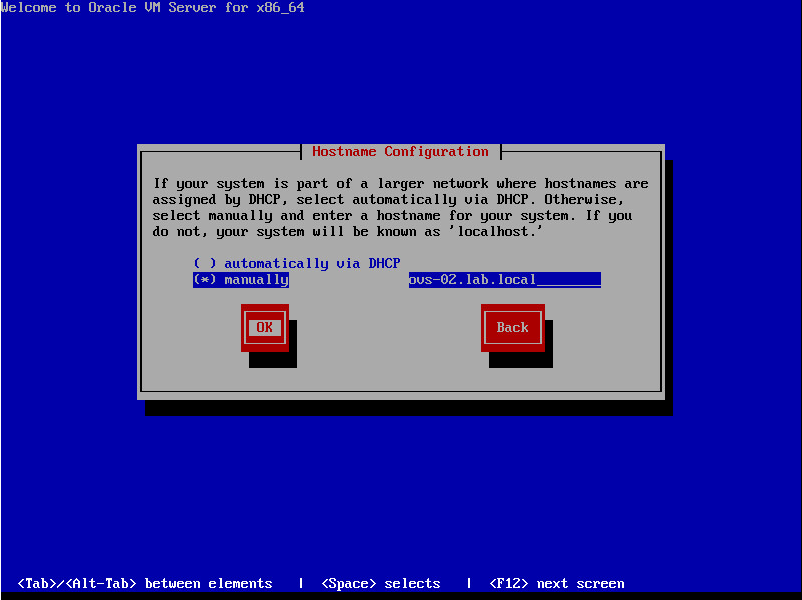](http://rodrigolira.eti.br/wp-content/uploads/2016/06/15.png)

16 - Selecione o **Time Zone** de acordo com a sua região e tecle **ENTER**:

[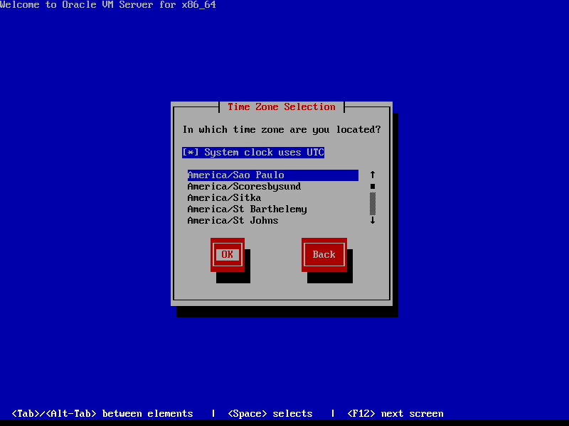](http://rodrigolira.eti.br/wp-content/uploads/2016/06/16.png)

17 - Configure a senha que vai ser utilizada pelo agente para o Manager poder gerenciar e monitorar o servidor e as VMs.

[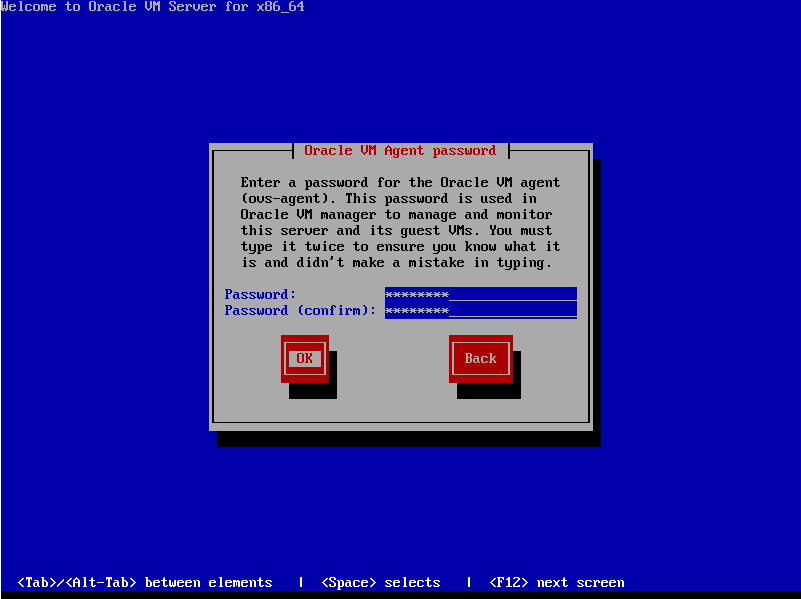](http://rodrigolira.eti.br/wp-content/uploads/2016/06/17.png)

18 - Configure a senha do usuário root e tecle ENTER, depois dessa etapa é iniciada a instalação do sistema.

[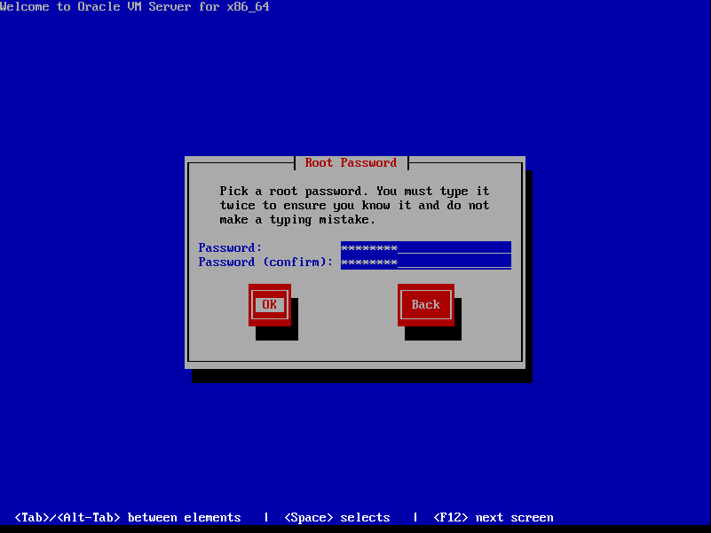](http://rodrigolira.eti.br/wp-content/uploads/2016/06/18.png)

19 - Depois do sistema instalado, tecle ENTER para reiniciar:

[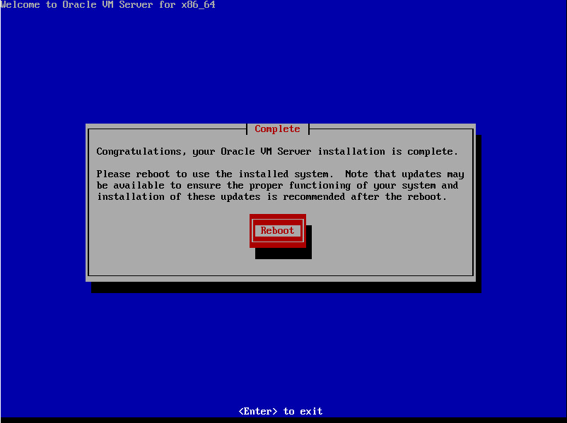](http://rodrigolira.eti.br/wp-content/uploads/2016/06/19.png)

20 -A figura abaixo mostra a tela do sistema após a inicialização, a mesma possui varias informações, porém nesse momento como não estamos com o ambiente totalmente pronto, essas informações serão exibidas quando configurarmos todo o lab, em outro momento iremos retornar a mesma para saber o que é cada uma dessas informações:

[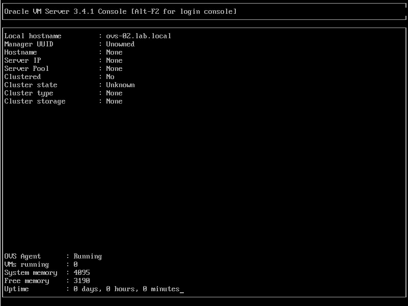](http://rodrigolira.eti.br/wp-content/uploads/2016/06/20.png)

Pronto, depois dessas etapas o sistema está instalado e configurado.

Repita o processo para a outra VM!

Os próximos posts serão em vídeo e será a instalação e a configuração do Manager.

Espero que tenham gostado, até a próxima :D
