Salve Salve Pessoa!

Nesse post vou mostrar todo o passo-a-passo de instalação do Oracle VM Manager, que é o cara responsável pelo gerenciamento do nosso ambiente virtualizado, a instalação dele é bem simples, porém existem alguns detalhes que se não prestarmos atenção podem nos tirar bastante tempo na hora da sua implementação. Diferentemente do Oracle VM Server, o Manager não vem em uma ISO já pronta, nesse caso precisamos instalar um Sistema Operacional antes, no caso do nosso lab, instalei um Oracle Linux 7, fiz a atualização de todos os pacotes.<!--more-->

Na página da documentação oficial, podemos encontrar todos os requerimentos e pré-requisitos de hardware e software.

**Sistemas Operacionais suportados:**

```
Oracle Linux 5 Update 5 64-bit or later.
Oracle Linux 6 64-bit or later.
Oracle Linux 7 64-bit or later.
Red Hat Enterprise Linux 5 Update 5 64-bit or later.
Red Hat Enterprise Linux 6 64-bit or later.
Red Hat Enterprise Linux 7 64-bit or later.
```

No nosso caso vamos utilizar o Oracle Linux 7.

[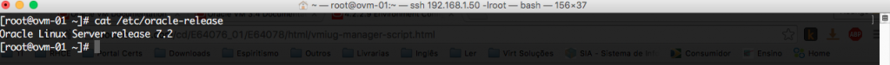](http://rodrigolira.eti.br/wp-content/uploads/2016/06/01-1.png)

**Navegadores suportados:**

```
Microsoft Internet Explorer 10
Mozilla Firefox 8
Apple Safari 6
Google Chrome 15
```

Ou suas versões mais atuais.

**Pacotes:**

```
zip
unzip
perl
libaio
net-tools
perl-Data-Dumper
```

Esses pacotes podem variar de acordo com a versão do SO e o tipo de instalação, no caso do lab, fiz a instalação do Oracle Linux 7 (Servidor de Infraestrutura), foi necessário apenas a instalação do pacote perl-Data-Dumper.

[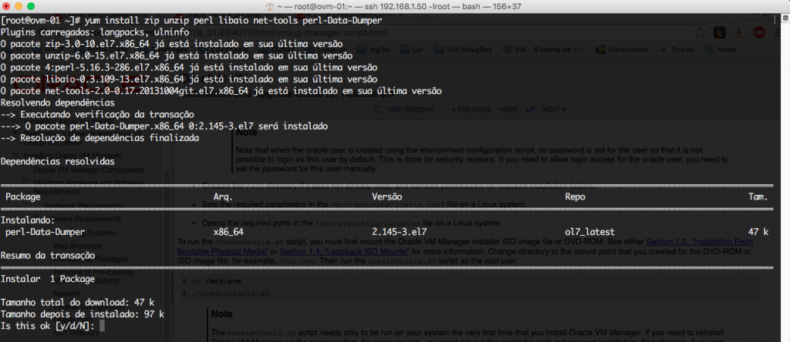](http://rodrigolira.eti.br/wp-content/uploads/2016/06/03-1.png)

**Remover pacotes do MySQL caso existam:**

```
mariadb-libs
```

Nesse caso removemos apenas o pacote mariadb-libs, removendo esse pacote, ele também remove o postfix.

[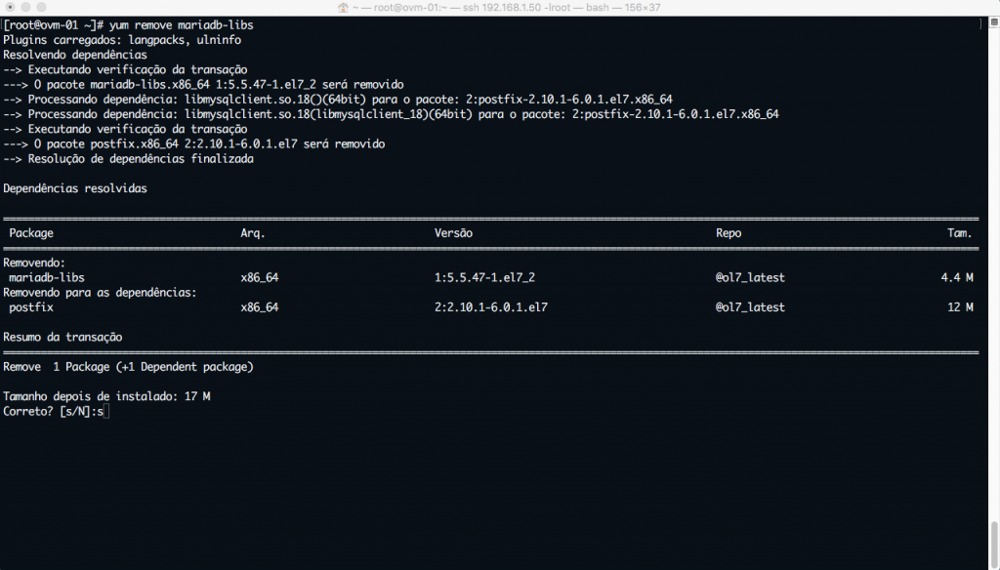](http://rodrigolira.eti.br/wp-content/uploads/2016/06/04-1.png)

**Configuração de Rede:**

```
/etc/hosts
```

Configurar o /etc/hosts com o nome dado a máquina do Oracle VM Server, no caso do lab, configuro tanto o nome do host do Oracle VM Manager, como também o nome dos hosts com o Oracle VM Server e o nome do Storage.

[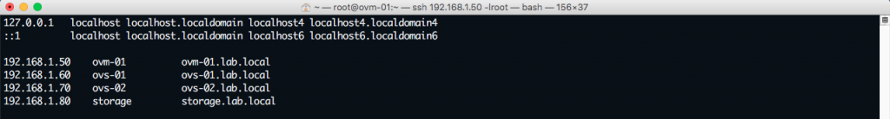](http://rodrigolira.eti.br/wp-content/uploads/2016/06/05-1.png)

**Configurações de firewall, usuários e diretórios:**

Existe um script dentro da ISO de instalação do Oracle VM Manager que faz a configuração de firewall, usuário e diretório, o nome desse script é:

```
createOracle.sh
```

Antes de executar o script precisamos fazer mais alguns ajustes, como o Oracle Linux 7 vem com o firewalld, temos que para o serviço e depois remove-lo da inicialização.

[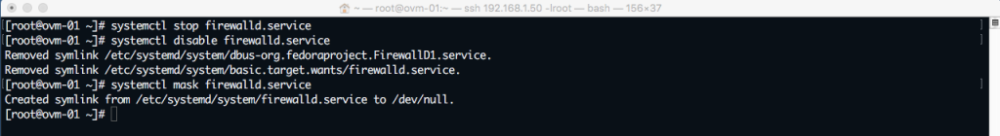](http://rodrigolira.eti.br/wp-content/uploads/2016/06/06-1.png)

Agora precisamos instalar o pacote iptables-services e iniciar o iptables.

[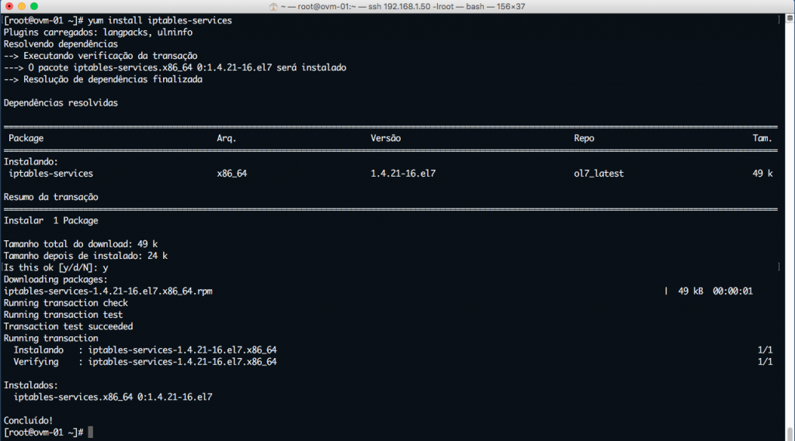](http://rodrigolira.eti.br/wp-content/uploads/2016/06/07-1.png)

[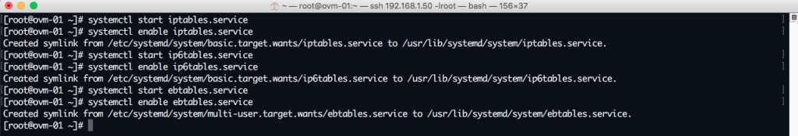](http://rodrigolira.eti.br/wp-content/uploads/2016/06/08-1.png)

Agora podemos executar o script, lembre-se de montar a ISO de instalação no SO, no meu caso, montei a mesma dentro do /mnt, já dentro do /mnt, temos os seguintes arquivos.

[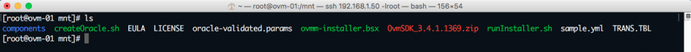](http://rodrigolira.eti.br/wp-content/uploads/2016/06/10-1.png)

Agora execute o script.

[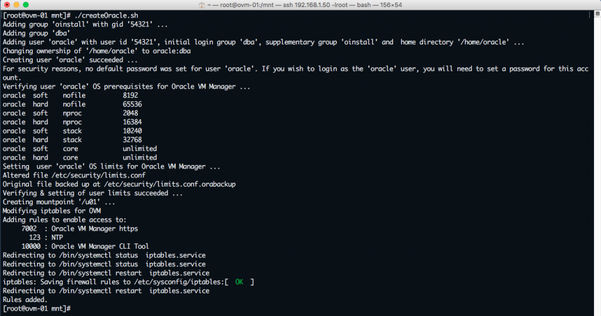](http://rodrigolira.eti.br/wp-content/uploads/2016/06/09-1.png)

Pronto, isso é o que devemos fazer antes de iniciar a instalação, agora podemos começar a instalar o Oracle VM Manager :D

1 - Para iniciarmos a instalação do Oracle VM Manager, basta executar o script runInstaller.sh, deverá aparecer um menu com quatro opções.

[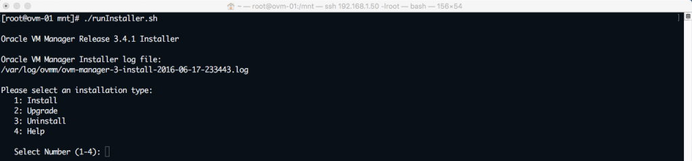](http://rodrigolira.eti.br/wp-content/uploads/2016/06/11-1.png)

2 - Digite **1** para instalar e tecle **ENTER**.

[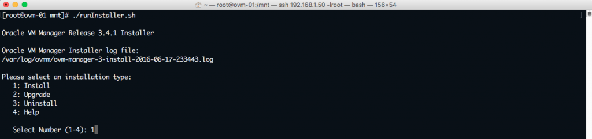](http://rodrigolira.eti.br/wp-content/uploads/2016/06/12-1.png)

Caso apareça um **WARNING**, é porque no nosso lab configuramos a VM do Oracle VM Manager com apenas 4gb de ram, e o recomendado é de pelo menos 8gb de ram, podemos instalar com os 4gb que nosso lab vai funcionar da mesma forma.

3- Insira uma **senha** para acesso ao Oracle VM Sever.

[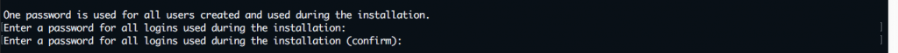](http://rodrigolira.eti.br/wp-content/uploads/2016/06/13-1.png)

4 - Configure o **FQDN**, pode apenas teclar **ENTER**, como já configuramos anteriormente o arquivo /etc/hosts.

[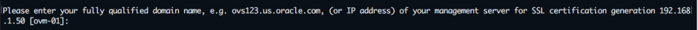](http://rodrigolira.eti.br/wp-content/uploads/2016/06/14-1.png)

5 - Ele verifica todas as configurações, depois digite **1** e tecle **ENTER** para iniciar a instalação do Oracle VM Manager.

[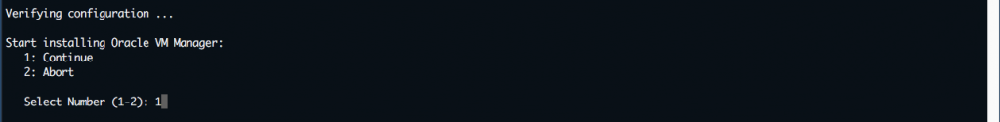](http://rodrigolira.eti.br/wp-content/uploads/2016/06/15-1.png)

 6 - Após a instalação terminar remova o arquivo temporário como solicitado.

[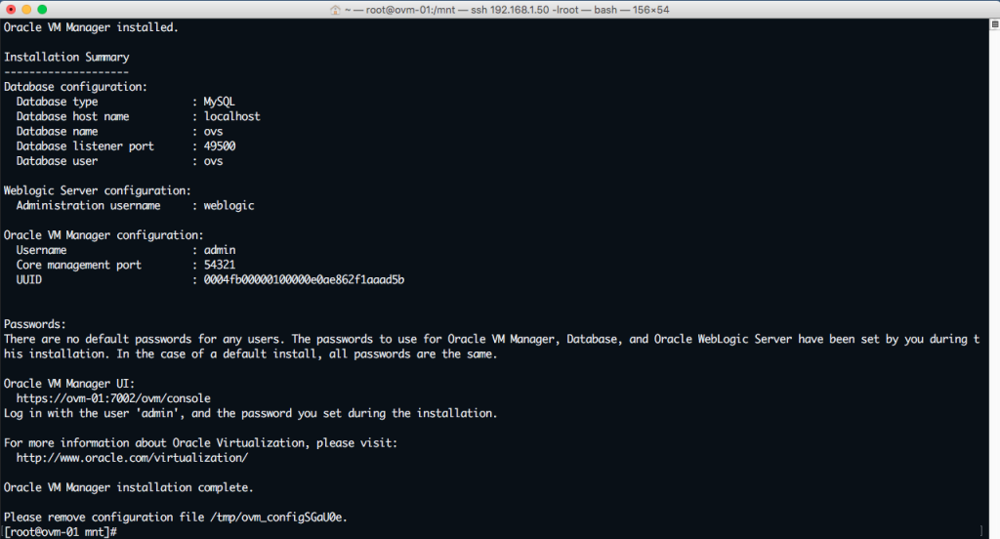](http://rodrigolira.eti.br/wp-content/uploads/2016/06/16-1.png)

7 - Abra o navegador e digite a URL, digite usuário e senha, por padrão o usuário é **admin** e a senha é a que você configurou na hora da instalação,

```
https://IP_DO_SERVIDOR:7002/ovm/console
```

Troque o nome **ovm-01** pelo IP do servidor.

[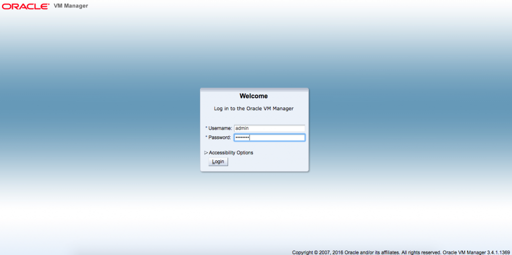](http://rodrigolira.eti.br/wp-content/uploads/2016/06/17-1.png)

Este é o dashboard padrão do Oracle VM Manager :D

[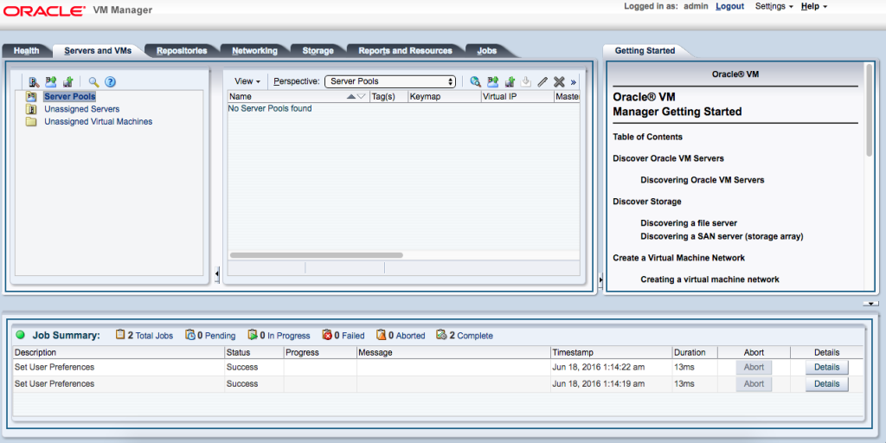](http://rodrigolira.eti.br/wp-content/uploads/2016/06/18-1.png)

Pronto, instalação realizada com sucesso :D

Espero que tenham gostado, no próximo post do lab, vou mostrar como configurar a parte de rede, storage, repositórios, pool e etc.

Obrigado e até a próxima :D
