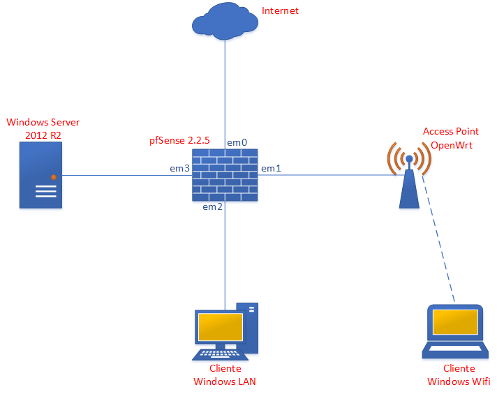

Salve Salve Pessoal!

Estou dando inicio a uma nova serie de vídeos, desta vez sobre o pfSense.

Ultimamente tenho recebido diversos contatos referente a um vídeo que publiquei sobre a integração do pfSense com captive portal autenticando usuários via RADIUS no Windows Server ([http://rodrigolira.eti.br/1260/](http://rodrigolira.eti.br/1260/)), problemas diversos, desde firewall até configuração errada das politicas no Windows.

Dessa forma resolvi criar uma serie de vídeos sobre o pfSense, que vai abordar desde os serviços mais básicos como configurar a interface de rede, até as configurações avançadas. Tudo isso buscando o mais próximo de um cenário real.

Para isso vamos começar montando o seguinte laboratório:

Como vocês podem ver, temos os seguintes elementos:

**01 Windows Server 2012 R2** - Você pode baixar a iso do mesmo no link abaixo:

[https://technet.microsoft.com/pt-br/evalcenter/dn205286.aspx](https://technet.microsoft.com/pt-br/evalcenter/dn205286.aspx)

**01 pfSense 2.2.5** - Você pode baixar a iso do mesmo no link abaixo:

[https://www.pfsense.org/download/](https://www.pfsense.org/download/)

**01 OpenWrt** - Vai fazer o papel de Access Point, você pode baixar no link abaixo:

[https://wiki.openwrt.org/doc/howto/vmware](https://wiki.openwrt.org/doc/howto/vmware)

Caso deseje, você pode baixar a VM pronta em formato OVA no link abaixo:

[https://dl.dropboxusercontent.com/u/7976972/openwrt15cc.ova](https://dl.dropboxusercontent.com/u/7976972/openwrt15cc.ova)

**02 Clientes Windows** - Sendo que um vai ser na rede LAN e outro na Wifi, você pode baixar a iso no link abaixo:

[http://windows.microsoft.com/pt-br/windows/downloads](http://windows.microsoft.com/pt-br/windows/downloads)

O software de virtualização que vou utilizar é o **VMware Workstation 12 Pro**, porém esse lab pode ser realizado normalmente no VIrtualBox.

Vou mostrar como instalar e configurar o **pfSense** e o **OpenWrt**, porém não vou abordar a instalação do Windows Server e nem do Cliente, dessa forma vão se adiantando :D

A topologia do nosso lab vai mudando de acordo com a necessidade, mas basicamente sempre será essa mesmo, estou pretendendo lançar pelo menos um vídeo por semana, não sei dizer a duração de cada vídeo nem a quantidade de assuntos abordados em cada um, por isso é bom ficarem ligados ;)

Até a próxima :D
