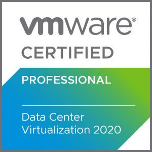
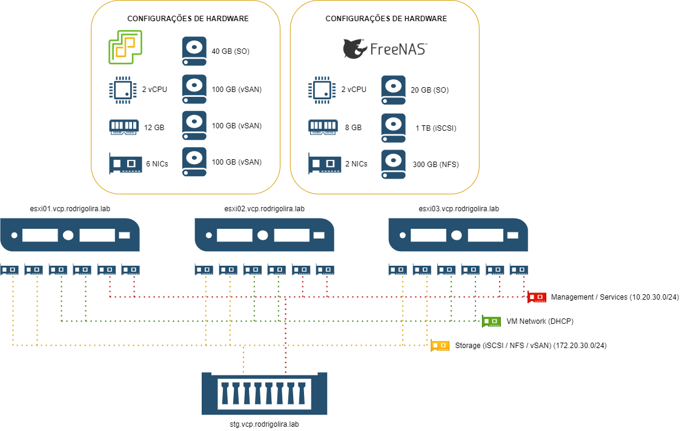
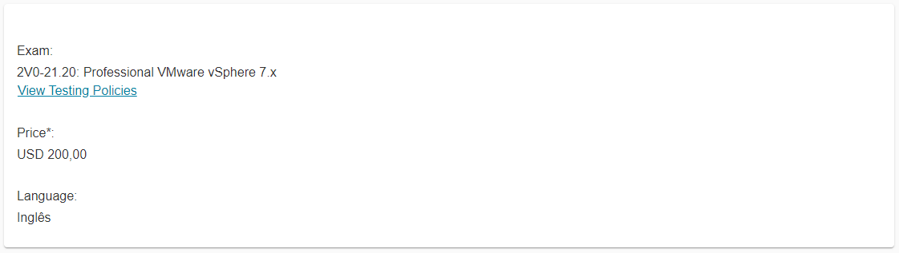
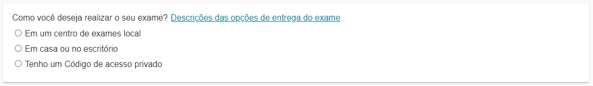

Salve Salve Pessoal!

Rescentemente a **VMware** lançou a nova versão do exame **VCP-DCV 2020** baseado no **VMware vSphere 7**.

Com esse novo lançamento eu resolvi atualizar a minha certificação. ;)

Dessa forma resolvi fazer uma série de posts e vídeos sobre a criação do meu **lab** para os estudos do exame, a proposta é que possamos além de criar o lab fazer um guia de estudos para quem está querendo realizar o exame também.

Abaixo segue a imagem de como será o meu lab, vou explicar melhor como será meu lab no próximo post dessa série com um vídeo, dessa maneira será bem mais fácil de vocês entenderem tudo.

Mas já podemos ver que teremos **3 hosts ESXi** e **1 FreeNAS** fazendo o papel de Storage. :P

Para que tem dúvidas sobre esse novo exame, segue abaixo algumas informações.

Esse exame não foge do padrão das outras certificações do mesmo nível da **VMware** no caso **Professional**.

Mas em resumo é o seguinte:

O exame custa **$ 200.00** dólares:

**OBS:** O valor pode váriar de acordo como país.

Podemos fazer o exame de casa, escritório ou em um centro de exames. No meu caso como moro em **João Pessoa/PB** o centro de exames local é a Hostdime.

A duração do exame é de **130 minutos**.

São **70 questões** de múltiplas ou única escolha.

A pontuação do exame vai até **500**, você precisa fazer pelo menos **300 pontos** para passar.

Podemos obter mais informações sobre o exame no link abaixo:

[https://www.vmware.com/education-services/certification/vcp-dcv-7-exam.html](https://www.vmware.com/education-services/certification/vcp-dcv-7-exam.html)

Por enquanto é isso, nos vemos no próximo post onde vou explicar o lab.

Até a próxima!

:D
