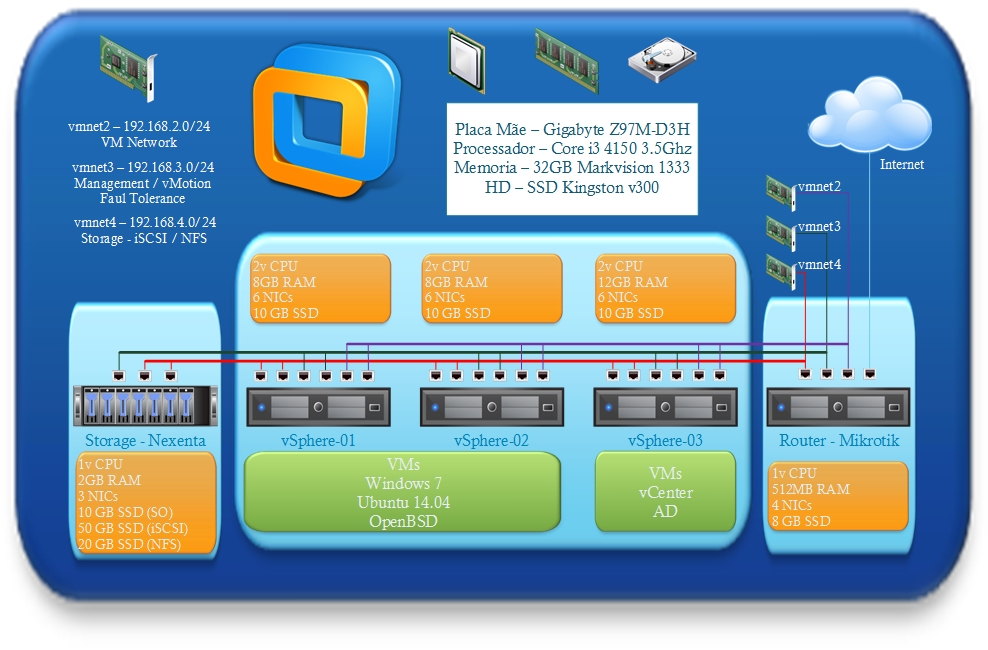

Salve Salve Pessoa!

Algum tempo atrás foi lançado o vSphere 6, e está semana saiu a nova versão da certificação (**VMware Certified Professional 6 – Data Center Virtualization),** dessa forma houve a necessidade da atualização do meu lab de estudos para o vSphere 6.

Dessa vez desenhei toda a topologia para que possa ficar mais fácil para eu lembrar e para você que segue meu blog entender melhor, vale lembrar que irei ministrar muito em breve um curso de vSphere na [Linuxfi](http://linuxfi.com.br), onde já dou aula de Linux.

A imagem mostra tando a configuração de hardware físico, como a configuração de hardware lógico e de todas as VMs utilizadas, anteriormente fiz um post onde explico todas as configurações de Hardware e Software do meu desktop, segue o link para o mesmo, [http://wp.me/p2lGMF-kM](http://wp.me/p2lGMF-kM).<!--more-->

Em outro post mostrei como instalar e realizar as configurações iniciais de storage, usando o Nexenta Community Edition, segue link, [http://wp.me/p2lGMF-mO](http://wp.me/p2lGMF-mO).

Já em outro post coloquei um vídeo que fiz mostrando como instalar o vSphere 6 e realizar a configuração inicial de rede, segue link, [http://wp.me/p2lGMF-oM](http://wp.me/p2lGMF-oM).

Abaixo a imagem da topologia que eu criei para esse lab.

 

Espero que vocês entendam, em outro post vou detalhar cada um dos itens na imagem.

Até a próxima :D
