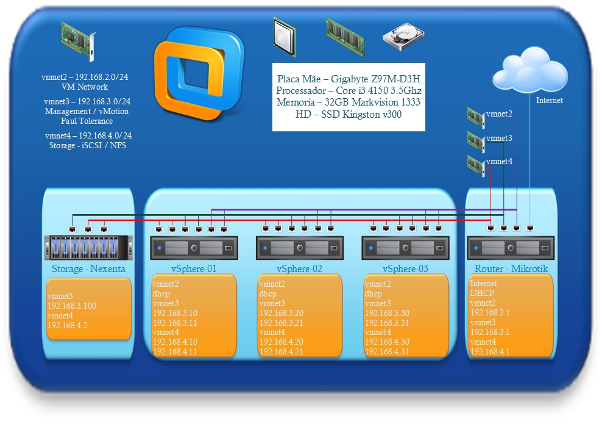

Salve Salve Pessoal!

No post:

[Lab VCP6-DCV – Parte 1](http://rodrigolira.eti.br/lab-vcp6-dcv-parte-1/ "Lab VCP6-DCV – Parte 1")

Eu exibi uma imagem de como estou montando meu lab para a prova VCP6-DCV.

Hoje vou mostrar outra imagem com a configuração da rede e um vídeo de como configurar o Mikrotik para o lab.

Segue abaixo a imagem de configuração de rede:<!--more-->

 

No vídeo que segue abaixo tem uma explicação de todos as configurações necessária e do que significa cada uma delas, espero que vocês gostem.

<iframe src="https://www.youtube.com/embed/uxGWfS6Fsqk" width="600" height="400" frameborder="0" allowfullscreen="allowfullscreen"></iframe>

No próximo vídeo irei mostrar como configurar o Nexenta para nosso storage.

Até a próxima :D
