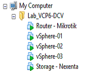

Salve Salve Pessoal!

Segue abaixo mais um vídeo do lab para vcp6, para quem não viu os outros posts segue os links abaixo:

[Lab VCP6-DCV – Parte 1](http://rodrigolira.eti.br/lab-vcp6-dcv-parte-1/)

[Lab VCP6-DCV – Parte 2](http://rodrigolira.eti.br/lab-vcp6-dcv-parte-2/ "Lab VCP6-DCV – Parte 2")

[Lab VCP6-DCV – Parte 3](http://rodrigolira.eti.br/lab-vcp6-dcv-parte-3/ "Lab VCP6-DCV – Parte 3")

[Lab VCP6-DCV – Parte 4](http://rodrigolira.eti.br/lab-vcp6-dcv-parte-4/ "Lab VCP6-DCV – Parte 4")

Nesse vídeo mostro como configurar instalar e configurar o vCenter Server Appliance 6.

Espero que gostem e compartilhem o vídeo.<!--more-->

<iframe src="https://www.youtube.com/embed/kcwbeld5_nI" width="600" height="400" frameborder="0" allowfullscreen="allowfullscreen"></iframe>

Até a próxima :D
