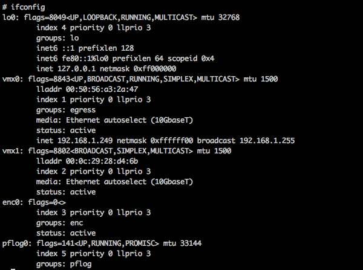
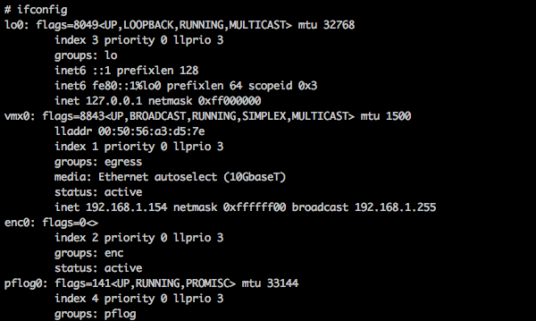
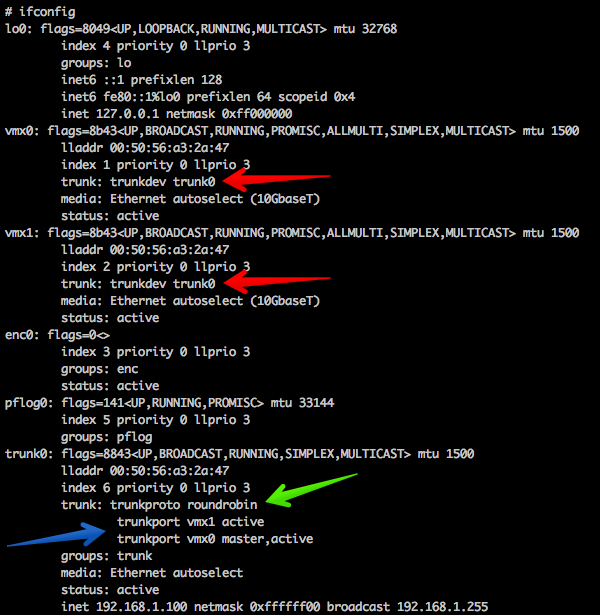
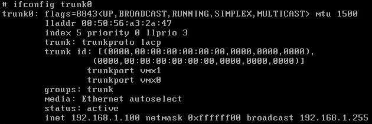
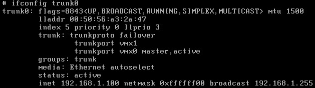

Salve Salve Pessoal!

Nesse post vou mostrar como configurar uma interface trunk no OpenBSD. Ops, Trunk??? Sim, trunk!

Trunk é o nome usado para interface virtual que é criada no OpenBSD, então não se confundam com "VLAN Trunk" e etc. ;)

Uma interface trunk permite agregar várias interfaces físicas em uma só interface virtual.

Atualmente nós podemos usar os seguintes protocolos para configurar uma interface trunk no OpenBSD: **broadcast**, **failover**, **lacp**, **loadbalance**, **none** ou **roundrobin**.

Para este post, nós vamos trabalhar com os seguintes protocolos: **roundrobin**, **lacp** e **failover**.

Vamos fazer um cenário bem simple, onde vamos ter 2 hosts com OpenBSD 6.0 instalado em cada um, no HOST-01 temos duas interfaces de rede (em0 e em1), no HOST-02 temos apenas uma interface de rede (em0). A lógica é simples, vamos configurar o trunk no host 01 e ficar testando a comunicação do host 02.

```
             HOST-01                                     HOST-02  
        |---------------|                          |----------------|
        |              vmx0 <------|               |                | 
        |  OpenBSD 6.0  |       trunk0 <-------> vmx0  OpenBSD 6.0  | 
        |              vmx1 <------|               |                |
        |---------------|                          |----------------|
```

A sintaxe de configuração de uma interface trunk é bem simples, segue um exemplo abaixo:

```
# ifconfig trunk0 trunkproto lacp trunkport vmx0 trunkport vmx1 192.168.1.1 netmask 255.255.255.0
```

**ifconfig** - É o utilitário de configuração de rede.

**trunk0** - É o trunk mais o ID da interface virtual que estamos criando.

**trunkproto** **lacp**\- Protocolo que iremos utilizar no trunk.

**trunkport** **vmx0**\- Dizemos que a interface vmx0 vai fazer parte do trunk.

**trunkport** **vmx1**\- Dizemos que a interface vmx0 vai fazer parte do trunk.

E depois o **IP** mais **MASCARA**.

Antes de começarmos a configurar vamos verificar as configurações de rede de cada host:

**HOST-01**

[](http://rodrigolira.eti.br/wp-content/uploads/2016/10/Screen-Shot-2016-10-19-at-21.16.39.png)

Como podemos verificar, o host-01 tem as interfaces vmx0 e vmx1, a interface vmx0 está recebendo IP porque a mesma está configurada como dhcp no arquivo de configuração da interface, a interface vmx1 não está com nenhuma configuração pelo fato de não existir nenhum arquivo de configuração para a mesma.

**HOST-02**

[](http://rodrigolira.eti.br/wp-content/uploads/2016/10/Screen-Shot-2016-10-19-at-21.17.13.png)

Como podemos ver, no host-02 temos apenas a interface vmx0, está recebendo IP porque a mesma está configurada como dhcp no arquivo de configuração da interface.

Antes de começarmos vamos apagar o arquivo de configuração das interfaces  do host-01, para não gerar nenhum conflito com o arquivo de configuração do trunk, execute o seguinte comando no host-01:

```
# rm /etc/hostname.vmx*
```

**OBS:** Não realize essas configurações remotamente ;)

Então vamos ao que realmente interessa, vamos começar as configurações :D

**ROUNDROBIN:**

A configuração de roundrobin é a padrão, ou seja, se não especificarmos nenhuma protocolo na configuração o roundrobin será usado.

Execute os comandos abaixo para configurar o trunk0 com o protocolo roundrobin:

```
# ifconfig vmx0 up

# ifconfig vmx1 up

# ifconfig trunk0 trunkport vmx0 trunkport vmx1 192.168.1.100 netmask 255.255.255.0
```

Após configurado, execute um ifconfig para verificar se a interface trunk0 subiu corretamente.

[](http://rodrigolira.eti.br/wp-content/uploads/2016/10/Screen-Shot-2016-10-19-at-22.01.52.png)

Vamos analisar a saída do comando **ifconfig**.

As **setas vermelhas** indicam que a interface vmx0 e vmx1 agora fazem parte do trunk0.

A **seta verde** indica qual protocolo estamos usado, lembre-se, se não especificarmos nenhum protocolo o protocolo padrão é o roundrobin.

A **seta azul** está indicandos as portas que fazem parte do trunk, o estado de cada uma, no nosso caso as duas estão ativas, sendo que a vmx0 está como master.

Mas como podemos definir quem vai ser a interface master? Simples, a primeira interface informada no comando será a interface master. ;)

Mas ainda temos um problema para resolver, tudo que fizemos até esse momento está apenas em memória, temos que criar um arquivo de configuração para cada interface **(vmx0, vmx1, trunk0)** e configurar cada um dos confs, para isso execute os seguintes comandos:

```
# echo "up" > /etc/hostname.vmx0

# echo "up" > /etc/hostname.vmx1

# echo "trunkport vmx0 trunkport vmx1 192.168.1.100 netmask 255.255.255.0" > /etc/hostname.trunk0
```

Pronto, agora temos a nossa configuração de forma persistente, reinicie o host-01 para verificar se tudo está como esperado.

Do host-02 fique pingando o host-01, desative e ative as interfaces vmx0 e vmx1 do host-01 e veja se o protocolo está funcionando corretamente.

**LACP**

Para configurar com o protocolo LACP, os passos são os mesmos, a diferença é que temos que inserir o protocolo desejado.

```
# ifconfig vmx0 up

# ifconfig vmx1 up

# ifconfig trunk0 trunkproto lacp trunkport vmx0 trunkport vmx1 192.168.1.100 netmask 255.255.255.0
```

[](http://rodrigolira.eti.br/wp-content/uploads/2016/10/Screen-Shot-2016-10-19-at-22.44.31.png)

Observe na imagem que nenhuma das interfaces estão como ativas, com a configuração com o protocolo LACP, nós precisamos que a outra ponta da rede, também esteja com lacp, normalmente seria um switch.

Para configurar o trunk usando lacp de forma persistente, execute os seguintes comandos:

```
# echo "up" > /etc/hostname.vmx0

# echo "up" > /etc/hostname.vmx1

# echo "trunkproto lacp trunkport vmx0 trunkport vmx1 192.168.1.100 netmask 255.255.255.0" > /etc/hostname.trunk0
```

No caso do lacp não consiguiremos realizar o teste de ping.

**FAILOVER**

Para configurar com o protocolo de failover, os passos são os mesmos que o lacp, só vamos mudar o protocolo desejado.

```
# ifconfig vmx0 up

# ifconfig vmx1 up

# ifconfig trunk0 trunkproto failover trunkport vmx0 trunkport vmx1 192.168.1.100 netmask 255.255.255.0
```

 

[](http://rodrigolira.eti.br/wp-content/uploads/2016/10/Screen-Shot-2016-10-19-at-22.49.45.png)

Observe na imagem que agora nós temos apenas a interface master como ativa, caso a mesma venha a falhar, a outra interface irá assumir o lugar dela.

Para configurar o trunk usando failover de forma persistente, execute os seguintes comandos:

```
# echo "up" > /etc/hostname.vmx0

# echo "up" > /etc/hostname.vmx1

# echo "trunkproto failover trunkport vmx0 trunkport vmx1 192.168.1.100 netmask 255.255.255.0" > /etc/hostname.trunk0
```

Faça o mesmo teste que o roundrobin, do host-02 fique pingando o host-01, desative e ative as interfaces vmx0 e vmx1 do host-01 e veja se o protocolo está funcionando corretamente.

Pronto, espero que tenham gostado do post, até a próxima :D

Referências:

[http://man.openbsd.org/trunk.4](http://man.openbsd.org/trunk.4)

[http://man.openbsd.org/hostname.if.5](http://man.openbsd.org/hostname.if.5)

[https://www.nostarch.com/obenbsd2e](https://www.nostarch.com/obenbsd2e)
